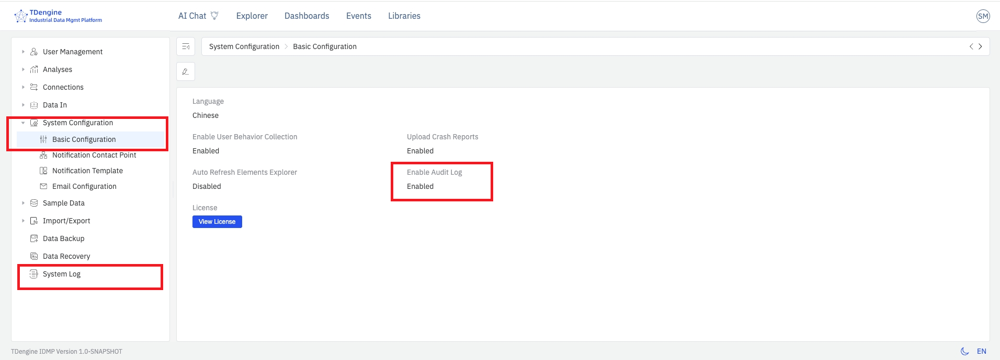
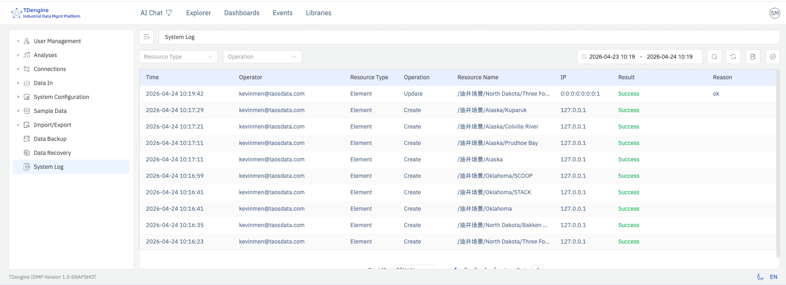

# 14.7 Audit Trail

The audit trail records all modifications users make to IDMP system objects. When an administrator enables this feature in System Configuration, IDMP automatically generates **tamper-proof** operation logs that preserve the actor, time, object, and before/after content of every change, and provides interfaces for querying, filtering, and exporting. This supports compliance auditing and security traceability.

The feature is designed with reference to industry standards such as `21 CFR Part 11` for the traceability of electronic records, making it suitable for pharmaceutical, food, energy, heavy industry, and other scenarios with strict operation-tracing requirements.

## 14.7.1 Key Features

- **Comprehensive recording:** Covers creation, modification, and deletion of all system objects (elements, templates, data sources, users, roles, permissions, system configuration, etc.), as well as key events such as login and logout
- **Tamper-proof:** Once written, logs cannot be edited or deleted; no user, including the super administrator, has permission to modify them
- **Full context:** Each log entry contains the actor, operation time, operation type, object type, object identifier, before/after values of key fields, and source IP
- **Queryable and exportable:** Administrators can filter and query by time, user, object type, operation type, and other dimensions, and export the results as a CSV file for offline analysis or archiving by auditors

## 14.7.2 Enabling the Audit Trail

The audit trail is disabled by default. To enable it:

1. Go to **Admin Console → System Configuration → Basic Configuration**.
2. Turn on the **System Log** switch.
3. Save the configuration. No restart is required — IDMP immediately begins recording all subsequent audited operations.
4. The **System Log** menu item appears in the left admin panel.

:::note
Operations that occurred before the audit trail was enabled are not retroactively recorded. It is recommended to enable this feature as early as possible when the system goes into production or when compliance auditing is required.
:::

## 14.7.3 Saving Change Reasons

After the audit trail is enabled, when a user performs a key operation such as **creating, updating, or deleting** an IDMP system object and clicks Save, the system pops up a **Change Description** dialog. The user must fill in the reason for the change before the operation can proceed.

The reason for change is required. The user should describe the business context or motivation for this change — such as "process parameter tuning", "equipment replacement", or "compliance rectification" — and fully describe the specific object and modification performed.

After clicking **OK**, the system completes the object change and writes the operation to the audit log. In addition to the standard fields listed in [14.7.4 Viewing and Querying](#1474-viewing-and-querying), the log entry also preserves the following:

- The full text of the **reason for change**
- **Before-change snapshot:** A complete set of the object's attribute values prior to this operation
- **After-change snapshot:** A complete set of the object's attribute values after this operation

Both snapshots are stored as JSON and may be used for manual rollback of the object when necessary.

:::note

- The Change Description dialog appears only when the system log switch is on. When the audit trail is disabled, no dialog is shown and no state snapshots are retained.
- For batch operations (e.g., deleting multiple elements at once), the reason for change is applied uniformly through the operation API to all log entries generated by that batch.

  :::

## 14.7.4 Viewing and Querying

Once the audit trail is enabled, the log list can be accessed from **Admin Console → System Log**. The page displays all recorded operation logs in a table, sorted in reverse chronological order.

The log list includes the following columns. Displayed columns can be adjusted via the design button at the far right of the toolbar:

| Field | Description |
|---|---|
| **Operation Time** | Server time when the operation occurred, to the second |
| **Operator** | Username of the logged-in user who performed the operation |
| **Source IP** | Client IP address from which the request was issued |
| **Operation Type** | Create, update, delete, login, logout, etc. |
| **Object Type** | Category of the affected object, such as element, template, user, role, or system configuration |
| **Object Identifier** | Name or unique identifier of the affected object |
| **Operation Details** | Specific field changes involved in this operation, including before and after values |
| **Result** | Success or failure; error information is attached on failure |
| **Data Fingerprint** | Encrypted digest of the log entry's key information, ensuring the original information is complete and has not been modified |

### Filtering and Searching

The log viewing and query page provides a filter bar that supports combining the following dimensions:

- **Time range:** Choose a start and end time to quickly locate operations within a specific period
- **Operator:** Exact match by username
- **Object type:** Dropdown selection, such as element, template, or user
- **Operation type:** Dropdown selection, such as create, update, or delete
- **Keyword:** Fuzzy search within the object identifier or operation details

Click a log entry to view its detailed information.

## 14.7.5 Exporting Logs

Click the **Export** button in the upper-right corner of the log list page. The system exports all logs **matching the current filter conditions** as a CSV file, named in the format `audit-trail-YYYYMMDD-HHmmss.csv`.

The export contains all fields shown in the list plus the complete JSON of the change details, making it easy to import into third-party audit tools for further analysis.

:::tip
If the log volume is large, apply time-range and object-type filters before exporting to reduce the export size and improve processing efficiency.
:::

## 14.7.6 Log Retention and Storage

Audit logs are stored in the TSDB database configured on the IDMP backend. By default, 10 years of historical logs are retained.

## 14.7.7 Security and Compliance Notes

- Only **system administrators** can access the audit log page and perform exports
- Audit logs are written directly by the backend service; no frontend API provides the ability to modify or delete log entries
- For compliance auditing scenarios, it is recommended to combine the role and permission controls described in [14.4 User Management](./04-user-management.md) to ensure that each operator can be traced back to a unique individual account, avoiding shared accounts
