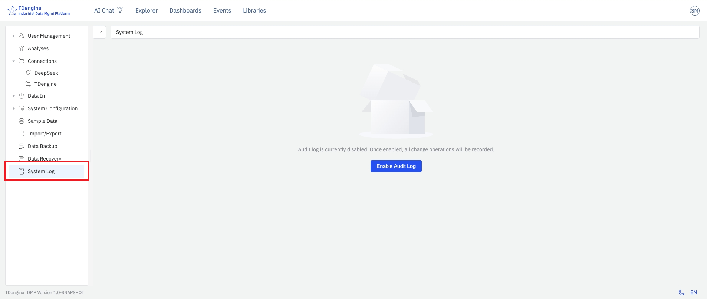
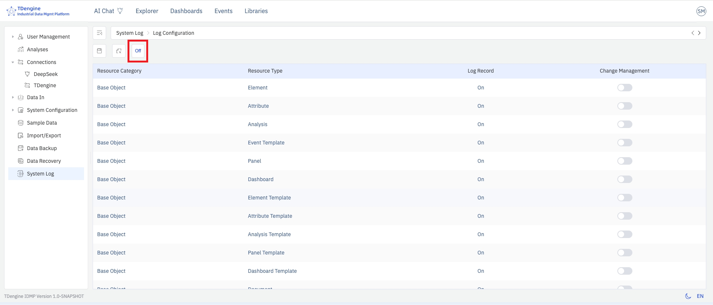
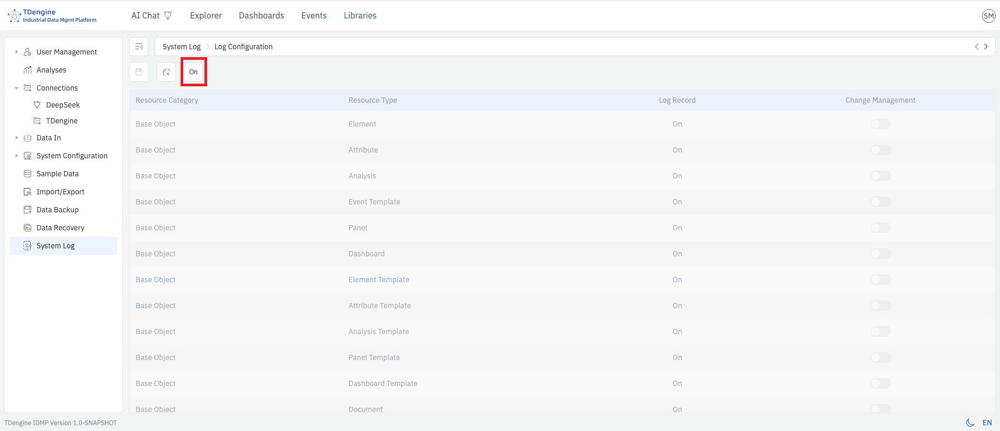
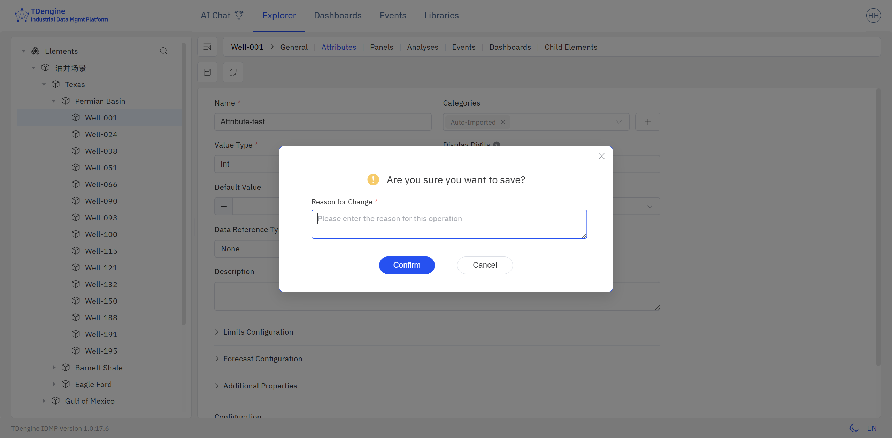

# 14.7 Audit Trail

The audit trail records all modifications users make to IDMP system objects. Once enabled, IDMP automatically generates **tamper-proof** operation logs that preserve the actor, time, object, and before/after content of every change, and provides interfaces for querying, filtering, and exporting — for compliance auditing and security traceability.

The feature is designed with reference to industry standards such as `21 CFR Part 11` for the traceability of electronic records, making it suitable for pharmaceutical, food, energy, heavy industry, and other scenarios with strict operation-tracing requirements.

The Audit Trail menu is **always visible** to every user who has the corresponding permission; enabling, disabling, and control-level configuration are all done in one place — the **Admin Console → Audit Trail** page.

## 14.7.1 Key Features

- **Comprehensive recording:** Covers creation, modification, and deletion of all system objects (elements, templates, data sources, users, roles, permissions, system configuration, etc.), as well as key events such as login and logout
- **Tamper-proof:** Once written, logs cannot be edited or deleted; no user, including the super administrator, has permission to modify them
- **Full context:** Each log entry contains the actor, operation time, operation type, object type, object identifier, before/after values of key fields, and source IP
- **Queryable and exportable:** Users with view permission can filter and query by time, user, object type, operation type, and other dimensions, and export the results as a CSV file for offline analysis or archiving by auditors

## 14.7.2 Permission Management

The audit trail feature has two dedicated permissions:

- **View Audit Trail:** users with this permission can view, filter, search, and export audit logs
- **Configure Audit Trail:** users with this permission can change audit-trail configuration, including enabling / disabling it and configuring each control level (such as change management)

Default permissions per role are listed below. The super administrator can adjust the permissions of other users as needed:

| Role                          | View Audit Trail | Configure Audit Trail |
| ----------------------------- | :--------------: | :-------------------: |
| Plant Manager & Supervisor    |        ✓        |          —          |
| IT / OT System Administrator  |        ✓        |          —          |
| Maintenance Engineer          |        —        |          —          |
| Data Analyst                  |        —        |          —          |
| Operator                      |        —        |          —          |
| Process Engineer              |        —        |          —          |
| Super Administrator           |        ✓        |          ✓          |

:::note
Enabling, disabling, and modifying audit-trail configuration all require the **Configure Audit Trail** permission, and those operations are themselves written into the audit log.
:::

## 14.7.3 Control Levels

The audit trail offers four control levels, with auditing and compliance capability increasing from low to high:

|    Level    | Name                | Description                                                                                                                                                |
| :---------: | ------------------- | ---------------------------------------------------------------------------------------------------------------------------------------------------------- |
| **Level 1** | Baseline            | The initial default state of IDMP; logging is not enabled                                                                                                  |
| **Level 2** | Log & Audit         | The audit trail is on; all operation logs are recorded, with no other impact on regular users                                                              |
| **Level 3** | Change Control      | Change management is on; users must fill in a reason for change before saving modifications to designated objects                                          |
| **Level 4** | Review & Approval   | On top of Change Control, adds second-factor password verification / e-signature, with optional third-party review integration (planned, not yet released) |

On the configuration page you can enable change management for each kind of resource object individually; changes take effect immediately after saving.

## 14.7.4 Enabling the Audit Trail

The audit trail is enabled from a single place — the **Admin Console → Audit Trail** menu. There is no need to go through System Configuration.

### First-time Enabling

1. Open **Admin Console → Audit Trail**. The right-hand pane indicates that the audit trail is currently disabled.
2. Users with the **Configure Audit Trail** permission see an **Enable Audit Trail** button below the notice. Clicking it brings up a confirmation dialog.
3. After clicking **Confirm**, the page auto-refreshes within 5 seconds and the audit trail becomes active — all subsequent audited operations are recorded from this point onward.

:::note
Operations that occurred before the audit trail was enabled are not retroactively recorded. It is recommended to enable this feature as early as possible when the system goes into production or when compliance auditing is required.
:::

### Audit-Trail Configuration

Once the audit trail is on, clicking **Audit Trail** opens the log query and filter page.

In the toolbar on the right side of this page there is an audit-trail configuration button. Clicking it opens the configuration page.

Here a user with configure permission can set the change-management policy for each kind of resource object — i.e. whether change management is required. Once change management is enabled for a resource type, any edit on that type of resource must be accompanied by a reason for change.

Note that once the audit trail is enabled, logging is automatically applied to all resource objects and cannot be turned off per-type.

### Disabling and Reconfiguring

1. Open **Admin Console → Audit Trail** and click the **Configure** button on the right of the toolbar (visible only to users with the **Configure Audit Trail** permission).
2. The left side of the toolbar on the configuration page provides an **Enable / Disable** toggle:
   - Click **Disable** — log recording, change management, and all related options switch to off.
   - Click **Enable** — log recording is turned back on; change-management options default to off and can be turned on manually as needed.

3. After the audit trail has been disabled, the configuration page is still accessible, but its elements appear grayed out. An administrator can re-enable the audit trail from this page; a confirmation dialog appears, and after clicking Confirm, the audit trail becomes active again.

### State When the Audit Trail Is Disabled

- The **Audit Trail** menu is **still visible** to users with the view or configure permission.
- When entering the log page, a notice dialog appears: **"The audit trail feature is currently disabled. Please contact an administrator."**
- After confirming the dialog, users can still query and browse historical log entries that were generated before the audit trail was disabled.

## 14.7.5 Saving Change Reasons

When **Change Management** (Level 3) is enabled, performing a key **create, update, or delete** operation on the corresponding IDMP system objects and clicking Save brings up a **Change Description** dialog, requiring the user to fill in the reason for change before proceeding.

The user should describe the business context or motivation for this change — such as "process parameter tuning", "equipment replacement", or "compliance rectification" — and fully describe the specific object and modification performed.

After clicking **OK**, the system completes the object change and writes the operation to the audit log. In addition to the standard fields listed in [14.7.6 Viewing and Querying](#1476-viewing-and-querying), the log entry also preserves the following:

- **Reason for change:** the full text of the reason entered by the user
- **Before-change snapshot:** a complete set of the object's attribute values prior to this operation
- **After-change snapshot:** a complete set of the object's attribute values after this operation

Both snapshots are stored as JSON and may be used for manual rollback of the object when necessary.

:::note

- The Change Description dialog appears only when change management is on. When change management is off, no dialog is shown and no state snapshots are retained.
- For batch operations (e.g., deleting multiple elements at once), the reason for change is applied uniformly through the operation API to all log entries generated by that batch.

:::

## 14.7.6 Viewing and Querying

Users with the **View Audit Trail** permission can access the log list via **Admin Console → Audit Trail**. The page displays all recorded operation logs in a table, sorted in reverse chronological order.

Users with the **Configure Audit Trail** permission additionally see a **Configure** entry on the right of the toolbar.

The log list includes the following fields. Displayed columns can be adjusted via the settings button at the far right of the toolbar:

| Field                  | Description                                                                                                                  |
| ---------------------- | ---------------------------------------------------------------------------------------------------------------------------- |
| **Operation Time**     | Server time when the operation occurred, to the second                                                                       |
| **Operator**           | Username of the logged-in user who performed the operation                                                                   |
| **Source IP**          | Client IP address from which the request was issued                                                                          |
| **Operation Type**     | Create, update, delete, login, logout, etc.                                                                                  |
| **Object Type**        | Category of the affected object, such as element, template, user, role, system configuration                                 |
| **Object Identifier**  | Name or unique identifier of the affected object                                                                             |
| **Operation Details**  | Specific field changes involved in this operation, including before and after values                                         |
| **Result**             | Success or failure; error information is attached on failure                                                                 |
| **Data Fingerprint**   | Encrypted digest of the log entry's key information, ensuring the original information is complete and has not been modified |

### Filtering and Searching

The log viewing and query page provides a filter bar that supports combining the following dimensions. Click a log entry to view its detailed information.

- **Time range:** choose a start and end time to quickly locate operations within a specific period
- **Operator:** exact match by username
- **Object type:** dropdown selection, such as element, template, or user
- **Operation type:** dropdown selection, such as create, update, or delete
- **Keyword:** fuzzy search within the object identifier or operation details

## 14.7.7 Exporting Logs

Click the **Export** button in the upper-right corner of the log list page. The system exports all logs **matching the current filter conditions** as a CSV file. The export contains all fields shown in the list plus the complete JSON of the change details, making it easy to import into third-party audit tools for further analysis.

:::tip
If the log volume is large, apply time-range and object-type filters before exporting to reduce the export size and improve processing efficiency.
:::

## 14.7.8 Log Retention and Storage

Audit logs are stored in the TSDB database configured on the IDMP backend. By default, 10 years of historical logs are retained.

## 14.7.9 Security and Compliance Notes

- Users with the **View Audit Trail** permission can access the log list page and perform exports;
- Users with the **Configure Audit Trail** permission can enable, disable, and configure the control level of the audit trail;
- Audit logs are written directly by the backend service; no frontend API provides the ability to modify or delete log entries;
- Enabling, disabling, and any change to audit-trail configuration are themselves recorded in the audit log, so configuration changes are also traceable;
- For compliance auditing scenarios, it is recommended to combine the role and permission controls described in [14.4 User Management](./04-user-management.md) to ensure that each operator can be traced back to a unique individual account, avoiding shared accounts.
