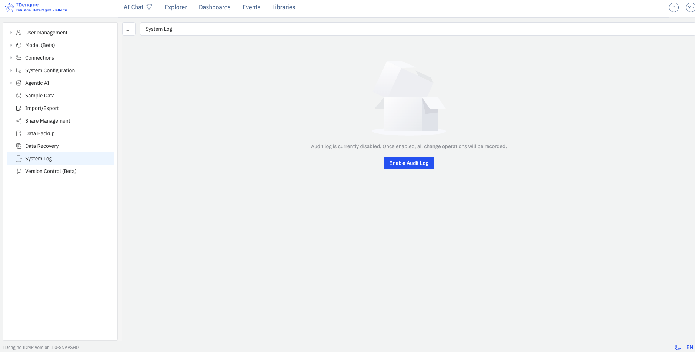
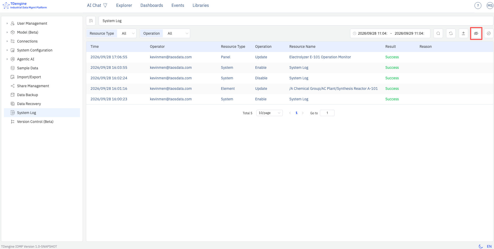
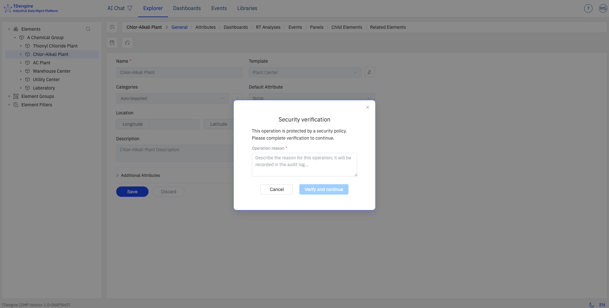

# 14.7 System Log

The System Log records all modifications users make to IDMP system objects. Once enabled, IDMP automatically generates **tamper-proof** operation logs that preserve the actor, time, object, and before/after content of every change, and provides interfaces for querying, filtering, and exporting — for compliance auditing and security traceability.

The feature is designed with reference to industry standards such as `21 CFR Part 11` for the traceability of electronic records, making it suitable for pharmaceutical, food, energy, heavy industry, and other scenarios with strict operation-tracing requirements.

The System Log menu is **always visible** to every user who has the corresponding permission; enabling and disabling the feature are configured on the **Admin Console → System Log** page.

## 14.7.1 Key Features

- **Comprehensive recording:** Covers creation, modification, and deletion of all system objects (elements, templates, connections, users, roles, permissions, system configuration, etc.), as well as key events such as login and logout
- **Tamper-proof:** Once written, logs cannot be edited or deleted; no user, including the super administrator, has permission to modify them
- **Full context:** Each log entry contains the actor, operation time, operation type, object type, object identifier, before/after values of key fields, and source IP
- **Queryable and exportable:** Users with view permission can filter and query by time, keyword, resource type, operation type, and other dimensions, and export the results as a CSV file for offline analysis or archiving by auditors

## 14.7.2 Permission Management

The System Log feature has its own dedicated permissions in two tiers:

- **View System Log:** users with this permission can view, filter, search, and export audit logs
- **Log Configuration:** users with this permission can change System Log configuration, including enabling / disabling it and configuring each control level (such as change management)

Default permissions per role are listed below. The super administrator can adjust the permissions of other users as needed:

| Role                          | View System Log | Log Configuration |
| ----------------------------- | :-------------: | :---------------: |
| Plant Managers and Supervisors |       ✓       |        —        |
| IT/OT System Administrators    |       ✓       |        —        |
| Maintenance Personnel          |       —       |        —        |
| Data Analysts                  |       —       |        —        |
| Operations Personnel           |       —       |        —        |
| Process Engineers              |       —       |        —        |
| Super Admin                    |       ✓       |        ✓        |

:::note
Enabling, disabling, and modifying System Log configuration all require the **Log Configuration** permission, and those operations are themselves written into the audit log.
:::

## 14.7.3 Control Levels

The System Log offers four control levels, with auditing and compliance capability increasing from low to high:

|    Level    | Name                | Description                                                                                                                                                |
| :---------: | ------------------- | ---------------------------------------------------------------------------------------------------------------------------------------------------------- |
| **Level 1** | Baseline            | The initial default state of IDMP; logging is not enabled                                                                                                  |
| **Level 2** | Log & Audit         | The System Log is on; all operation logs are recorded, with no other impact on regular users                                                              |
| **Level 3** | Change Control      | Change management is on; users must fill in a reason for change before saving modifications to designated objects                                          |
| **Level 4** | Review & Approval   | On top of Change Control, adds password verification / e-signature, with optional third-party review integration (planned, not yet released) |

On the **Resource Security Configuration** page you can enable change management for each kind of resource object individually; changes take effect immediately after saving.

## 14.7.4 Enabling the System Log

### First-time Enabling

1. Open **Admin Console → System Log**. The right-hand pane indicates that the System Log is currently disabled.
2. Users with the **Log Configuration** permission see an **Enable Audit Log** button below the notice. Clicking it brings up a second confirmation dialog.
3. After clicking **Confirm**, the change takes effect immediately and the list refreshes — the System Log is now active, and all subsequent audited operations are recorded from this point onward.

:::note
Operations that occurred before the System Log was enabled are not retroactively recorded. It is recommended to enable this feature as early as possible when the system goes into production or when compliance auditing is required.
:::

### System Log Configuration

Once the System Log is on, open **Admin Console → System Configuration → Resource Security Configuration**.

Here a user with the Log Configuration permission can click the edit button to set, for each kind of resource object, whether a reason for change must be submitted. Once this is enabled for a resource type, the corresponding operations on that type of resource must be accompanied by a reason for change.

### Viewing Logs

1. Open **Admin Console → System Log**; the right-hand pane lists the recorded operation logs.
2. Filter and query by resource type, operation type, time range, and keyword.
3. Click the **Select Columns** button to control which fields are displayed (e.g. New Value, Old Value).

### Enabling and Disabling

1. Open **Admin Console → System Log** and click the **Disable Audit Log** button on the right of the toolbar (visible only to users with the **Log Configuration** permission).
   - When disabled, the system no longer records operation logs, but users can still view previously recorded log entries.
   - When re-enabled, the system resumes recording operation logs.

## 14.7.5 Saving Change Reasons

After a resource type is configured to require a reason for change on modification and deletion, performing a key **update or delete** operation on such an object and clicking Save brings up a dialog that requires the user to fill in the reason for this change before proceeding.

The user should describe the business context or motivation for this change — such as "process parameter tuning", "equipment replacement", or "compliance rectification" — and fully describe the specific object and modification performed.

After clicking **Verify and continue**, the system completes the object change and writes the operation to the audit log. In addition to the standard fields listed in [14.7.6 Viewing and Querying](#1476-viewing-and-querying), the log entry also preserves the following:

- **Reason for change:** the full text of the reason entered by the user
- **Before-change state snapshot:** a complete set of the object's attribute values prior to this operation
- **After-change state snapshot:** a complete set of the object's attribute values after this operation

Both snapshots are stored as JSON and may be used for manual rollback of the object when necessary.

:::note

- The dialog with the reason-for-change input appears only while the System Log is on. When it is off, no dialog is shown and nothing is written to the audit log.
- For batch operations (e.g., deleting multiple elements at once), the reason for change is applied uniformly through the operation API to all log entries generated by that batch.

:::

## 14.7.6 Viewing and Querying

Users with the **View System Log** permission can access the log list via **Admin Console → System Log**. The page displays all recorded operation logs in a table, sorted in reverse chronological order.
The log list includes the following fields. Displayed columns can be adjusted via the settings button at the far right of the toolbar:

| Field                  | Description                                                                                                                  |
| ---------------------- | ---------------------------------------------------------------------------------------------------------------------------- |
| **Time**               | Server time when the operation occurred, to the second                                                                       |
| **Operator**           | Username of the logged-in user who performed the operation                                                                   |
| **IP**                 | Client IP address from which the request was issued                                                                          |
| **Operation**          | Create, update, delete, login, logout, etc.                                                                                  |
| **Resource Type**      | Category of the affected object, such as element, template, user, role, system configuration                                 |
| **Resource Name**      | Name or unique identifier of the affected object                                                                             |
| **Old Value**          | Value of the affected fields before this operation                                                                           |
| **New Value**          | Value of the affected fields after this operation                                                                            |
| **Result**             | Success or failure; error information is attached on failure                                                                 |
| **Data Fingerprint**   | Encrypted digest of the log entry's key information, ensuring the original information is complete and has not been modified |

### Filtering and Searching

The log viewing and query page provides a filter bar that supports combining the following dimensions; hover over a cell to view its full content.

- **Time range:** choose a start and end time to quickly locate operations within a specific period
- **Resource type:** dropdown selection, such as element, template, or user
- **Operation:** dropdown selection, such as create, update, or delete
- **Keyword:** fuzzy search within the object identifier or operation details

The filter dropdowns use the same labels as the column headers.

## 14.7.7 Exporting Logs

Click the **Download List** button in the upper-right corner of the log list page. The system exports all logs **matching the current filter conditions** as a CSV file. The export contains all fields shown in the list plus the complete JSON of the change details, making it easy to import into third-party audit tools for further analysis.

:::tip
If the log volume is large, apply time-range and resource-type filters before exporting to reduce the export size and improve processing efficiency.
:::

## 14.7.8 Log Retention and Storage

Audit logs are stored in the TSDB database configured on the IDMP backend. By default, 10 years of historical logs are retained.

## 14.7.9 Security and Compliance Notes

- Users with the **View System Log** permission can access the log list page and perform exports;
- Users with the **Log Configuration** permission can enable, disable, and configure the control level of the System Log;
- Audit logs are written directly by the backend service; no frontend API provides the ability to modify or delete log entries;
- Enabling, disabling, and any change to System Log configuration are themselves recorded in the audit log, so configuration changes are also traceable;
- For compliance auditing scenarios, it is recommended to combine the role and permission controls described in [14.4 User Management](./04-user-management.md) to ensure that each operator can be traced back to a unique individual account, avoiding shared accounts.
