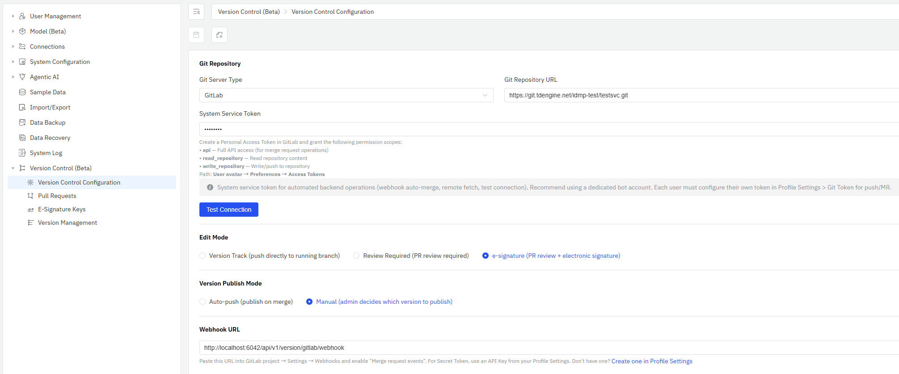
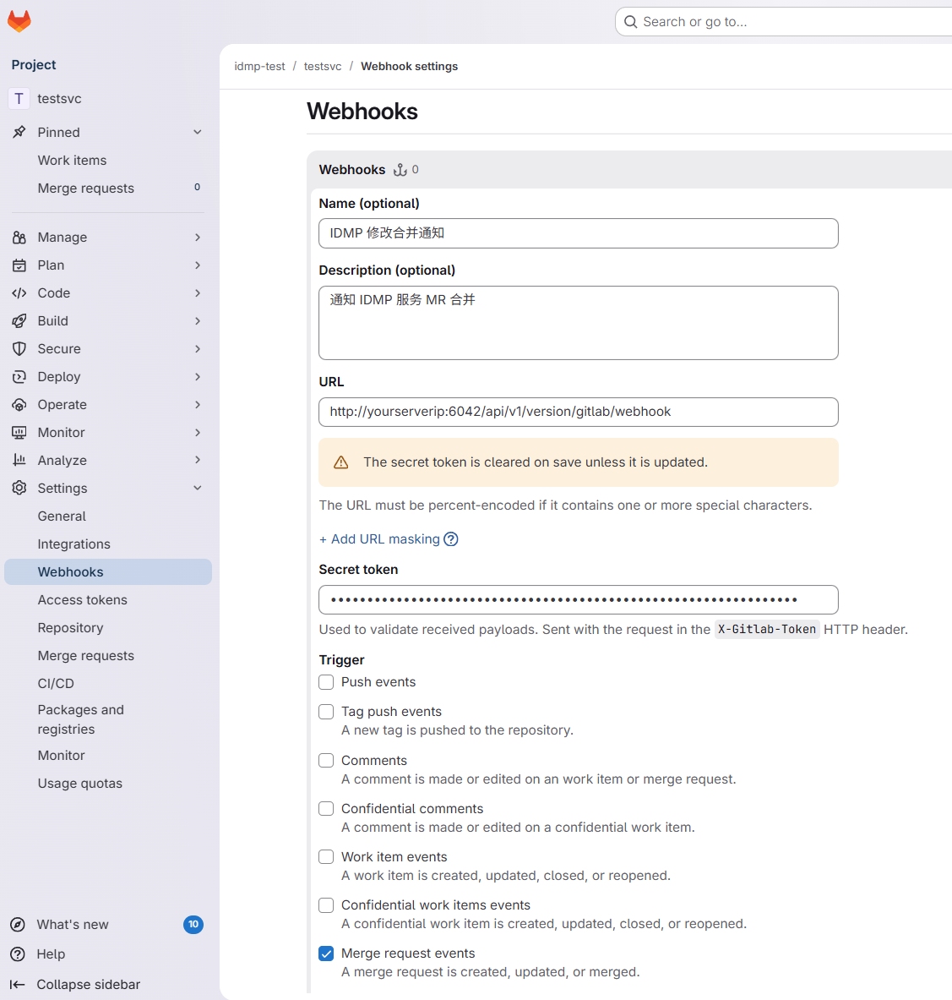
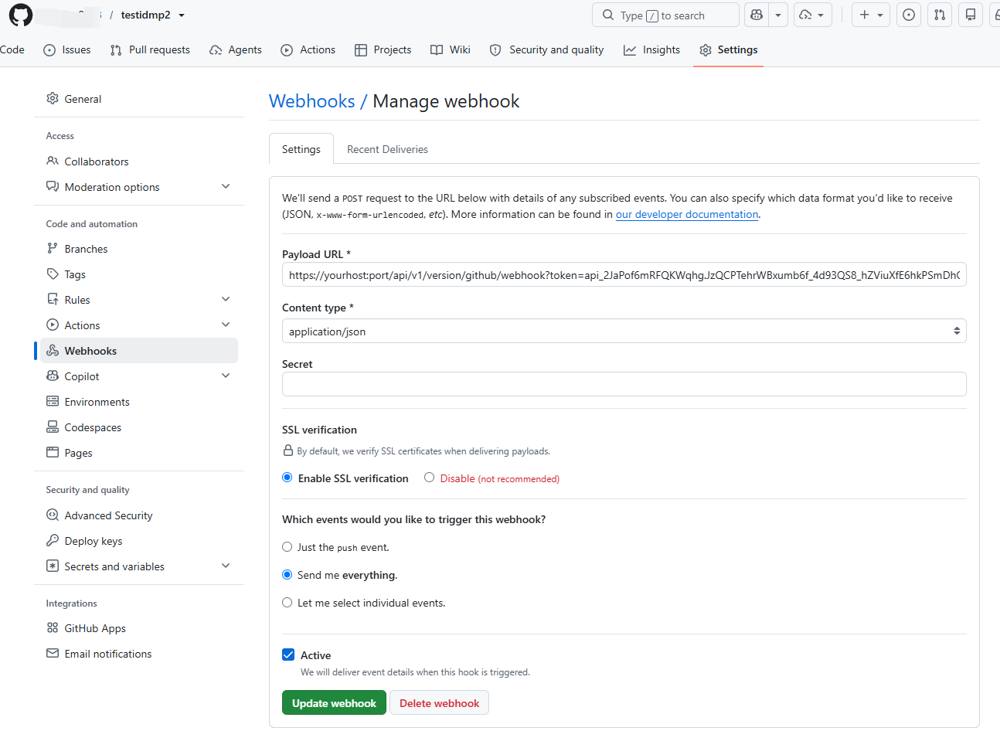

# 14.11.2 Configuring Git Repository

Administrators configure the Git repository connection on the **Management Console → Version Control → Configuration** page.

## Prerequisites

- Have a GitLab or GitHub account
- Have created an empty Git repository for IDMP
- Have generated a Personal Access Token (see permission requirements below)

## Configuration Steps

### 1. Enable Version Control

On the **Management Console → Version Control** page, turn on the **Version Control** toggle.


After enabling, the left menu will show version control submenu items, and the system will begin initializing the Git repository in the background.

### 2. Go to Configuration Page

Click **Management Console → Version Control → Configuration** in the left menu.



### 3. Select Git Server Type

Select **GitLab** or **GitHub** from the **Git Server Type** dropdown.

### 4. Enter Repository URL

Enter the HTTPS address of the repository in the **Git Repository URL** field, for example:

```
https://gitlab.example.com/your-org/idmp-data.git
```

### 5. Enter Access Token

Enter the Personal Access Token in the **System Service Token** field.

import Tabs from '@theme/Tabs';
import TabItem from '@theme/TabItem';

<Tabs>
<TabItem value="gitlab" label="GitLab">

When creating a Personal Access Token in GitLab, grant the following permission scopes:

- **api** — Full API access (for merge request operations)
- **read_repository** — Read repository content
- **write_repository** — Write/push to repository

Path: **User avatar → Preferences → Access Tokens**

</TabItem>
<TabItem value="github" label="GitHub">

When creating a Personal Access Token in GitHub:

- **Classic token**: Grant the **repo** scope (full repository access)
- **Fine-grained token**: Grant **Contents: Read & write** and **Pull requests: Read & write** permissions

Path: **User avatar → Settings → Developer settings → Personal access tokens**

</TabItem>
</Tabs>

:::info System Service Token vs Personal Token
The system service token is used for automated backend operations (webhook auto-merge, remote fetch, test connection). Use a dedicated bot account. For user-initiated push/MR, configure a personal token in **Profile Settings → Git Token**.
:::

### 6. Test Connection

After filling in the details, click the **Test Connection** button. If configured correctly, it will show "Connection successful".

### 7. Save Configuration

Click the **Save** button and enter the administrator password to confirm.

:::info First-Time Save
When saving the Git repository configuration for the first time, IDMP will automatically initialize the remote tracking
for the metadata repository, perform an initial commit, and push all data from the main workspace to the `main` branch
of the remote repository. If the repository URL is changed later, the system will automatically re-execute these
initialization steps.
:::

## Webhook Configuration

After saving the configuration, the page will display the Webhook Callback URL. Configure this URL in the GitLab/GitHub repository's Webhook settings.

<Tabs>
<TabItem value="gitlab" label="GitLab">

1. Copy the **Webhook Callback URL** from the page
2. In GitLab project → Settings → Webhooks, paste the URL
3. Select **Merge request events** as the trigger
4. Use an API Key from your Profile Settings as the Secret Token



</TabItem>
<TabItem value="github" label="GitHub">

1. Copy the **Webhook Callback URL** from the page (the GitHub URL already includes the API Key as a query parameter, in the format `?token=api_xxx`)
2. In GitHub repository → Settings → Webhooks → Add webhook, paste into **Payload URL**
3. Set Content type to **application/json**
4. Select **Let me select individual events** → check **Pull requests**



</TabItem>
</Tabs>

Webhook serves two important roles in version control:

- **Auto-Publish** (Auto-Push mode): After an MR/PR is merged, GitLab/GitHub notifies IDMP via webhook. IDMP automatically pulls the latest version and updates the running system without administrator intervention.
- **Real-Time Notification**: When a reviewer manually merges an MR/PR on GitLab/GitHub, IDMP receives the event via webhook and pushes an SSE notification to the submitter, informing them that their MR has been merged.

:::info Webhook URL Note
The host portion of the auto-generated Webhook URL is taken from the browser's address bar. If GitLab/GitHub cannot directly access that address (e.g., IDMP is deployed on an internal network), replace the host with an address accessible to GitLab/GitHub before configuring the webhook.
:::

## Edit Mode & Publish Mode

The edit mode and publish mode can be set at the bottom of the configuration page. See [Edit Modes & Publish Modes](./01-concepts.md) for details.

## FAQ

**Q: What if the test connection fails?**

- Check that the repository URL is correct (must use HTTPS)
- Check if the token has expired
- Check if the token has sufficient permissions
- Check if the network can reach the Git server

**Q: Can I switch Git server types?**

Yes. After switching, you need to re-enter the repository URL and token, and test the connection again.
