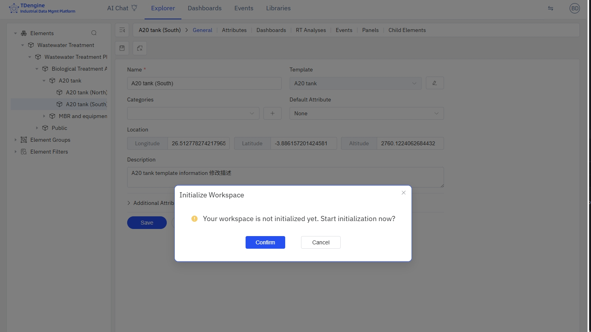
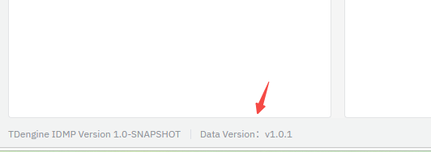
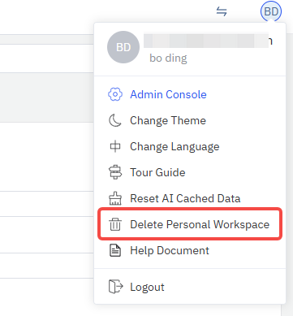
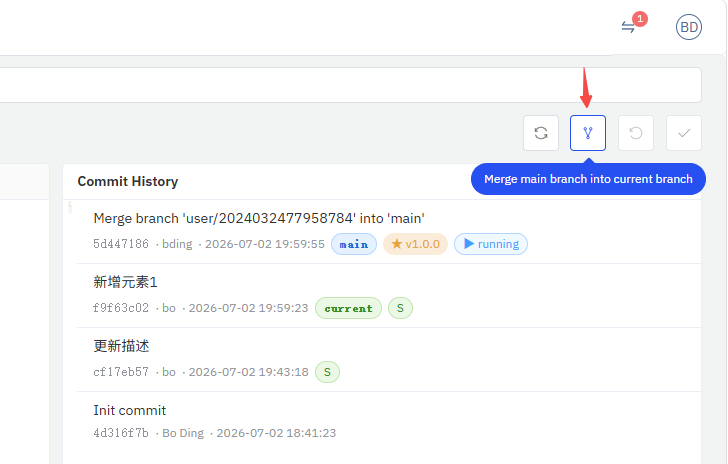

# 14.11.3 Personal Workspace

In **Review Required** or **E-Signature** modes, each user has an independent **Personal Workspace**.
The personal workspace ensures that unreviewed changes do not affect the public view and are not visible to other users.

## What is a Personal Workspace?

A personal workspace is an independent Git branch automatically created by the system for each user. In review modes:

- All user changes are made on the personal branch
- Other users cannot see these changes
- Changes only become visible to everyone after passing MR/PR review and being merged

## Initializing a Personal Workspace

### Trigger

Personal workspaces use a **lazy creation** strategy: they are only triggered when a user first edits a version-controlled object.

For example, when a user performs any of the following operations, the system detects that the workspace is not initialized and automatically triggers creation:

- Creating new elements, templates, panels, etc.
- Modifying element attributes, analysis configurations, etc.
- Deleting UoM, adding categories, etc.

### Initialization Process

1. User clicks the "Save" or "Confirm" button
2. System detects that the personal workspace is not initialized
3. A confirmation dialog appears: "Current workspace not initialized. Initialize now?"
4. After user confirms, a full-screen loading animation is displayed
5. System creates the personal branch and copies data in the background
6. After initialization completes, a "Workspace ready" notification appears in the top-right corner
7. User can now save changes normally



> During initialization, users can continue editing forms on the page, but clicking Save will prompt "Workspace not yet ready."

### Status Indicator

During initialization, a workspace status badge appears next to the avatar in the top-right corner:

- **Initializing**: Spinning icon + "Initializing XXs"
- **Initialization Failed**: Red exclamation mark + error summary; click to retry
- **Ready**: Badge auto-hides



## Deleting a Personal Workspace

If a user needs to return to the public workspace (admin view), they can manually delete their personal workspace.

1. Click the user avatar in the top-right corner
2. Select **Delete Personal Workspace** from the dropdown menu
3. Enter an audit reason to confirm
4. The page automatically refreshes and returns to the public view



:::warning Note
Deleting a personal workspace will lose all uncommitted changes. Make sure you have committed or no longer need these changes before deleting.
:::

## Syncing from Main

When other users' MRs/PRs are merged, your personal workspace may fall behind the main branch. The **Sync button** is available in the top-right corner of the change list page:

- The button shows the number of commits behind the main branch
- Click the button to merge the latest content from main into your personal workspace
- After syncing, you can see changes merged by other users



## Workspace Lifecycle

```text
User's first edit → Auto-create personal workspace → Changes made on personal branch
                                                    ↓
                                        Check-In → Submit MR/PR → Review & Merge
                                                    ↓
                                        Personal workspace retained after merge (may have uncommitted changes)
                                                    ↓
                                        User can manually delete workspace to return to public view
```
