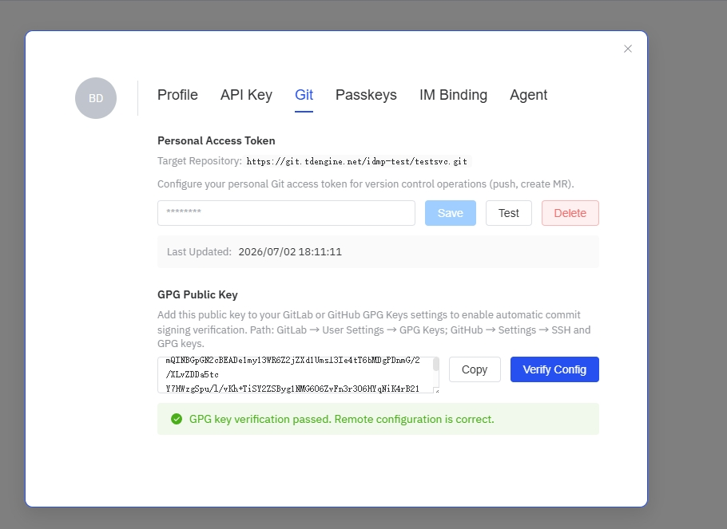
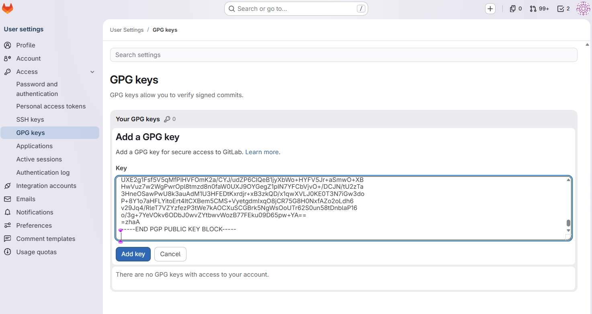

# 14.11.4 Configuring Personal Git Token

In Review Required or E-Signature modes, each user needs to configure their own Git Personal Access Token
for pushing personal branches and creating Merge Requests.

## Why a Personal Token?

- The administrator-configured **system service token** is used for automated backend operations
- User-initiated push and MR creation require a **personal token** to correctly record the committer's identity in Git history
- Personal tokens ensure that each user's commits are traceable and non-repudiable

## Configuration Steps

### 1. Generate a Personal Access Token

Create a personal access token in GitLab or GitHub (permission requirements are the same as for the administrator configuration).

### 2. Open Profile Settings

Click the user avatar in the top-right corner, and select the menu item with the email address from the dropdown to open the Profile Settings dialog.

### 3. Switch to the Git Tab

In the Profile Settings dialog, click the **Git** tab.

### 4. Enter the Token

Paste your Personal Access Token into the input field.

### 5. Test the Token

Click the **Test** button to verify the token's validity. A successful test will show "Connection successful".

### 6. Save

Click the **Save** button to complete the configuration.

## GPG Public Key

In the Git tab, you can see your GPG public key information (if the administrator has generated one for you).

- Click **Copy Public Key** to copy the GPG public key
- Add the public key to GitLab/GitHub's GPG Keys settings to enable automatic signature verification for your commits
- Click **Verify Configuration** to check if the GPG configuration on the remote Git service is correct

> GPG keys are generated by the administrator on the **Management Console → Version Control → E-Signature Keys** page. See [GPG Key Management](./05-gpg-keys.md) for details.

## FAQ

**Q: Can I skip configuring a personal token?**

In Version Track mode, it's not needed. In Review Required / E-Signature modes, Check-In will fail without a personal token.

**Q: What if the token expires?**

Regenerate the token and update it in Profile Settings.

**Q: What if the test connection fails?**

Check that the token has sufficient permissions and has not expired.
