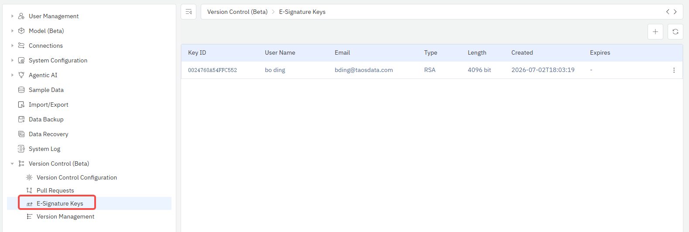

# 14.11.5 GPG Key Management

In **E-Signature** mode, all commits require GPG key signing.
Administrators manage GPG keys on the **Management Console → Version Control → E-Signature Keys** page.

## What is GPG Electronic Signature?

GPG (GNU Privacy Guard) is an electronic signature technology based on asymmetric encryption. In version control:

- Each Check-In automatically signs the commit using the user's GPG private key
- The Git server verifies the signature using the corresponding public key
- Signed commits appear with a "Verified" badge in Git history
- Meets electronic signature requirements of regulations such as FDA 21 CFR Part 11

## Generating GPG Keys

### 1. Go to the Key Management Page

Click **Management Console → Version Control → E-Signature Keys** in the left menu.

### 2. Click the Generate Button

Click the **+** button in the top-right corner to open the Generate Key dialog.

### 3. Select User and Email

- Search for and select the target user in the **Select User** dropdown
- The **Email Address** field will auto-fill with the user's email
- A warning will appear if the user already has a key

### 4. Set Expiration

Choose the key expiration period: Never, 1 year, 2 years, or 3 years.

### 5. Generate

Click the **Generate** button. The system will generate an RSA 4096-bit key pair in the background.

## Viewing and Copying the Public Key

After key generation, the user needs to configure the corresponding public key in GitLab/GitHub.

1. Click the user avatar in the top-right corner → select the menu item with the email address to open the Profile Settings dialog
2. Switch to the **Git** tab
3. Click **Copy Public Key** in the GPG Public Key section
4. Paste the public key into GitLab/GitHub's GPG Keys settings:
   - **GitLab**: User Settings → GPG Keys
   - **GitHub**: Settings → SSH and GPG keys

:::tip
Users can also view and copy their own GPG public key in **Profile Settings → Git** tab.
:::

## Verifying GPG Configuration

After configuring the GPG public key on GitLab/GitHub, users can click the **Verify Configuration** button in Profile Settings
to check whether the GPG configuration on the remote Git service is correct.

## Deleting Keys

:::danger Warning
After deleting a key, historical commits signed with that key will become unverifiable. Proceed with caution.
:::

1. In the key list, click **Delete** on the key row
2. Confirm the delete operation

## Key List

The key list displays the following information:

| Column | Description |
|----|------|
| Key ID | Last 16 characters of the GPG key fingerprint |
| Username | User the key belongs to |
| Email | Email address associated with the key |
| Type | Key algorithm type (RSA) |
| Length | Key length (4096 bit) |
| Created | Key generation time |
| Expires | Key expiration time (empty means never expires) |

## Commit Workflow in E-Signature Mode

After configuring GPG keys, in E-Signature mode:

1. User clicks Check-In on the change list page
2. Fills in the reason for change
3. System automatically signs the commit with the GPG key
4. The check-in dialog displays "This commit will be automatically signed with GPG e-signature"
5. After submission, the commit appears with a "Verified" badge in GitLab/GitHub

