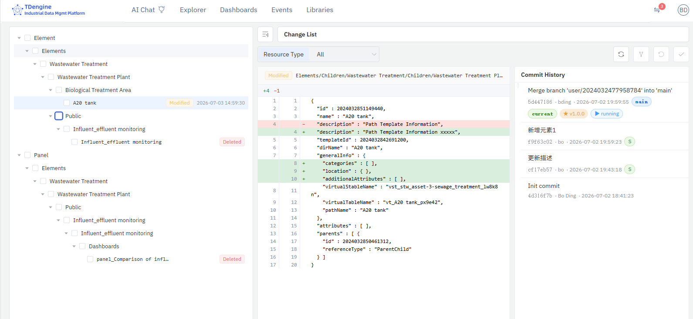

# 14.11.6 Change List & Daily Operations

The change list is the core page for managing uncommitted changes. Whenever a user modifies version-controlled data,
a badge in the top-right corner shows the uncommitted change count; clicking it opens the change list.

## Change Badge

After modifying data, a red badge appears next to the avatar in the top-right corner, showing the number of uncommitted changes.

- The number updates in real time (via SSE push)
- Shows "99" when exceeding 99
- Click the badge to jump directly to the change list page

## Change List Page

The change list page uses a three-panel layout: left change tree, center change detail panel, right commit history panel.

### Left: Change Tree

The change tree groups all uncommitted changes by resource type:

- **Change Types**: Added, Modified, Deleted, Renamed, Untracked
- **Resource Types**: Elements, Element Templates, Event Templates, Dashboards, Panels, Analyses, Connections, Categories, UoM, Enumerations, etc.
- **Checkboxes**: Support single and select-all
- **Context Menu**: Each row supports individual Check-In or Undo

### Top Toolbar

- **Resource Type Filter**: Filter changes by resource type
- **Undo Button**: Batch undo selected changes
- **Check-In Button**: Batch submit selected changes
- **Sync Button** (Review Required / E-Signature mode): Sync latest content from the main branch

### Center: Change Detail Panel

After selecting a change, the center panel displays detailed information:

- **Diff Comparison**: Side-by-side comparison of HEAD version vs working tree version
- **Change Details**: Resource path, change type, modification time

### Right: Commit History Panel

The commit history panel displays the current branch's commit history as a swimlane diagram, with each commit node annotated with badges indicating its role in the version control workflow:

| Badge | Meaning |
|------|------|
| **main** | HEAD of the main branch (latest commit on the public main branch) |
| **current** | HEAD of the current user branch (latest commit in personal workspace) |
| **★ v1.0.0** | Published version tag (published by administrator in Version Management) |
| **▶ running** | Currently running version (the data version currently used by the system) |
| **MR !2** | Merge Request associated with this commit; click to open in GitLab/GitHub |
| **S** | GPG signature badge, indicating the commit has been verified with GPG e-signature |

The swimlane diagram uses different colors to distinguish the main branch line from the user branch line, with connecting lines between nodes showing parent-child relationships.

## Check-In

Check-In submits selected changes to the Git repository.

### Steps

1. Check the change rows to submit in the change list
2. Click the **Check-In** button
3. Fill in the **Reason for Change** (required) in the dialog
4. Click **Submit**

### Reason for Change

- The reason is required and will be used as the Git commit message
- It is also recorded in the audit log
- Write a clear business reason for future traceability

### E-Signature Mode

In E-Signature mode, the check-in dialog displays the hint: "This commit will be automatically signed with GPG e-signature".

## Undo

Undo restores selected changes to the previous version (HEAD).

### Steps

1. Check the change rows to undo in the change list
2. Click the **Undo** button
3. Confirm the undo operation

:::warning Note
Undo is irreversible. After undoing, workspace files are restored to the HEAD version, and all uncommitted changes will be lost.
:::

## Change Type Reference

| Type | Description |
|------|------|
| **Added** | Newly created resource, not yet committed to Git |
| **Modified** | Content of an existing resource has changed |
| **Deleted** | Resource has been deleted but not committed |
| **Untracked** | New file in the workspace, not tracked by Git |
| **Renamed** | Resource has been renamed, showing old and new paths |
