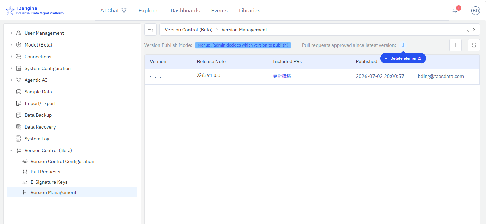
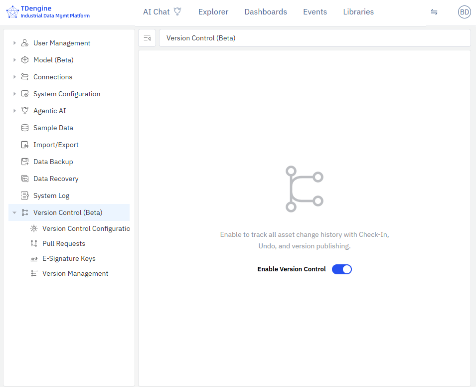

# 14.11.8 Version Publishing Management

Administrators view published versions and manage version publishing on the **Management Console → Version Control → Version Management** page.

## Opening Version Management

Click **Management Console → Version Control → Version Management** in the left menu.

## Page Layout

### Top Status Bar

- **Version Publish Mode**: Displays the current publish mode (Auto-Push / Manual)
- **Pending PR Count**: Number of approved PRs since the latest version
- **Publish Button** (Manual mode): Available when there are pending PRs
- **Refresh Button**: Refresh the version list

### Version List

| Column | Description |
|----|------|
| Version No. | Version identifier (short commit ID or custom version number) |
| Release Note | Version description (the reason for change entered during Check-In) |
| Included PRs | List of MRs/PRs included in this version; clickable links |
| Published At | Version publish time |
| Published By | Person who performed the publish |
| Status | Running / Published |

### Status Descriptions

- **Running**: The currently running version, green badge
- **Published**: Historical published version, gray badge

### Footer Data Version

The bottom of the page displays the current data version number:

- Shows the tag name when a tag exists (e.g., `v1.0.0`)
- Shows the first 8 characters of the commit ID when no tag exists
- Shows "N/A" when not yet generated

## Manual Publish (Manual Mode)

In manual mode, the administrator manually publishes a new version:

1. Confirm that the "Pending PR Count" is greater than 0
2. Click the **+** button in the top-right corner
3. In the dialog, the system auto-generates a version number (modifiable)
4. Enter the administrator password to confirm
5. Click **Publish**

## Auto-Publish (Auto-Push Mode)

In auto-push mode, the system automatically publishes a new version after an MR/PR is merged — no administrator intervention required.

:::info Auto-Publish Failure Handling
If an error occurs during auto-publish, the system does not record the version, and the local repository
is reset to its pre-publish state. The administrator will still see a pending PR count > 0 on the
Version Management page and can click the Publish button to manually retry.
:::

## Version Rollback

The version rollback feature allows the system to be restored to a historical version. It is useful for scenarios such as accidental operations, incorrect bulk changes, or issues discovered after a release. By using rollback, administrators can quickly restore the system to a previously correct state, avoid manual one-by-one recovery, and ensure that the related data, such as index data, remains consistent with the current data version.

Use the following steps:

1. Go to **Management Console → Version Control → Version Management**.
2. In the version list, find the historical version you want to roll back to.
3. Select that version and click **Rollback to This Version**.
4. The system will automatically perform Git revert and synchronize the related data stores and version records.
5. After the rollback completes, the system will create a new version record and audit log, which administrators can view on the Version Management page.
