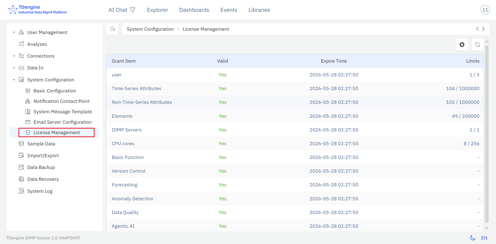
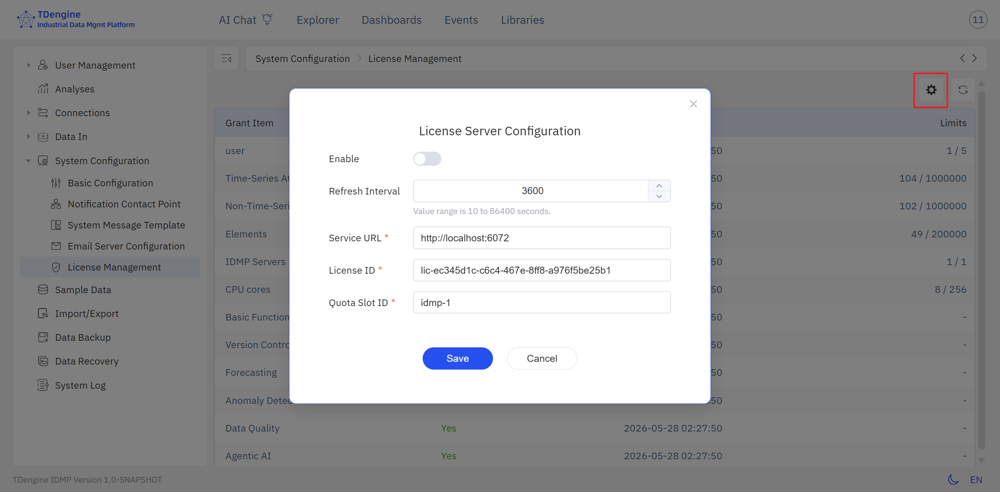

# 14.10 License Management

The License Management page provides a centralized view of the software licenses currently granted to a TDengine IDMP system and their usage, along with an optional configuration entry for ECS (Enterprise Certificate Service) licensing.

## 14.10.1 Opening License Management

A **License Management** item is provided under **Admin Console → System Configuration**. Click it to open the IDMP License Management page.

## 14.10.2 License Contents

The License Management page lists all licensed items granted to the current IDMP system in a table. Each row contains the following 4 columns:

| Column | Description |
|---|---|
| **Licensed Item** | The name of the feature or resource governed by the license |
| **Available** | Whether this item is currently available in the system |
| **Expiration** | The expiration time of this item |
| **Quantity** | The licensed quantity and current usage, in the form `<used>/<limit>` — for example, `1/5` indicates that 5 users are licensed and 1 user currently exists in the system |

The currently listed licensed items include: **Users**, **Time-Series Attributes**, **Non-Time-Series Attributes**, **Elements**, **IDMP Clusters**, **CPU**, **Core Features**, **Version Control**, **Data Forecasting**, **Anomaly Detection**, **Data Quality**, **Agentic AI**, and others.

## 14.10.3 ECS License Configuration

The toolbar at the top right of the License Management page provides a **Configure** button. Clicking it opens the **License Service Configuration** dialog with the following options:

| Field | Description |
|---|---|
| **Enable ECS Licensing** | Toggle that controls whether ECS licensing is enabled |
| **Refresh Interval** | How often the client pulls license information from the ECS server |
| **License Server URL** | The server URL of the ECS licensing service |
| **License ID** | The license identifier issued by ECS |
| **Quota ID** | The quota identifier associated with this license |

## 14.10.4 Licensing Models

- **ECS licensing disabled** (default): the IDMP system automatically obtains its software license from a TSDB system on the same network segment. This is the licensing model used by most IDMP users today.
- **ECS licensing enabled**: an independent IDMP software license is delivered centrally by the ECS service. This supports running multiple IDMP environments and managing per-environment quota.

TDengine has launched an independent licensing system for IDMP, including ECS (Enterprise Certificate Service) and CLS (Customer License Service).

For information on purchasing an independent IDMP software license, or for any related questions, please contact TDengine sales.
