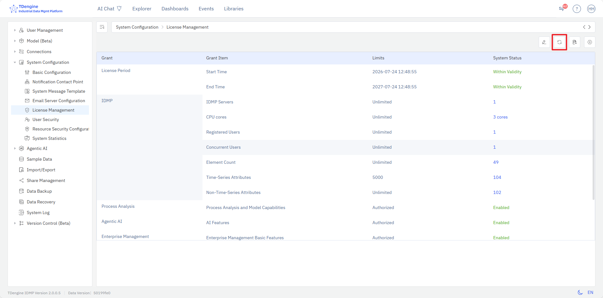

# 14.12 License Management

## 14.12.1 IDMP Tag Overview

A **Tag** is one of the core variables in IDMP software product pricing. A Tag represents the time-series data stream of a single observation metric. It typically consists of four information items: timestamp, observed value, quality flag, and annotation. Examples include the outlet temperature of a piece of equipment, the steam pressure of a production line, or the bearing vibration of a fan — each observation metric counts as one Tag.

The IDMP system's definition of Tags is fully consistent with the PI Tag (also known as PI Point) of the OSIsoft PI System, following the same counting principles:

- **Only observation metrics are counted**: one observation metric stream counts as one Tag. Ancillary information such as quality flags and annotations is not included.
- **Only persistently stored data is counted**: only time-series data streams saved in the TSDB database count as Tags. Data that is not persisted, such as attribute associations and derived attributes generated by calculation expressions, is excluded from the Tag count.
- **Static descriptive information is not counted**: static metadata of observation metrics, such as limits, types, locations, and identifiers, is excluded from the Tag count.
- **Only element time-series data is counted**: all internal administrative time-series data of the IDMP system (such as audit logs and operation records) is excluded from the Tag count.

**Note that IDMP Tags and TSDB time series counts are two completely independent statistical measures.** TSDB counts time series at the database level, including all non-timestamp columns of time-series data tables (including quality flags and descriptive information) in its calculation. As a result, the TSDB time series count is typically significantly larger than the IDMP Tag count. IDMP supports two software license management models: it can use the software license of a TSDB system on the same network segment directly, or it can obtain an independent IDMP software license through TDengine's ECS licensing service.

## 14.12.2 License Management Page

The License Management page provides a centralized view of the current software license and usage status of the TDengine IDMP system.

## 14.12.3 Opening License Management

A **License Management** item is provided under **Admin Console → System Configuration**. Click it to open the IDMP License Management page.

## 14.12.4 License Contents

The License Management page lists all licensed items of the current IDMP system in a table. Each row contains the following 4 columns:

| Column                      | Description                                          |
| --------------------------- | ---------------------------------------------------- |
| **License Type**      | The feature or resource type governed by the license |
| **Licensed Item**     | The name of the feature or resource under license    |
| **Licensed Quantity** | The licensed quantity                                |
| **System Status**     | The current usage status of the system               |

The software license information listed on the page includes:

- **License Period**: the start and end time of the current license
- **IDMP Core Features**: server node count, CPU core count, registered users, concurrent users, elements, time-series Tags, non-time-series attributes
- **Process Analytics**: process analysis and modeling capabilities
- **Agentic AI**: AI agents and built-in AI applications
- **Enterprise Management**: enterprise management core features, version control and e-signature
- **Business Applications**: product quality analysis
- **High Availability**: high-availability architecture, such as cluster deployment

## 14.12.5 ECS License Configuration

The toolbar at the top right of the License Management page provides a **Configure** button. Clicking it opens the **License Service Configuration** page, where you can choose between commercial and free license configuration:

For users of TDengine Free Edition, you can apply for a license extension when the free license is about to expire. You will need to confirm that you have read and agree to the *TDengine Free Edition User Agreement*, check the free license extension option, fill in a brief survey, and click Confirm. The system will then automatically generate a new free license to ensure continued use.

For users of TDengine Commercial Edition, you can configure the CLS access address. The system will automatically refresh the activation code of the current IDMP instance (used to apply for a commercial license code). Enter the commercial license code obtained from TDengine and click Confirm to complete the license update.

After completing the license update, return to the License Management page and click the refresh button in the top-right toolbar to obtain the latest license status.

## 14.12.6 Licensing Model Description

TDengine has launched a new TDengine software license management system covering both IDMP and TSDB. Users need to install CLS in the TDengine deployment environment, which interacts with the cloud-based ECS through online or offline file exchange to activate and manage licenses for local TDengine instances. This model supports multiple slots, meaning a single license can deploy multiple IDMP instances with quota management across different instances.

- ECS: Enterprise Certificate Service, TDengine's cloud-based license management server.
- CLS: Customer License Service, which is deployed by default when installing TDengine software. It provides license management services for local TDengine instances. CLS offers a web-based interface to help system administrators perform license activation and slot management for multiple locally deployed TDengine instances.

TDengine CLS can be deployed on a local network and exchange information with the cloud-based ECS through offline key files. Locally deployed IDMP instances need to periodically interact with CLS to confirm the current system license status. CLS is an extremely lightweight service; it is recommended to deploy the CLS module in the same environment as IDMP.

Please note that under this licensing model, the IDMP software license is completely independent from TSDB.
