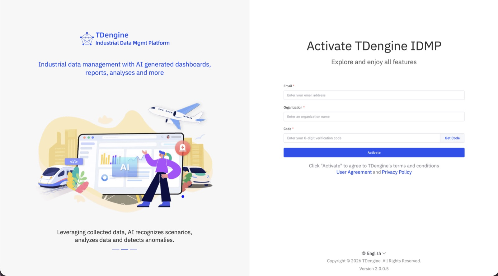
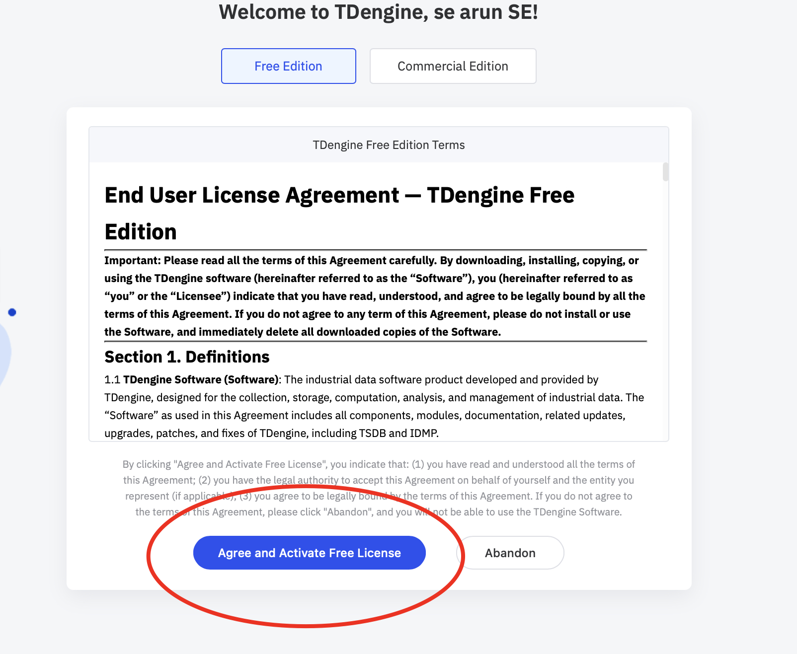

# 14.13.1 TDengine All-in-One Installation on Linux

This guide describes how to deploy TDengine All-in-One in host mode on Linux.

**Watch TDengine Tutorial Videos:** [**Linux Installation Video**](https://www.youtube.com/watch?v=Jz-ojTF--kQ&list=PLQ3OTMvx-LOQ&index=6)

## 14.13.1.1 Environment Requirements

Before deployment, ensure that the target server meets the following requirements.

**Software requirements:**

- Ubuntu for host deployment
- Linux kernel `3.10.0-1160` or later
- `glibc 2.28` or later
- Stable internet access

**Recommended configuration:**

| Resource | Recommended |
| --- | --- |
| CPU | 12 cores |
| Memory | 16 GB RAM |
| Storage | 500 GB available disk space |

Run all installation commands as `root`.

## 14.13.1.2 Deploy TDengine All-in-One

Run the following command as `root`:

```bash
curl -fsSL https://downloads.taosdata.com/apex/install.sh | bash -s -- -m apex
```

The command downloads the Apex deployment tool and starts the deployment process. During deployment, select the All-in-One option to deploy the complete TDengine platform.

If the deployment exits unexpectedly, restart it with the following command:

```bash
~/.apex/deploy-scripts/linux/deploy.sh
```

## 14.13.1.3 Troubleshooting

If deployment is not successful, verify the following:

- The installation was run as `root`.
- The server has internet access to download installation packages.
- Required ports are available and not blocked by the firewall.

**Note:** If you encounter an issue related to the log files, stop IDMP and
delete the following directory:

```text
/var/log/taos
```

Then rerun the deployment command above.

## 14.13.1.4 Access and Activate IDMP

After deployment completes successfully, open IDMP in a browser:

```text
http://localhost:6042
```

If you access the service from another machine, replace `localhost` with the host name or IP address of the server where TDengine is installed.

Enter your email address, organization name, and verification code to activate IDMP.



For the Free Edition, review the license agreement and select **Agree and Activate Free License**.



**Watch TDengine Tutorial Videos:** [**TDengine Tutorial Videos**](https://www.youtube.com/playlist?list=PLQ3OTMvx-LOQ)
