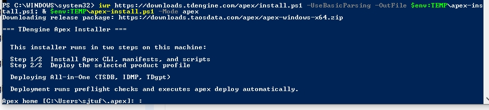

# 14.13.2 TDengine All-in-One Installation on Windows

This guide describes how to deploy TDengine All-in-One in host mode on a Windows server.

**Watch TDengine Tutorial Videos:** [**Windows Installation Video**](https://www.youtube.com/watch?v=4nW4bA9UEJc&list=PLQ3OTMvx-LOQ&index=5)

## 14.13.2.1 Environment Requirements

Before deployment, ensure that the target server meets the following requirements.

**Software requirements:**

- Windows 10 SP3, Windows 11, or later
- Windows Server 2019 or later
- Stable internet access

**Recommended configuration:**

| Resource | Recommended |
| --- | --- |
| CPU | 12 cores |
| Memory | 16 GB RAM |
| Storage | 500 GB available disk space |

Open PowerShell as Administrator before starting deployment.

## 14.13.2.2 Deploy TDengine All-in-One

Run the following command in PowerShell as Administrator:

```powershell
iwr 'https://downloads.taosdata.com/apex/install.ps1' -UseBasicParsing -OutFile "$env:TEMP\apex-install.ps1"; & "$env:TEMP\apex-install.ps1" -Mode apex
```

When the deployment prompt appears, press Enter to continue the installation.



## 14.13.2.3 Troubleshooting

If deployment is not successful, verify the following:

- PowerShell was run as Administrator.
- The server has internet access to download installation packages.
- Required ports are available and not blocked by Windows Firewall.

**Note:** If you encounter an issue related to the log files, stop IDMP and
delete the log directory, for example:

```text
C:\TDengine\log
```

Then rerun the deployment command above.

## 14.13.2.4 Access and Activate IDMP

After deployment completes successfully, open IDMP in a browser:

```text
http://localhost:6042
```

If you access the service from another machine, replace `localhost` with the host name or IP address of the server where TDengine is installed.

Enter your email address, organization name, and verification code to activate IDMP.


For the Free Edition, review the license agreement and select **Agree and Activate Free License**.


**Watch TDengine Tutorial Videos:** [**TDengine Tutorial Videos**](https://www.youtube.com/playlist?list=PLQ3OTMvx-LOQ)
