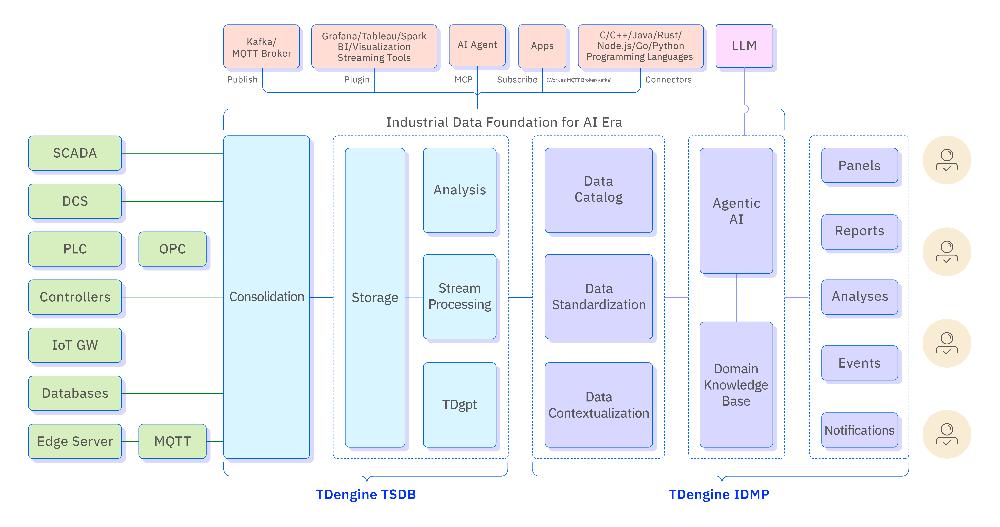

# 1 Introduction

## 1.1 What is TDengine IDMP

TDengine IDMP (Industrial Data Management Platform) is an AI-native platform designed to manage, analyze, and generate insights from industrial operational data.

It works together with TDengine TSDB, a high-performance distributed time-series database that stores and processes large volumes of time-series data generated by sensors, devices, and control systems.

TDengine IDMP builds on top of this time-series foundation and provides higher-level capabilities for industrial data management, including:

- industrial data modeling based on elements and attributes
- contextualization of raw sensor data
- standardization of industrial data across systems
- visualization and dashboards
- event-based operational analysis
- real-time analytics
- AI-powered insight generation

Through these capabilities, IDMP enables organizations to transform raw operational signals into structured information that can be used for monitoring, analysis, optimization, and decision-making.

Unlike traditional monitoring tools that focus primarily on dashboards, TDengine IDMP is designed to help engineers and operators understand operational behavior and identify insights directly from industrial data.

IDMP is a data management and analytics platform, not a complete industrial IoT platform. It does not provide device connectivity management, control command dispatch, or firmware updates — but it integrates cleanly with platforms that do. It is also not a manufacturing execution system; it does not manage personnel, maintenance work orders, inventory, or production scheduling.

TDengine IDMP's scope is deliberate: to be the most capable platform for managing, contextualizing, standardizing, visualizing, analyzing, and deriving intelligence from industrial time-series data.

---

## 1.2 Why Industrial Data Foundations Matter in the AI Era

Industrial systems generate enormous volumes of data — temperatures, pressures, flow rates, vibration signals, energy consumption, equipment states — sampled at high frequency from thousands or millions of measurement points. At first glance, this looks like a wealth of information. In practice, most of it goes underutilized. The raw signals exist in isolation, produced by heterogeneous systems with different naming conventions, different units, and no shared understanding of what the data means.

AI has the potential to change industrial operations profoundly. But AI cannot reason about raw, decontextualized signals. A vibration reading of 4.7 mm/s means nothing to an AI system unless it knows that this reading belongs to a specific motor, on a specific production line, operating under a specific load condition, in the context of a batch that started three hours ago. The more fundamental the question — "Why did output drop yesterday?" or "Which compressor is most likely to fail next week?" — the more the AI depends on structured, contextualized, semantically rich data to produce a useful answer.

This is what makes industrial data management platforms essential in the AI era. AI will replace many software tools — report generators, scheduling assistants, form-filling workflows. But it cannot replace the infrastructure that collects, organizes, and maintains the context around industrial data. Whoever controls that data foundation will shape what AI can do in the industrial world.

The shift is already underway. Traditional industrial software put visualization at the center — the goal was to display the current state of operations on a screen. In the AI era, the goal is different: to transform operational data into understanding. That requires not just storing data, but organizing it into a form that humans and AI systems can both navigate and reason about. Industrial data platforms are the layer that makes this possible.

---

## 1.3 TDengine Architecture Overview

TDengine is built on two complementary components that together form a complete industrial data foundation.

**TDengine TSDB** (Time-Series Database) is the data infrastructure layer. It handles real-time ingestion from industrial gateways, PLCs, SCADA systems, IoT devices, and other sources. It stores time-series data at scale — supporting billions of data points across millions of measurement series — and delivers high-performance queries with millisecond-level responsiveness. TDengine TSDB also includes a built-in stream processing engine that enables real-time computation over incoming data streams, without the need for a separate streaming platform.

**TDengine IDMP** is the data semantics and intelligence layer. It sits on top of TSDB and provides the organizational structure, business context, and analytical intelligence that raw time-series storage cannot. IDMP does not store time-series data itself — it reads from TSDB (or another connected time-series database). What it does store and manage is the asset model: the elements, attributes, relationships, templates, and metadata that give the time-series data meaning.

Together, the two components address the three layers that any complete industrial data foundation must provide:

| Layer | Capability | Component |
|---|---|---|
| Data Infrastructure | Real-time ingestion, high-throughput writes, scalable storage, high-performance queries | TDengine TSDB |
| Data Semantics | Asset modeling, data contextualization, standardization, event management | TDengine IDMP |
| Intelligence | Real-time analytics, AI-generated insights, natural language queries, anomaly detection, forecasting | TDengine IDMP + AI |

The platform is designed to be open. It exposes an MCP (Model Context Protocol) interface so AI agents can access industrial data directly. It supports REST API, JDBC, ODBC, and client SDKs in Java and Python. Data can flow outward through Kafka, MQTT, and data subscription interfaces, so downstream AI systems, BI tools, and third-party applications can consume it in real time. This openness ensures that TDengine can serve as a hub in a broader industrial AI ecosystem rather than a closed silo.

---

## 1.4 How IDMP Relates to TDengine TSDB

TDengine TSDB is a powerful time-series database, but a database alone is not enough for industrial operations. Even with billions of stored data points and fast query performance, a raw database cannot tell you which measurement belongs to which piece of equipment, what its engineering unit is, what its normal operating range is, or what it means when the value exceeds a threshold. It cannot organize equipment into a hierarchy, standardize naming across sites, or automatically detect an anomaly and notify the responsible engineer.

TDengine IDMP completes the picture. It provides the metadata management, business context, and analytical capabilities that TSDB deliberately leaves out of scope. When IDMP connects to TSDB, it can automatically synchronize the asset topology — if a new device is added or a configuration changes in TSDB, IDMP updates the asset hierarchy to reflect it. This keeps the data catalog accurate without manual reconciliation.

It is worth being clear about the boundary between the two systems. IDMP does not store time-series data. Every query for a measurement value, every trend chart, every real-time analysis result — all of this data is retrieved from TSDB at query time. IDMP stores only the structural and contextual information: the element tree, attribute definitions, metadata, templates, event records, and analysis configurations. This separation means that adding IDMP to an existing TDengine TSDB deployment is non-destructive and does not duplicate data.

IDMP is designed primarily for use with TDengine TSDB, where the integration is deepest and most efficient. Connections to other time-series databases are also supported.

---

## 1.5 Comparison with Traditional Historians

Industrial data historians have been the standard for operational data management for decades. The most widely deployed is the **AVEVA PI System**, which consists of several components: the PI interface/connector for data ingestion, the PI Data Archive for time-series storage, the PI Asset Framework (AF) for asset modeling, and PI Vision for visualization.

Functionally, **TDengine TSDB + IDMP maps directly to this stack**: TDengine TSDB corresponds to PI interface/connector + PI Data Archive, and TDengine IDMP corresponds to PI Asset Framework + PI Vision. Users familiar with PI System will recognize the core concepts — asset hierarchies, attributes, event frames, templates — and find that IDMP implements them on a modern, AI-ready architecture.

The key differences reflect how the technology landscape has changed since traditional historians were designed:

| Capability | Traditional Historians (e.g., PI System) | TDengine TSDB + IDMP |
|---|---|---|
| AI integration | Limited; requires third-party tools | Native; Zero-Query Intelligence, Chat BI |
| Event rule | Manual configuration by OT engineers | Manual or AI-assisted; LLM can generate rules based on collected data |
| Visualization | Display-focused | Insight-focused; AI generates and recommends panels |
| Advanced analytics | Limited; requires third-party tools | Built-in batch analysis, forecasting, anomaly detection, imputation, clustering, regression, and more |
| Scale | Typically up to one million of tags | Designed for billions of data points |
| Data flow | Primarily inward (collect and store) | Bidirectional; data subscription allows real-time outflow to downstream systems |
| Openness | Proprietary interfaces; limited export | REST API, JDBC, ODBC, Kafka, MQTT, MCP, open SDKs |
| Deployment | Primarily Windows | Linux, containers, VMs, private cloud, cloud-native |

The current limitation of TDengine compared to mature historians is in data source connectivity. PI System supports a very wide range of industrial interfaces and protocols built up over decades. TDengine currently supports OPC-UA, OPC-DA, and MQTT natively, with additional sources supported through TDengine TSDB's data ingestion framework. This gap is narrowing with each release.

For organizations evaluating a migration from PI System or another historian, the functional mapping is close enough that existing asset models and analysis logic can generally be re-expressed in TDengine IDMP without fundamental redesign.

---

## 1.6 Core Concepts

Understanding TDengine IDMP begins with a small set of core concepts that appear throughout the platform. These concepts form the vocabulary of the system, and every feature — from modeling to visualization to AI insights — is built on top of them.

### 1.6.1 Elements (Assets)

An **element** is the fundamental unit of the asset model. Every node in the asset tree is an element. Elements represent physical or logical entities: a sensor, a motor, a production line, a plant, a city, a business unit — anything that is meaningful to the operation and whose data you want to organize and track.

Elements are arranged in a tree hierarchy. Each element can have zero or more child elements, and every element except the root has a parent. This hierarchy mirrors the real-world structure of the operation: a wind farm contains turbines, each turbine contains subsystems, each subsystem contains individual sensors. Navigating the tree is how users explore the operation and locate the data they need.

Each element carries its own set of attributes, analyses, panels, and dashboards. It is the organizational anchor for everything else in the system.

### 1.6.2 Attributes

An **attribute** is a property of an element. Attributes represent the individual data dimensions associated with an asset — its temperature, its operating state, its power output, its geographic location, its rated capacity, and so on.

Attributes can be of different kinds. Some are static configuration values stored directly in IDMP (such as a motor's rated power or an asset's installation date). Others are dynamic, linked to live time-series data in TSDB through a data reference. Still others are derived — computed by a real-time analysis and written back as the result. Every dynamic attribute has configurable metadata: engineering unit, display unit, decimal precision, upper and lower limits, and target value.

### 1.6.3 Time Series

**Time series** are the streams of timestamped measurement values stored in TDengine TSDB. They are the raw data produced by sensors, instruments, and control systems — thousands or millions of individual data points arriving every second.

If you come from an OT background, you may be more familiar with the term **tag**. A tag — as used in PI System, SCADA systems, DCS platforms, and most industrial historians — is exactly the same concept: a single named measurement point that produces a continuous stream of timestamped values. The terms are interchangeable. TDengine uses "time series" to align with modern data terminology, but every tag in your existing system corresponds directly to one time series in TDengine TSDB.

In IDMP, time series are not managed directly. Instead, they are accessed through the attributes of elements. When an attribute is linked to a time-series data reference, IDMP retrieves the values from TSDB on demand — for trend charts, analyses, AI queries, and any other operation that needs the underlying data. This indirection is intentional: it keeps the semantic layer (IDMP) cleanly separated from the storage layer (TSDB).

### 1.6.4 Contextual Data

**Contextual data** is the metadata that gives time-series values meaning. A raw sensor reading — "42.7 at 14:23:07" — is not useful without context. Contextual data answers the questions: What is being measured? Where? Under what conditions? To what standard?

In IDMP, contextual data is attached to elements and their attributes. It includes descriptive information (what is this element, what does this attribute represent), physical dimensions (engineering unit, display precision, upper and lower limits, target value), and classification tags (category, location, organizational unit, operational condition). Contextual data is also what enables the AI features of IDMP: the system uses this structured business context to understand the operational scenario and generate relevant analyses and insights.

### 1.6.5 Events

An **event** is a discrete operational occurrence that has a defined start time, an end time, a duration, a severity level, and associated data captured at the time it occurred. Events are the bridge between continuous time-series data and discrete operational knowledge.

Events in IDMP are generated by real-time analyses. When an analysis detects a condition — a threshold breach, a process deviation, the start or end of a production batch — it creates an event record that captures not just the occurrence but the relevant attribute values and computed results at that moment. Events can require acknowledgment, can trigger notifications to responsible personnel, and can be browsed, compared, and analyzed after the fact.

This concept, known as Event Frames in the PI System, is one of the most powerful ideas in industrial data management. It converts continuous sensor streams into structured, named operational episodes that both engineers and AI systems can reason about: "How many compressor surge events occurred last quarter?" "Which batches deviated most from the target temperature profile?" "What happened in the 10 minutes before the motor failed?"

### 1.6.6 Panels

A **panel** is a single visualization component — a chart, a gauge, a table, a status display — that presents data from one or more element attributes. Panels are the building blocks of all visualization in IDMP.

IDMP supports a wide range of panel types: trend charts, bar charts, pie charts, gauge charts, bar gauges, scatter charts, stat displays, state timeline charts, state history charts, tables, asset list tables, event list tables, event trend charts, map charts, and rich text panels. Each panel type is suited to different kinds of data and different analytical questions.

Panels can be created manually, or they can be generated automatically by the AI engine based on the data and context of an element.

### 1.6.7 Dashboards

A **dashboard** is a collection of panels organized into a single view. Dashboards provide a coherent, structured overview of an element or a group of elements — combining trend charts, gauges, tables, and other panel types into a unified operational picture.

Each element in IDMP can have multiple dashboards, each organized for a different purpose or audience: one for operators monitoring real-time status, another for engineers performing root-cause analysis, another for managers reviewing daily KPIs. Dashboards can be shared, exported as scheduled reports, and embedded in external web applications.

Like panels, dashboards can be created manually or generated automatically by the AI engine.

### 1.6.8 Insights

**Insights** are the AI-generated analytical outputs that IDMP produces from the data and context of an element. Insights go beyond displaying data — they interpret it.

The insight engine in IDMP can automatically detect the application scenario of an element (a wind turbine, a wastewater treatment tank, a logistics fleet) based on the structure and content of its data. From that understanding, it generates the panels, real-time analyses, and summary reports most relevant to that scenario — without the user needing to configure anything. It can also answer natural language questions about the data, detect anomalies, generate forecasts, impute missing values, and perform root-cause analysis.

Insights are the layer where the industrial data foundation connects to the intelligence that justifies building it.

### 1.6.9 Templates

A **template** defines a reusable standard structure for an asset class or operational pattern. Instead of configuring each element, attribute, analysis, panel, or dashboard from scratch, you define the structure once in a template and apply it consistently across all assets of the same type.

Templates exist at every level of the platform: element templates define the standard set of attributes for an asset class (e.g., Pump, Meter, Boiler); attribute templates define individual reusable measurement definitions; analysis templates capture standard detection logic; panel and dashboard templates standardize visualizations; event and notification templates standardize how operational occurrences are named and reported.

Templates are what make large-scale industrial deployments manageable. When you update a template, the change propagates to all elements derived from it — ensuring consistency across hundreds or thousands of assets without manual rework.
