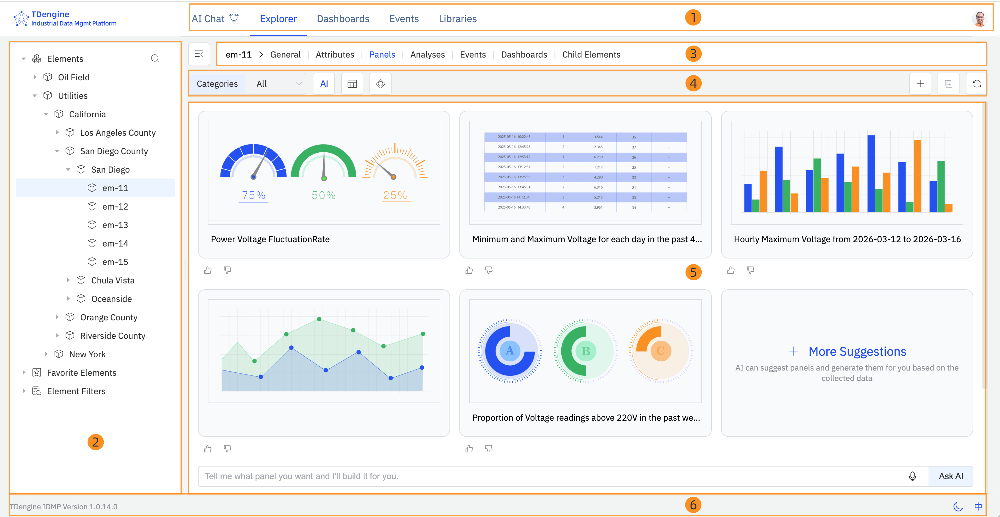
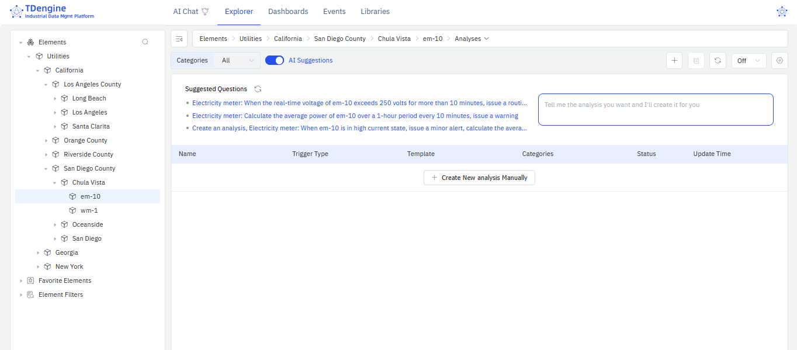

# 2.4 Exploración de las funcionalidades de IDMP

Tras activar TDengine IDMP, siga los pasos de esta sección para familiarizarse con la interfaz y explorar las funcionalidades clave del sistema.

## 2.4.1 Tour guiado de la interfaz

El Tour guiado se abre automáticamente en su primer inicio de sesión. Le conduce por las principales áreas de la interfaz de IDMP. Haga clic en **Siguiente** para avanzar por cada paso. Puede cerrarlo en cualquier momento haciendo clic en **X**. Para volver a iniciar el tour más tarde, haga clic en su avatar en la parte superior derecha y seleccione **Tour guiado**.

La interfaz está organizada en las siguientes áreas:

**1. Barra de navegación superior**

La barra de navegación superior ocupa todo el ancho de la página. A la izquierda se encuentra el logotipo de TDengine. En el centro están los cinco módulos principales:

- **Chat IA** — Haga preguntas sobre sus datos industriales en lenguaje natural.
- **Explorador** — Explore y gestione su jerarquía de activos, atributos, paneles, análisis y eventos.
- **Dashboards** — Vea y gestione dashboards en todos los elementos.
- **Eventos** — Examine, filtre y analice eventos en todo el sistema.
- **Bibliotecas** — Gestione recursos compartidos como plantillas de elementos, plantillas de eventos, enumeraciones, unidades de medida y más.

En el extremo derecho está su **avatar**. Haga clic en él para gestionar su perfil, acceder a la administración del sistema o iniciar el Tour guiado.

**2. Panel izquierdo**

El panel izquierdo muestra la estructura de árbol del módulo activo. En el **Explorador**, muestra tres secciones:

- **Elementos** — La jerarquía de activos. Haga clic en la flecha para expandir un nodo; haga clic en el nombre del elemento para seleccionarlo. Use el icono de búsqueda para encontrar elementos por nombre.
- **Elementos favoritos** — Elementos que ha marcado como favoritos para un acceso rápido.
- **Filtros de elementos** — Filtros de búsqueda guardados que le permiten recuperar rápidamente un conjunto específico de elementos.

**3. Barra de pestañas de contexto**

La barra de pestañas de contexto aparece a la derecha del panel izquierdo. Muestra el nombre del objeto seleccionado actualmente, seguido de un conjunto de pestañas que representan las vistas disponibles para ese objeto. Cuando se selecciona un elemento, las pestañas son: **General**, **Atributos**, **Paneles**, **Análisis**, **Eventos**, **Dashboards** y **Elementos hijos**. Haga clic en una pestaña para cambiar de vista. En el extremo izquierdo de la barra de pestañas de contexto hay un icono de colapso para ocultar el panel izquierdo y maximizar el área de trabajo.

:::note
El Tour guiado integrado denomina esta área como "Barra de ruta".
:::

**4. Barra de acciones**

Debajo de la barra de pestañas de contexto hay una fila de controles. El lado izquierdo normalmente muestra menús desplegables de filtro (como **Categorías**) y botones de alternancia de vista (como el botón de sugerencias de **IA** o la alternancia entre vista de cuadrícula y lista). El lado derecho muestra iconos de acción, incluido **+** para agregar un nuevo elemento y un botón de actualización.

**5. Área de trabajo principal**

El área principal debajo de la barra de acciones muestra el contenido de la pestaña seleccionada actualmente: detalles del elemento, listas de atributos, paneles, eventos, etc. El contenido se puede ver y editar directamente en esta área.

**6. Barra de estado**

La barra de estado se extiende a lo largo de la parte inferior de la página. El lado izquierdo muestra la versión actual de IDMP. El lado derecho tiene un **selector de tema** (modo claro/oscuro) y un **selector de idioma**.

## 2.4.2 Ver información del elemento

Los siguientes pasos utilizan el escenario **Utilities** (Servicios públicos) como ejemplo. Si no lo cargó durante la activación, vaya a **Consola de administración** > **Datos de muestra** y cárguelo antes de continuar.

1. En el panel izquierdo, haga clic en **Elementos**. Los elementos del escenario Utilities aparecen en una jerarquía de árbol.
2. Seleccione **Utilities** > **California** > **San Diego County** > **Chula Vista** > **em-10**. Este elemento representa el medidor de electricidad número 10 en Chula Vista, California.
3. En la barra de pestañas de contexto, seleccione **General** para ver la descripción e información básica sobre este medidor.
4. Seleccione **Atributos** para ver sus atributos, como corriente y voltaje.

## 2.4.3 Probar paneles generados por IA

1. Seleccione el elemento **Utilities** > **California** > **San Diego County** > **Chula Vista** > **em-10**.
2. En la barra de pestañas de contexto, seleccione **Paneles**. Se muestran cinco paneles recomendados por IA. Haga clic en **+ Más sugerencias** para generar opciones adicionales.
3. También puede solicitar un panel en lenguaje natural usando el cuadro de entrada debajo de las recomendaciones. Por ejemplo:

   *"Muestra un gráfico de líneas con los cambios de voltaje y corriente cada minuto del medidor de electricidad em-10 en las últimas 24 horas."*

   Haga clic en **Preguntar a la IA** para generar el panel.

## 2.4.4 Probar el análisis impulsado por IA

1. Seleccione el elemento **Utilities** > **California** > **San Diego County** > **Chula Vista** > **em-10**.
2. En la barra de pestañas de contexto, seleccione **Análisis**. Se muestran tres preguntas recomendadas por IA.
3. Haga clic en un enlace de sugerencia para abrir la página de creación de análisis, donde puede revisar y ajustar la configuración generada por IA. Haga clic en **Guardar** para completar la configuración.
4. También puede describir un análisis en lenguaje natural usando el cuadro de entrada junto a las recomendaciones. Por ejemplo:

   *"Si la fluctuación de potencia del medidor de electricidad em-10 supera más o menos el 20% durante 30 minutos, generar una alerta de nivel 'advertencia' y calcular el rango de fluctuación."*

   Pulse **Intro** para generar el análisis.

## 2.4.5 Próximos pasos

Ha explorado la interfaz de IDMP y probado los paneles y análisis generados por IA. A partir de aquí, puede:

- Continuar con el **Capítulo 3** para aprender cómo construir su propio modelo de activos con elementos y atributos.
- Continuar con el **Capítulo 12** para conectar sus propias fuentes de datos e ingestar datos industriales reales.
- Cargar escenarios de muestra adicionales para explorar más casos de uso del sector. Haga clic en su avatar en la parte superior derecha, seleccione **Consola de administración** y luego haga clic en **Datos de muestra** en el panel izquierdo.
