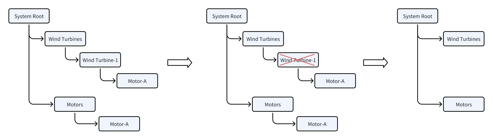

# 3.1 Elementos

En TDengine IDMP, cada activo físico o lógico de su entorno industrial — una fábrica, una línea de producción, una máquina o un sensor — se representa como un **elemento**. Los elementos son los bloques constructivos fundamentales de su modelo de activos, y proporcionan a los datos de series temporales sin procesar un hogar estructurado y un contexto significativo.

## 3.1.1 Qué es un elemento

Un elemento es una representación digital de un activo del mundo real o de una agrupación lógica en su entorno industrial. Los elementos permiten organizar, buscar y analizar datos por activo en lugar de por tablas de datos sin procesar.


Cuando selecciona un elemento en el árbol de activos, la pestaña **General** muestra la siguiente información:

| Campo | Descripción |
|---|---|
| **Nombre** | El identificador único del elemento dentro del ámbito de su padre |
| **Ruta** | La ruta jerárquica completa a este elemento en el árbol de activos (por ejemplo, `/Elements/Utilities/California/San Diego County/Chula Vista/em-10`) |
| **Plantilla** | La plantilla de elemento en la que se basa este elemento. Haga clic en el nombre de la plantilla para navegar a su definición. |
| **Categorías** | Una o más etiquetas de categoría definidas por el usuario para agrupar y filtrar elementos |
| **Atributo predeterminado** | El atributo que se muestra por defecto cuando este elemento aparece en una vista de resumen |
| **Descripción** | Una descripción en texto libre de lo que representa este activo |
| **Ubicación** | Las coordenadas GPS del activo físico: longitud, latitud y altitud. Se utiliza para visualizaciones basadas en mapas. |
| **Atributos adicionales** | Pares clave-valor de formato libre para cualquier metadato personalizado específico de este elemento, como fabricante, número de modelo, número de serie, fecha de instalación o contacto de mantenimiento |

Debajo de los campos principales, la pestaña General contiene las siguientes secciones expandibles:

### Documentos relacionados

Cargue archivos — como manuales de usuario, manuales de ingeniería, planos P&ID, informes de calibración o cualquier material de referencia específico del dominio — y adjúntelos directamente al elemento. Estos documentos se indexan y quedan disponibles para el motor de IA de TDengine IDMP. Cuando un usuario hace preguntas sobre un elemento a través del Chat de IA, la IA puede recurrir a estos documentos para proporcionar respuestas más precisas y contextualizadas. Por ejemplo, adjuntar el manual de operación de una bomba permite a la IA responder preguntas sobre su rango de operación esperado, intervalos de mantenimiento y umbrales de alarma.

Para añadir un documento: expanda **Documentos relacionados** y haga clic en **+ Añadir documento**.

### Anotación

Añada notas de texto libre al elemento. Las anotaciones son útiles para registrar observaciones, historial de mantenimiento o contexto operativo que no encaja en los campos de atributos estructurados.

Para añadir una anotación: expanda **Anotación** y haga clic en **+ Nueva anotación**. Consulte [Anotaciones](../11-collaboration/02-annotations.md) para más detalles.

### Padres

Muestra todos los elementos padre en la jerarquía de activos. Un elemento puede aparecer en múltiples jerarquías simultáneamente (por ejemplo, una bomba puede pertenecer tanto a una jerarquía geográfica como a una jerarquía de equipos funcional). La sección Padres lista cada padre con su ruta completa.

### Seguridad *(próximamente)*

Control de acceso basado en roles para este elemento. Esta función aún no está implementada.

### Versión *(próximamente)*

Historial de versiones y registro de auditoría de los cambios en la configuración de este elemento. Esta función aún no está implementada.

## 3.1.2 Árbol de activos y elementos secundarios

Los elementos se organizan en un **árbol de activos** jerárquico que refleja la estructura física o lógica de su entorno industrial. Una jerarquía típica podría verse así:

```text
Enterprise
└── Plant
    └── Production Line
        └── Machine
            └── Sensor
```

Cualquier elemento puede tener uno o más **elementos secundarios**. Esta relación padre-hijo le permite:

- Navegar por todo el catálogo de activos desde arriba hacia abajo
- Agregar datos a través de una rama del árbol (por ejemplo, el uso total de energía en todas las máquinas de una línea de producción)
- Aplicar configuraciones en cualquier nivel de la jerarquía

La raíz del árbol de activos — el elemento de nivel superior sin padre — normalmente representa un activo de nivel empresarial o de sitio. Puede crear múltiples elementos de nivel raíz para representar sitios o unidades de negocio separados.

Un elemento también puede aparecer en más de una jerarquía al mismo tiempo — por ejemplo, una turbina eólica puede pertenecer tanto a un árbol de sitio geográfico como a un árbol por tipo de equipo. Esto se logra mediante *referencias de elemento*. Consulte [3.1.7 Referencias de elemento](#317-element-references) para más detalles.

## 3.1.3 Creación de elementos

Los nuevos elementos siempre se crean como hijos de un elemento padre existente. Hay tres formas de hacerlo:

### Método 1: Desde el menú contextual al pasar el cursor sobre el árbol de activos

1. En el árbol de activos, pase el cursor sobre el elemento padre para mostrar el icono **⋮** junto a su nombre.
2. Haga clic en **⋮** y seleccione **Nuevo elemento secundario**.
3. Complete los detalles del elemento y haga clic en **Guardar**.

### Método 2: Desde la barra de herramientas de la pestaña Elementos secundarios

1. Seleccione el elemento padre en el árbol de activos.
2. Haga clic en la pestaña **Elementos secundarios** en el panel de detalles del elemento.
3. Haga clic en el icono **+** en la barra de herramientas (parte superior derecha de la pestaña Elementos secundarios).
4. Complete los detalles del elemento y haga clic en **Guardar**.

:::tip
Utilice una convención de nomenclatura coherente en toda su organización. Por ejemplo, agregue un código de sitio como prefijo a los nombres de elementos (como `SF-Line-01`) para facilitar la navegación en árboles de activos grandes. Al seleccionar una **Plantilla** al crear un elemento, se prellenará automáticamente un conjunto estándar de atributos para esa clase de activo.
:::

## 3.1.4 Edición de elementos

Para editar un elemento existente:

1. Seleccione el elemento en el árbol de activos.
2. En la pestaña General, haga clic en el icono **Editar** (icono de lápiz) en la barra de herramientas.
3. Modifique los campos según sea necesario: Nombre, Descripción, Plantilla, Categorías, Atributo predeterminado, Ubicación y Atributos adicionales.
4. Haga clic en **Guardar** para aplicar los cambios.

Para añadir o actualizar **Documentos relacionados**, **Anotaciones** u otras secciones, expanda la sección correspondiente directamente en la pestaña General sin entrar en modo de edición.

:::note
Cambiar el elemento padre de un elemento existente lo reubicará a él — y a todos sus hijos — en la nueva posición del árbol de activos. Esto no afecta a los datos de series temporales subyacentes vinculados a sus atributos.
:::

## 3.1.5 Eliminación de elementos

Hay varias formas de eliminar un elemento:

### Método 1: Desde la barra de herramientas de la pestaña General

1. Seleccione el elemento en el árbol de activos.
2. Haga clic en el icono **Eliminar** (icono de papelera) en la esquina superior derecha de la pestaña General.
3. Confirme la eliminación en el cuadro de diálogo.

### Método 2: Desde la pestaña Elementos secundarios del padre

1. Navegue al elemento padre y haga clic en la pestaña **Elementos secundarios**.
2. En la lista de elementos secundarios, haga clic en el menú **⋮** (tres puntos) en la fila del elemento que desea eliminar.
3. Seleccione **Eliminar** y confirme.

### Método 3: Desde el menú contextual del árbol de activos

1. Pase el cursor sobre el elemento en el árbol de activos para mostrar el menú **⋮**.
2. Seleccione **Eliminar** y confirme.

:::warning
Eliminar un elemento padre elimina permanentemente todos sus elementos secundarios también. Esta acción no se puede deshacer. Los datos de series temporales subyacentes en TDengine TSDB no se eliminan, pero todas las configuraciones de elementos, asignaciones de atributos, documentos relacionados, anotaciones y otros metadatos asociados con los elementos eliminados se perderán permanentemente.
:::

## 3.1.6 Plantillas de elemento

En entornos industriales, grandes cantidades de activos suelen ser del mismo tipo — cientos de medidores de electricidad, decenas de bombas o miles de sensores. Crear cada elemento individualmente no es práctico y es propenso a errores. Las **plantillas de elemento** resuelven esto definiendo un modelo reutilizable para una clase de activo: sus atributos, análisis, paneles, dashboards y reglas de notificación se especifican una vez en la plantilla y luego se aplican automáticamente a cada elemento creado a partir de ella.

Las plantillas de elemento se gestionan en **Bibliotecas** en el menú de navegación principal.

### Herencia de plantillas

Las plantillas admiten herencia. Puede crear una plantilla base (por ejemplo, "Motor") y luego derivar plantillas más especializadas a partir de ella (por ejemplo, "Motor AC", "Motor DC"). Una plantilla marcada como **Solo plantilla base** solo puede heredarse — no puede usarse directamente para crear elementos.

### Cadenas de sustitución

Dado que una plantilla se comparte entre muchos elementos, los valores de los campos dentro de una plantilla no pueden estar codificados de forma fija. IDMP proporciona **cadenas de sustitución** que se resuelven a los valores reales cuando se crea un elemento. Las cadenas de sustitución más comunes incluyen:

| Cadena de sustitución | Se resuelve en |
|---|---|
| `${Template#name}` | El nombre de la plantilla |
| `${Element#name}` | El nombre del elemento |
| `${Attribute#name}` | El nombre del atributo |
| `${attributes["AttrName"]#value}` | El valor actual del atributo nombrado |
| `${startTime}` | La hora de inicio del evento |
| `${endTime}` | La hora de fin del evento |

No necesita memorizar estas cadenas — en cualquier lugar donde las cadenas de sustitución sean válidas, IDMP muestra un selector **+** que lista todas las cadenas aplicables para ese campo.

Además de las cadenas proporcionadas por el sistema, puede definir cadenas de sustitución **KEYWORD** personalizadas en una plantilla. Un KEYWORD es un parámetro que usted define — con un texto de ayuda descriptivo — que el usuario debe proporcionar en el momento de crear el elemento. Por ejemplo, un KEYWORD llamado "ID de dispositivo" solicitaría al usuario que introduzca el ID de dispositivo específico al crear cada elemento, permitiendo que la plantilla vincule automáticamente ese elemento a la fuente de datos correcta en TDengine TSDB.

### Configuraciones clave de plantilla

| Configuración | Descripción |
|---|---|
| **Solo plantilla base** | Si está habilitada, esta plantilla solo puede usarse como padre para otras plantillas, no para crear elementos directamente. |
| **Permitir extensión** | Si está habilitada, los elementos creados a partir de esta plantilla pueden tener atributos, análisis o paneles personalizados adicionales además de los definidos en la plantilla. Si está deshabilitada, no se permite ninguna personalización. |
| **Patrón de nombre de elemento** | Un patrón — compuesto de cadenas fijas y cadenas de sustitución — que determina el nombre generado automáticamente para cada elemento creado a partir de esta plantilla. Por ejemplo, `DEV-${KEYWORD1}` nombraría los elementos como `DEV-smeter-1`. |

### Campos de la pestaña General

Cuando abre una plantilla de elemento, la pestaña **General** muestra:

| Campo | Descripción |
|---|---|
| **Nombre de plantilla** | El nombre de la plantilla |
| **Descripción** | Descripción opcional |
| **Plantilla base** | La plantilla padre de la que hereda esta, si la hay |
| **Categorías** | Etiquetas de categoría |
| **Atributo predeterminado** | El atributo que se muestra por defecto cuando un elemento aparece en vistas de resumen |
| **Patrón de nombre de elemento** | El patrón de nombre generado automáticamente usando cadenas de sustitución (p. ej., `${KEYWORD1}`) |
| **Solo plantilla base** | Si es verdadero, esta plantilla no puede usarse para crear elementos directamente — solo como base para otras plantillas |
| **Permitir extensión** | Si es verdadero, los elementos pueden tener atributos, análisis o paneles personalizados más allá de lo que define la plantilla |
| **Ubicación** | Coordenadas GPS predeterminadas (Altitud, Latitud, Longitud) heredadas por los elementos |
| **Palabras clave** | Cadenas de sustitución KEYWORD personalizadas definidas para esta plantilla, cada una con un texto de ayuda descriptivo que se muestra en el momento de crear el elemento |
| **Documentos relacionados** | Archivos adjuntos a la plantilla, indexados por el motor de IA |

### Contenido de una plantilla de elemento

Una vez creada una plantilla, su página de detalles muestra las siguientes pestañas. Cada pestaña gestiona una categoría de subplantilla que se instancia automáticamente para cada elemento creado a partir de esta plantilla:

| Pestaña | Descripción |
|---|---|
| **General** | Las configuraciones a nivel de elemento descritas anteriormente |
| **Plantilla de atributo** | El conjunto estándar de atributos, incluyendo los enlaces de referencia de datos de TDengine TSDB. Consulte [Plantillas de atributo](./02-attributes.md#attribute-templates). |
| **Plantilla de panel** | Paneles estándar (gráfico de tendencias, indicador, tabla, etc.) creados automáticamente para cada elemento. Consulte [Plantillas de panel y dashboard](../04-visualization/07-panel-dashboard-templates.md). |
| **Plantilla de análisis** | Reglas de análisis reutilizables que se ejecutan en cada elemento de este tipo. Consulte [Plantillas de análisis](../07-real-time-analysis/07-analysis-templates.md). |
| **Plantilla de dashboard** | Dashboards estándar asociados automáticamente con cada elemento. Consulte [Plantillas de panel y dashboard](../04-visualization/07-panel-dashboard-templates.md). |
| **Plantilla de regla de notificación** | La regla de notificación predeterminada aplicada a los elementos creados a partir de esta plantilla, incluyendo punto de contacto, intervalo de reenvío, configuración de escalada y plantilla de mensaje. |

### Creación de una plantilla de elemento

1. Navegue a **Bibliotecas** en el menú principal y seleccione **Plantilla de elemento**.
2. Haga clic en **+** para abrir el formulario de creación de plantilla de elemento.
3. Introduzca el nombre de la plantilla, configure las opciones clave, defina las palabras clave si es necesario y haga clic en **Guardar**.
4. Desde la página de detalles de la plantilla, haga clic en cada pestaña (**Plantilla de atributo**, **Plantilla de panel**, **Plantilla de análisis**, **Plantilla de dashboard**, **Plantilla de regla de notificación**) para añadir las subplantillas correspondientes.

### Ejemplo: Uso de KEYWORD para mapear una supertabla de TDengine

Este ejemplo muestra cómo funcionan en la práctica las cadenas de sustitución KEYWORD. Suponga que su base de datos TDengine `smdb` contiene una supertabla `SMeter` con dos columnas de métricas (`current`, `voltage`) y una columna de etiqueta (`model`). La supertabla tiene tablas secundarias llamadas `smeter-1`, `smeter-2`, etc. Desea crear un elemento IDMP por cada tabla secundaria, con cada elemento vinculado automáticamente a su tabla correspondiente.

#### Paso 1 — Crear la plantilla de elemento

Cree una nueva plantilla de elemento llamada `Smart Meter`. En el campo **Patrón de nombre de elemento**, escriba `DEV-`, luego haga clic en **+** y seleccione **KEYWORD**. El sistema le solicita un texto de ayuda — introduzca algo como `Nombre de tabla secundaria en la supertabla SMeter (p. ej., smeter-1)`. El patrón de nombre queda:

```text
DEV-${KEYWORD1}
```

#### Paso 2 — Crear plantillas de atributo

Cree tres plantillas de atributo en la plantilla `Smart Meter`:

| Atributo | Tipo de referencia de datos | Configuración de referencia de datos |
|---|---|---|
| Current | TDengine Metric | `TDengine/smdb/${KEYWORD1}/current` |
| Voltage | TDengine Metric | `TDengine/smdb/${KEYWORD1}/voltage` |
| Model | TDengine Tag | `TDengine/smdb/${KEYWORD1}/model` |

Para cada atributo, establezca el **Tipo de referencia de datos** en **TDengine Metric** o **TDengine Tag**, luego abra el cuadro de diálogo de Configuración de referencia de datos. Seleccione la conexión TDengine y la base de datos `smdb`. En el campo **Patrón de nombre de tabla**, haga clic en **+** y seleccione `KEYWORD1`. Introduzca el nombre de columna (`current`, `voltage` o `model`). Haga clic en **Comprobar** con un nombre de tabla secundaria de ejemplo para verificar el enlace.

#### Paso 3 — Crear elementos a partir de la plantilla

Cuando crea un nuevo elemento usando la plantilla `Smart Meter`, IDMP le solicita que introduzca un valor para `KEYWORD1`, mostrando el texto de ayuda que definió. Introduzca el nombre de una tabla secundaria — por ejemplo, `smeter-1`. IDMP automáticamente:

- Nombra el elemento `DEV-smeter-1`
- Resuelve los tres enlaces de atributo:
  - Current: `TDengine/smdb/smeter-1/current`
  - Voltage: `TDengine/smdb/smeter-1/voltage`
  - Model: `TDengine/smdb/smeter-1/model`

Repita el proceso para `smeter-2`, `smeter-3`, etc. Cada elemento queda completamente configurado con una sola entrada en el momento de creación.

## 3.1.7 Referencias de elemento

:::note
Este es un tema avanzado. La mayoría de los usuarios puede omitir esta sección y volver a ella cuando necesiten organizar activos en múltiples jerarquías.
:::

Cuando se crea un elemento bajo un padre, se establece una **referencia** entre los dos. Un elemento puede tener múltiples referencias — lo que significa que puede aparecer en más de un lugar del árbol de activos simultáneamente, sin ser duplicado físicamente. Esto es similar a un enlace simbólico en un sistema de archivos.

Por ejemplo, una turbina eólica podría aparecer bajo una jerarquía geográfica (`Sitio A → Turbinas eólicas → Turbina eólica-1`) y también bajo una jerarquía por tipo de equipo (`Todas las turbinas → Turbina eólica-1`). Ambas son vistas del mismo elemento y sus datos.

La sección **Padres** en la pestaña General de un elemento lista todas las referencias actuales — cada ubicación en el árbol de activos donde aparece este elemento.

### Tipos de referencia

IDMP define tres tipos de referencia que controlan qué sucede cuando se elimina un elemento o su padre.

### Referencia fuerte

El tipo de referencia predeterminado. Un elemento con al menos una referencia fuerte siempre existe en algún lugar del árbol de activos. Eliminarlo de una ubicación solo elimina esa referencia — el elemento continúa existiendo donde estén sus otras referencias fuertes.


En el diagrama anterior, Turbina eólica-1 tiene referencias fuertes tanto en Turbinas eólicas como en Sitio A. Eliminar Turbina eólica-1 de Sitio A solo elimina esa referencia — Turbina eólica-1 sigue existiendo en Turbinas eólicas.

### Referencia de composición

Se utiliza cuando un elemento forma parte físicamente de su padre — por ejemplo, un motor que es un componente de una turbina eólica. Una referencia de composición es un vínculo más fuerte: si se elimina el elemento padre, el hijo se elimina completamente de todas las ubicaciones, independientemente de cualquier otra referencia que pueda tener.



En el diagrama anterior, Motor-A tiene una referencia de composición bajo Turbina eólica-1 y también aparece en otros lugares. Cuando se elimina Turbina eólica-1, Motor-A se elimina permanentemente de todos los lugares.

Un elemento puede tener como máximo una referencia de composición.

### Referencia débil

Se utiliza cuando desea que un elemento aparezca en una jerarquía adicional sin afectar a su ciclo de vida. Las referencias débiles son informativas — eliminar una referencia débil no tiene ningún efecto en el elemento ni en sus otras referencias.


Sin embargo, si se eliminan todas las referencias fuertes y de composición, el elemento deja de existir y todas sus referencias débiles se limpian automáticamente.


### Reglas de referencia

Las siguientes reglas rigen las referencias de elemento:

1. Al crear un elemento secundario, el tipo de referencia puede establecerse en **Fuerte** o **Composición**.
2. Un elemento puede tener cualquier número de referencias débiles; eliminar una referencia débil no tiene ningún efecto en el elemento.
3. Un elemento puede tener como máximo una referencia de composición.
4. Si un elemento no tiene referencia de composición, debe tener al menos una referencia fuerte para existir.
5. Si se elimina un padre con referencia de composición, el elemento hijo se elimina completamente de todas las ubicaciones.
6. Si después de una eliminación un elemento tiene cero referencias fuertes y de composición, todas sus referencias débiles se eliminan automáticamente y el elemento deja de existir.

Dentro de un único árbol de activos, un elemento solo puede aparecer una vez. Puede aparecer en múltiples árboles separados, pero no en múltiples rutas dentro del mismo árbol.
