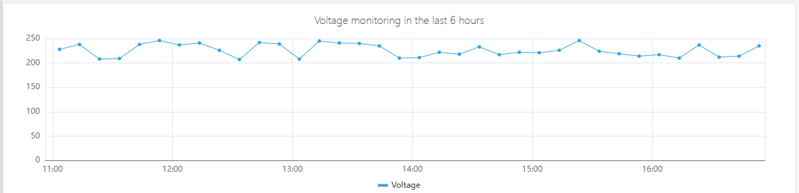
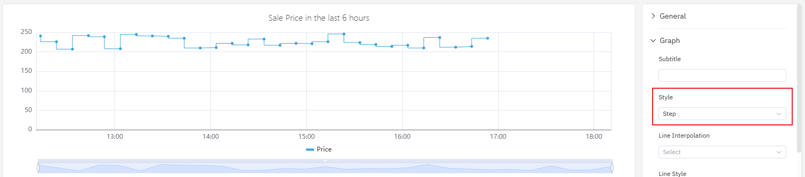
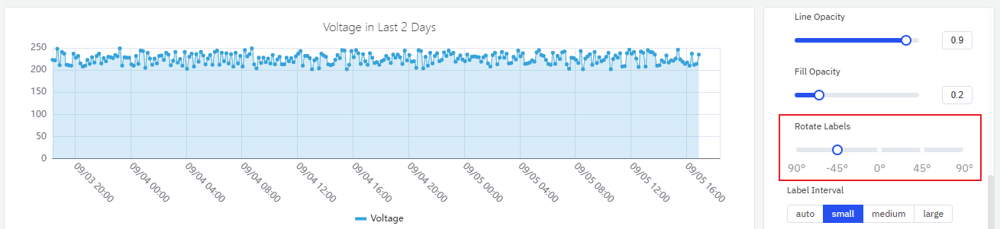
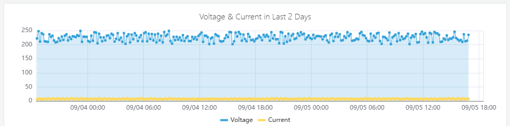
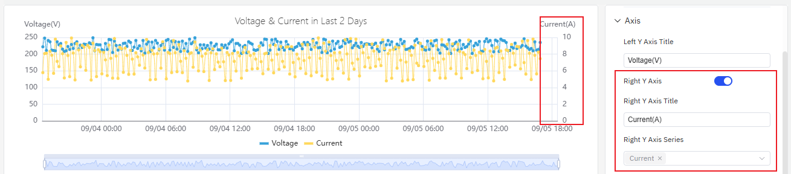
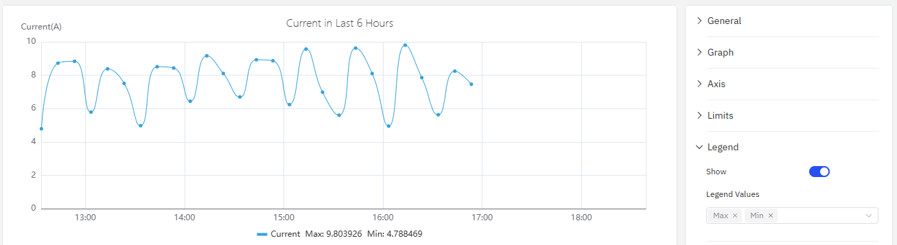

# 4.2.1 Gráfico de tendencia

## Descripción general

El gráfico de tendencia traza una o más métricas de series temporales como líneas sobre un eje de tiempo, conectando los puntos de datos para mostrar cómo cambian los valores con el tiempo. Está diseñado específicamente para mediciones continuas —temperatura, presión, caudal, consumo de energía, vibración, etc.— donde el patrón temporal en sí mismo tiene significado. Se pueden trazar múltiples métricas en el mismo gráfico, cada una como una línea independiente, lo que permite identificar correlaciones y variaciones relativas de un vistazo.

Además del trazado básico, el gráfico de tendencia es el tipo de panel principal en TDengine IDMP y el punto de entrada para las funciones de análisis avanzado: usar IA para predecir valores futuros, reparar huecos de datos mediante interpolación, superponer períodos históricos con desplazamiento temporal y comparar datos de lotes en un eje de tiempo normalizado.

## Cuándo usarlo

Use el gráfico de tendencia cuando:

- Necesite monitorear cómo cambian los valores de medición continua con el tiempo
- Quiera comparar múltiples métricas relacionadas en paralelo (por ejemplo, temperatura de entrada y salida)
- Necesite detectar anomalías, cambios bruscos o derivas graduales en una señal
- Quiera comparar el comportamiento actual con una línea base histórica usando desplazamiento temporal
- Necesite superponer líneas de límite para ver cómo se relacionan los valores con su rango operativo
- Esté realizando análisis de predicción o interpolación sobre atributos de series temporales

Para señales de estado discreto (encendido/apagado, en marcha/detenido), use la línea de tiempo de estado. Para el análisis de correlación entre dos atributos continuos (X frente a Y, en lugar de ambos frente al tiempo), use el gráfico de dispersión.

## Configuración

### Barra de herramientas del modo de visualización

Además de los [controles generales del modo de visualización](../01-panels.md#413-modo-de-visualización-de-paneles), el gráfico de tendencia añade los siguientes controles:

| Control | Descripción |
|---|---|
| **Habilitar múltiples carriles** | Muestra cada métrica en su propia banda horizontal en lugar de compartir un eje Y |
| **Deshabilitar muestreo** | Obtiene datos sin procesar sin reducción de muestras. Úselo cuando necesite ver cada punto de datos individual. |
| **Interpolación** | Entra en el modo de interpolación. Haga clic y arrastre para seleccionar un hueco en los datos; IDMP rellena ese hueco usando estimación de tendencia basada en IA. |
| **Restablecer interpolación** | Elimina cualquier interpolación aplicada al gráfico actual |

### Barra de herramientas del modo de edición

Además de los [controles generales del modo de edición](../01-panels.md#414-modo-de-edición-de-paneles), el gráfico de tendencia añade los siguientes controles:

| Control | Descripción |
|---|---|
| **Deshabilitar muestreo** | Activa el modo de datos sin procesar para la vista previa |
| **Mostrar predicción** | Superpone la predicción de IA sobre la vista previa del gráfico |
| **Interpolación** | Entra en el modo de interpolación en la vista previa |
| **Restablecer interpolación** | Elimina la interpolación de la vista previa |
| **Guardar como imagen** | Descarga la vista previa actual como imagen PNG |
| **Pantalla completa** | Expande la vista previa del editor para llenar la ventana del navegador |
| **Interpretar panel** | Ejecuta el análisis de IA sobre los datos de la vista previa actual |

### Configuración del gráfico

#### Estilo de línea

El ajuste **Estilo** controla cómo se conectan los puntos de datos. Hay tres opciones: **Línea** (segmentos de línea recta entre puntos), **Curva suavizada** (spline curvo) y **Escalonado** (línea escalonada que mantiene el valor hasta el siguiente punto).

Las líneas escalonadas son ideales para señales que cambian de forma discreta en lugar de continua — por ejemplo, valores de referencia, códigos de modo o valores de precio que se mantienen constantes entre cambios.

Los ajustes **Estilo de línea**, **Grosor de línea**, **Transparencia de línea** y **Transparencia de relleno** ajustan cómo se renderiza cada línea:

**Transparencia de relleno** dibuja un área sombreada debajo de cada línea. Esto es especialmente efectivo para cantidades acumuladas —consumo de energía, producción— donde el área rellena refuerza el sentido de acumulación.

| Ajuste | Descripción |
|---|---|
| **Estilo** | Modo de renderizado de la línea: Línea, Curva suavizada o Escalonado |
| **Estilo de línea** | Patrón de la línea: sólida, discontinua o punteada |
| **Grosor de línea** | Ancho del trazo (control deslizante) |
| **Transparencia de línea** | Transparencia de la línea, 0–1 |
| **Transparencia de relleno** | Relleno del área debajo de cada línea, 0–1 (0 = sin relleno) |

#### Etiquetas

Cuando el rango de tiempo es largo o el gráfico es estrecho, las etiquetas del eje X pueden superponerse y ser difíciles de leer:

Dos ajustes pueden resolver este problema:

1. **Rotación de etiquetas** — Rota el texto de las etiquetas para reducir las superposiciones:

2. **Intervalo de etiquetas** — Reduce el número de etiquetas mostradas:

| Ajuste | Descripción |
|---|---|
| **Rotación de etiquetas** | Ángulo de rotación de las etiquetas del eje X, de –90° a +90° |
| **Intervalo de etiquetas** | Densidad de etiquetas: automático, pequeño, mediano, grande |

#### Apilado de datos

Cuando se trazan múltiples series que representan partes de un todo (por ejemplo, consumo de electricidad residencial e industrial), **Apilado de series** acumula los valores para mostrar el total:

Habilitar el apilado junto con la transparencia de relleno hace que el efecto acumulativo sea visualmente más claro.

| Ajuste | Descripción |
|---|---|
| **Apilado de series** | Modo de apilado: ninguno, mismo signo, todos, valores positivos, valores negativos |
| **Múltiples carriles** | Muestra cada métrica en su propia banda horizontal |

### Configuración de ejes

#### Títulos de ejes

El eje Y izquierdo puede configurarse con un título y una unidad:

#### Doble eje Y

Cuando dos métricas tienen rangos que difieren en órdenes de magnitud, trazarlas en el mismo eje Y hace que la señal más pequeña parezca plana y sea difícil de leer:

Habilitar **Eje derecho** asigna la segunda métrica a una escala independiente en el lado derecho, haciendo que ambas señales sean claramente legibles:

| Ajuste | Descripción |
|---|---|
| **Título del eje Y izquierdo** | Etiqueta del eje Y izquierdo |
| **Rango de valores** | Valor mínimo y máximo del eje Y izquierdo (vacío = escala automática) |
| **Eje derecho** | Habilita el eje Y secundario en el lado derecho |

### Configuración de valores de límite

Los límites operativos definidos en los atributos —LoLo, Lo, Valor objetivo, Hi, HiHi— pueden mostrarse como líneas de referencia horizontales en el gráfico. Esto hace que sea inmediatamente evidente si un valor está dentro del rango operativo normal:

Los límites se definen en el propio atributo (en la configuración de atributos del elemento) y se obtienen automáticamente sin necesidad de volver a ingresarlos aquí.

### Configuración de leyenda

La leyenda puede mostrar estadísticas de resumen junto al nombre de cada serie, incluyendo mínimo, máximo, promedio y valor más reciente. Esto es útil para la comparación de un vistazo entre múltiples métricas:

| Ajuste | Descripción |
|---|---|
| **Mostrar** | Modo de visualización: lista, tabla u oculto |
| **Posición** | Ubicación: abajo o a la derecha |
| **Valores de leyenda** | Estadísticas que se muestran en modo tabla: valor más reciente, mínimo, máximo, promedio, total, etc. |

## Ejemplos de uso

**Monitoreo de consumo de energía con apilado.** Un analista de energía necesita rastrear el consumo de electricidad residencial e industrial durante el último mes. Se añaden dos métricas —consumo residencial y consumo industrial— al mismo gráfico de tendencia, se habilita el apilado de series y se establece la transparencia de relleno en 0,4. El resultado muestra las contribuciones individuales y la carga total en un solo gráfico.

**Doble eje Y para señales mixtas.** Un ingeniero de procesos monitorea el voltaje (cientos de voltios) y la corriente (pocos amperios) en el mismo gráfico. Con un eje Y compartido, la línea de corriente es casi plana. Al habilitar el eje derecho se asigna el voltaje a la escala izquierda y la corriente a la escala derecha, haciendo que ambas líneas de tendencia sean claramente visibles.

**Monitoreo con líneas de límite.** Un equipo de operaciones monitorea si la presión de salida de una bomba supera los límites Hi e HiHi definidos. Con los valores de límite habilitados en el gráfico de tendencia, cualquier excedencia se hace inmediatamente evidente cuando la línea de presión cruza la línea de referencia. El gráfico codifica por color las zonas de límite según la gravedad de la alarma definida en el atributo.

**Comparación con desplazamiento temporal.** Un ingeniero de calidad compara las curvas de temperatura del lote de hoy y de ayer añadiendo el mismo atributo de temperatura dos veces — una sin desplazamiento y una con un desplazamiento temporal de 24 horas. Las dos líneas se superponen en el mismo eje de tiempo, destacando claramente cómo difiere la ejecución de hoy respecto a la anterior.
