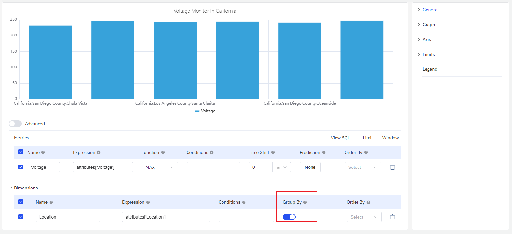
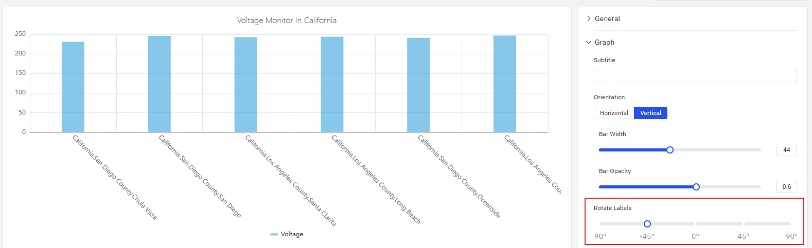
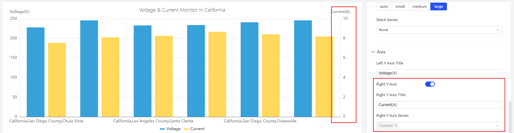
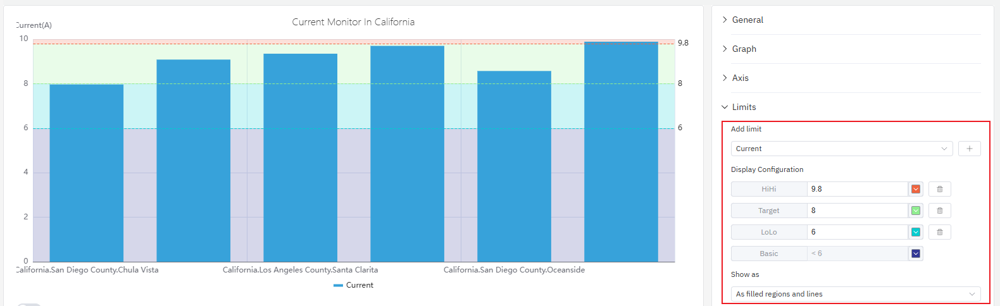

# 4.2.2 Gráfico de barras

## Descripción general

El gráfico de barras representa los valores numéricos mediante la altura de las barras (o el ancho en la disposición horizontal). Es adecuado para datos agregados —valores agrupados por intervalos de tiempo o dimensiones categóricas— y es ideal para escenarios de comparación entre períodos o grupos.

Cada barra corresponde a un valor agregado: la suma, el promedio o el conteo dentro de una ventana de tiempo (como el consumo de energía por hora), o el valor de una categoría (como la producción por línea de producción). Se pueden mostrar múltiples métricas como barras agrupadas o apiladas.

## Cuándo usarlo

Use el gráfico de barras cuando:

- Compare cantidades discretas en diferentes períodos de tiempo (por hora, por día, por mes)
- Compare la misma métrica entre múltiples categorías o sitios
- Visualice la contribución de cada parte al todo usando barras apiladas
- Los datos son intrínsecamente agregados, no series temporales continuas

Para datos de series temporales continuas donde el patrón de tendencia es importante, use el gráfico de tendencia. Para un único valor de resumen (como el consumo total del día), use el panel de valor estadístico.

## Configuración

### Barra de herramientas del modo de edición

Además de los [controles generales del modo de edición](../01-panels.md#414-modo-de-edición-de-paneles), el gráfico de barras añade los siguientes controles:

| Control | Descripción |
|---|---|
| **Guardar como imagen** | Descarga la vista previa actual como imagen PNG |
| **Pantalla completa** | Expande la vista previa del editor para llenar la ventana del navegador |
| **Interpretar panel** | Ejecuta el análisis de IA sobre los datos de la vista previa actual |

### Configuración del gráfico

#### Orientación del diseño

El gráfico de barras admite diseños tanto **vertical** (por defecto) como **horizontal**. Las barras horizontales son más fáciles de leer cuando las etiquetas de categorías son largas o cuando se necesita comparar múltiples grupos en paralelo:

#### Estilo de barra

**Ancho de barra** y **Transparencia de barra** controlan la apariencia de las barras individuales:

Si no se establece el ancho de barra, el gráfico lo calcula automáticamente en función del ancho general y el número de barras — este comportamiento adaptativo funciona bien en la mayoría de los casos. Solo establezca un ancho fijo cuando necesite un espaciado preciso en pantallas de resolución fija.

| Ajuste | Descripción |
|---|---|
| **Orientación del diseño** | Vertical (las barras se extienden hacia arriba) u horizontal (las barras se extienden hacia la derecha) |
| **Ancho de barra** | Ancho de las barras individuales (control deslizante; déjelo vacío para el cálculo automático) |
| **Transparencia de barra** | Transparencia de las barras, 0–1 |
| **Apilado de series** | Apila múltiples métricas: ninguno, mismo signo, todos, valores positivos, valores negativos |

#### Etiquetas

Cuando las etiquetas de categorías son largas o numerosas, pueden superponerse en el eje. Dos ajustes pueden resolver esto:

1. **Rotación de etiquetas** — Inclina el texto de las etiquetas para evitar superposiciones:

2. **Intervalo de etiquetas** — Reduce el número de etiquetas mostradas:

| Ajuste | Descripción |
|---|---|
| **Rotación de etiquetas** | Ángulo de rotación de las etiquetas del eje |
| **Intervalo de etiquetas** | Densidad de etiquetas: automático, pequeño, mediano, grande |

### Configuración de ejes

#### Títulos de ejes

El eje Y puede configurarse con un nombre y una etiqueta de unidad:

#### Doble eje Y

Cuando se trazan dos métricas con rangos que difieren en órdenes de magnitud, un eje compartido comprime la señal más pequeña haciéndola difícil de leer. Habilitar **Eje derecho** asigna cada métrica a su propia escala:

| Ajuste | Descripción |
|---|---|
| **Título del eje Y izquierdo** | Etiqueta del eje Y izquierdo |
| **Rango de valores** | Valor mínimo y máximo del eje Y (vacío = escala automática) |
| **Eje derecho** | Habilita el eje Y secundario en el lado derecho |

### Configuración de valores de límite

Los límites de la configuración de atributos —LoLo, Lo, Valor objetivo, Hi, HiHi— pueden mostrarse como líneas de referencia horizontales sobre las barras, marcando las zonas de seguridad y advertencia:

### Configuración de leyenda

En modo tabla, la leyenda puede mostrar estadísticas de resumen junto a cada serie:

| Ajuste | Descripción |
|---|---|
| **Mostrar** | Modo de visualización: lista, tabla u oculto |
| **Posición** | Ubicación: abajo o a la derecha |
| **Valores de leyenda** | Estadísticas que se muestran en modo tabla: valor más reciente, mínimo, máximo, promedio, total, etc. |

## Ejemplos de uso

**Comparación del consumo diario de energía.** Un analista de energía necesita comparar el consumo de electricidad de cada día del último mes. Un gráfico de barras con una ventana deslizante de 1 día muestra una barra por día. La línea de límite Hi resalta los días que superaron el nivel de consumo objetivo.

**Comparación de producción entre sitios.** Un gerente de operaciones añade una dimensión de agrupación por nombre de sitio. Cada barra representa la producción total de un sitio durante el período de tiempo seleccionado. Cambiar al diseño horizontal mejora la legibilidad cuando los nombres de los sitios son largos.

**Carga residencial e industrial apilada.** Se añaden dos métricas —consumo residencial y consumo industrial— al mismo gráfico de barras con el apilado de series habilitado. Cada barra muestra la carga total con los dos componentes separados por color, lo que permite ver de un vistazo qué componente domina en cada intervalo de tiempo.
