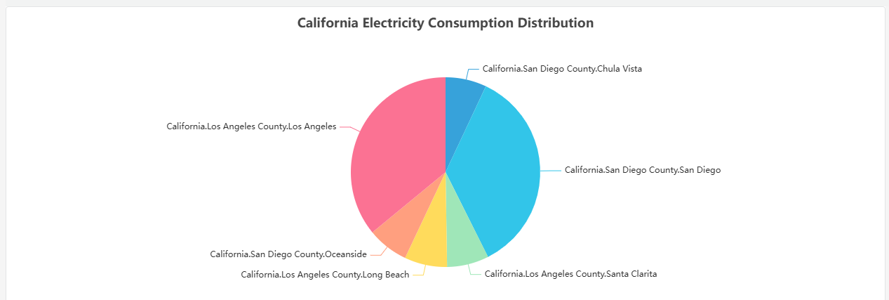

# 4.2.3 Gráfico circular

## Descripción general

El gráfico circular divide un círculo en sectores proporcionales, donde cada sector representa la proporción de su categoría correspondiente sobre el total. Cada sector representa una categoría o grupo de métricas, lo que hace que las contribuciones relativas de cada parte sean evidentes de un vistazo.

Las etiquetas de los sectores se muestran directamente en el gráfico. El gráfico es más claro cuando hay menos de 8 sectores — con más, los sectores más pequeños son difíciles de distinguir, y en ese caso un gráfico de barras o una tabla son mejores opciones.

## Cuándo usarlo

Use el gráfico circular cuando:

- Quiera mostrar cómo se distribuye un total entre un número reducido de categorías
- La proporción relativa entre las partes sea más importante que los valores absolutos
- Haya como máximo cinco a siete categorías

Evite el gráfico circular cuando haya muchas categorías, cuando los valores sean similares en magnitud (es difícil juzgar diferencias por el tamaño del arco), o cuando necesite rastrear cambios a lo largo del tiempo. Use el gráfico de barras para comparaciones y el gráfico de tendencia para datos temporales.

## Configuración

### Barra de herramientas del modo de edición

Además de los [controles generales del modo de edición](../01-panels.md#414-modo-de-edición-de-paneles), el gráfico circular añade los siguientes controles:

| Control | Descripción |
|---|---|
| **Guardar como imagen** | Descarga la vista previa actual como imagen PNG |
| **Pantalla completa** | Expande la vista previa del editor para llenar la ventana del navegador |
| **Interpretar panel** | Ejecuta el análisis de IA sobre los datos de la vista previa actual |

### Configuración del gráfico

| Ajuste | Descripción |
|---|---|
| **Título** | El título del gráfico que se muestra encima del gráfico circular |
| **Subtítulo** | Un título secundario que se muestra debajo del título principal |

El gráfico circular no tiene secciones de ejes, valores de límite ni leyenda. Las etiquetas de los sectores y los porcentajes se muestran directamente en el gráfico.

## Ejemplos de uso

**Consumo de electricidad por fase.** Un ingeniero eléctrico añade tres métricas —corriente de fase A, fase B y fase C— al gráfico circular. El gráfico muestra de inmediato si la carga está distribuida de forma uniforme entre las fases o si se concentra en una de ellas.

**Contribución de producción por turno.** Un gerente de fábrica añade una dimensión de agrupación por turno (diurno, nocturno, madrugada) con la producción total como métrica. El gráfico circular muestra la contribución de cada turno a la producción total del día.

**Distribución de eventos por gravedad.** Un equipo de operaciones añade una dimensión de agrupación por categoría de gravedad de alarma. El gráfico circular muestra qué proporción corresponde a eventos urgentes, de advertencia e informativos — adecuado para los informes de resumen de turno.
