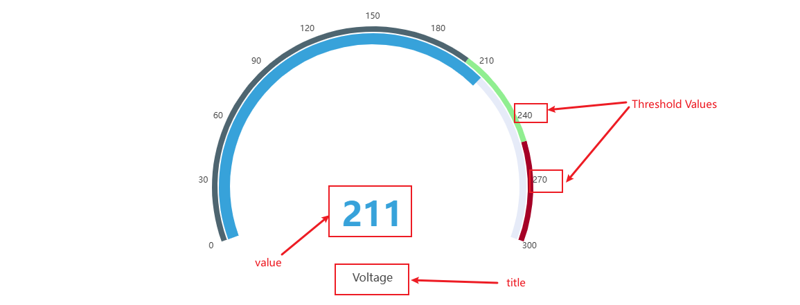
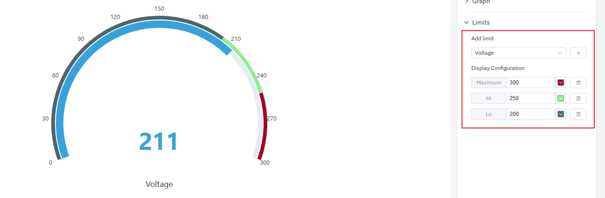

# 4.2.4 Indicador

## Descripción general

El indicador muestra un único valor actual en una escala semicircular, similar a un medidor analógico en un panel de control. El puntero y los arcos de color permiten ver de un vistazo en qué posición se encuentra el valor dentro de su rango operativo.

El indicador siempre muestra el punto de datos más reciente en el rango de tiempo seleccionado. Se pueden mostrar múltiples indicadores en un solo panel —uno por métrica— dispuestos horizontal o verticalmente.

## Cuándo usarlo

Use el indicador cuando:

- Quiera mostrar una única medición en tiempo real en un formato que el operador pueda entender de inmediato
- Necesite transmitir de un vistazo si el valor se encuentra en la zona de seguridad, advertencia o alarma
- Esté construyendo pantallas para operadores o dashboards de estado donde la metáfora espacial (posición del puntero) comunique urgencia

Para la comparación de múltiples valores a lo largo del tiempo, use el gráfico de tendencia. Para lecturas numéricas puras sin metáfora de esfera, use el panel de valor estadístico.

## Configuración

### Barra de herramientas del modo de edición

Además de los [controles generales del modo de edición](../01-panels.md#414-modo-de-edición-de-paneles), el indicador añade los siguientes controles:

| Control | Descripción |
|---|---|
| **Guardar como imagen** | Descarga la vista previa actual como imagen PNG |
| **Pantalla completa** | Expande la vista previa del editor para llenar la ventana del navegador |
| **Interpretar panel** | Ejecuta el análisis de IA sobre los datos de la vista previa actual |

### Configuración del gráfico

El indicador admite la configuración de etiquetas de escala, visualización de título y tamaño de fuente:

| Ajuste | Descripción |
|---|---|
| **Título** | El título del gráfico que se muestra encima del panel |
| **Orientación del diseño** | Orientación al mostrar múltiples indicadores: horizontal o vertical |
| **Mostrar etiquetas de umbral** | Interruptor: muestra los valores numéricos del umbral alrededor del arco de la esfera |
| **Mostrar nombre** | Interruptor: muestra el nombre de la métrica debajo de la esfera |
| **Tamaño de fuente del nombre** | Tamaño de fuente de la etiqueta del nombre de la métrica (predeterminado: 16) |
| **Tamaño de fuente del valor** | Tamaño de fuente del valor en el centro de la esfera (predeterminado: 48) |

### Configuración de valores de límite

Los límites definidos en los atributos —LoLo, Lo, Valor objetivo, Hi, HiHi— se muestran como arcos de color en la esfera. Esto divide visualmente la esfera en zonas de seguridad, haciendo que sea inmediatamente evidente si el puntero se encuentra en la zona de advertencia o alarma:

Los límites se obtienen automáticamente de la configuración de atributos del elemento, sin necesidad de volver a ingresarlos.

## Ejemplos de uso

**Presión de salida de bomba.** El atributo de presión de salida de una bomba tiene definidos los límites Lo y Hi. El indicador muestra la presión actual con el arco dividido en zonas verde (normal), amarillo (advertencia) y rojo (alarma). El operador puede ver de un vistazo si la bomba funciona dentro de las especificaciones.

**Monitoreo de velocidad de motor.** Tres motores en una línea de producción contribuyen cada uno con un indicador al mismo panel, dispuestos horizontalmente. El operador ve las tres velocidades en paralelo e identifica de inmediato cuál opera fuera del rango normal.

**Punto de monitoreo de temperatura.** La temperatura del horno se muestra en el indicador, con el límite HiHi establecido en la temperatura operativa máxima segura. Cuando el puntero se acerca a la zona roja, el operador sabe que debe actuar antes de que se active la alarma.
