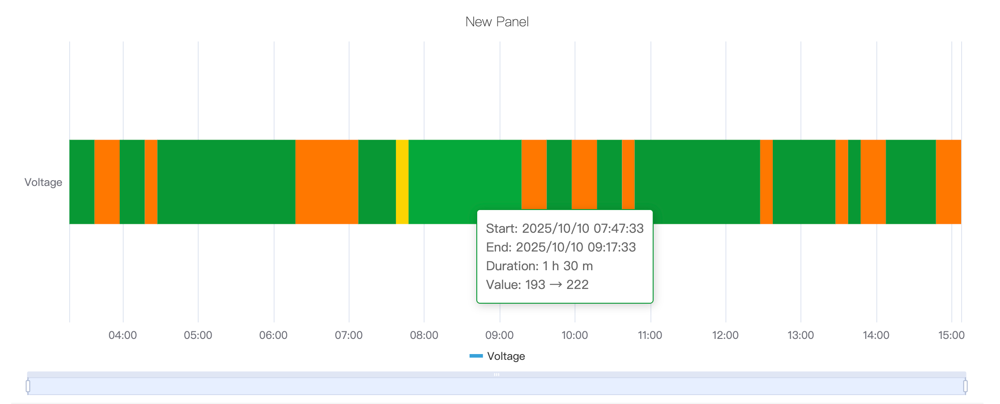
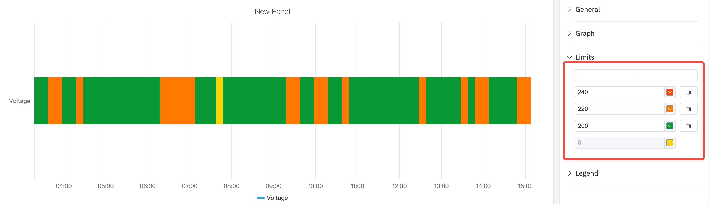

# 4.2.8 Línea de tiempo de estado

## Descripción general

La línea de tiempo de estado muestra los cambios de valor a lo largo del tiempo como bandas horizontales de colores. Cada segmento de la banda se colorea y etiqueta según el valor que representa, lo que permite ver de un vistazo cuánto tiempo ha estado un proceso en cada estado y cuándo se produjeron las transiciones de estado.

Se pueden mostrar múltiples métricas como múltiples bandas horizontales apiladas, lo que permite la comparación en paralelo del historial de estados de diferentes señales.

## Cuándo usarlo

Use la línea de tiempo de estado cuando:

- Los datos representen estados discretos en lugar de mediciones continuas (encendido/apagado, en marcha/inactivo/fallo, abierto/cerrado)
- Necesite ver cuánto tiempo ha estado un proceso en cada estado y cuándo se produjeron las transiciones
- Necesite comparar el historial de estados de múltiples señales o equipos en el mismo eje de tiempo

Para señales de valor continuo, use el gráfico de tendencia. Para una vista compacta de cuadrícula de múltiples métricas con estados por intervalos de tiempo, use el historial de estado.

## Configuración

### Barra de herramientas del modo de edición

Además de los [controles generales del modo de edición](../01-panels.md#414-modo-de-edición-de-paneles), la línea de tiempo de estado añade los siguientes controles:

| Control | Descripción |
|---|---|
| **Guardar como imagen** | Descarga la vista previa actual como imagen PNG |
| **Pantalla completa** | Expande la vista previa del editor para llenar la ventana del navegador |
| **Interpretar panel** | Ejecuta el análisis de IA sobre los datos de la vista previa actual |

### Configuración del gráfico

La apariencia de cada banda de estado se controla mediante los siguientes ajustes:

| Ajuste | Descripción |
|---|---|
| **Título** | El título del gráfico |
| **Subtítulo** | El título secundario |
| **Grosor de línea** | El ancho del borde alrededor de cada segmento de estado (0 = sin borde) |
| **Altura de fila** | La altura relativa de cada banda (predeterminado: 0,3) |
| **Transparencia de relleno** | Transparencia del relleno de color del estado, de 0 a 1 |
| **Rotación de etiquetas** | Ángulo de rotación de las etiquetas de tiempo del eje X |
| **Intervalo de etiquetas** | Densidad de las etiquetas del eje X |

Los colores y etiquetas de estado están determinados por la configuración de **Mapeo de valores**, donde puede mapear cada valor (por ejemplo, 0, 1, "En marcha") a un color de visualización y una etiqueta de texto correspondientes.

### Configuración de valores de límite

Se pueden superponer líneas de límite en la línea de tiempo para marcar los umbrales:

### Configuración de leyenda

La leyenda identifica el color de cada estado. En modo tabla, también se pueden mostrar estadísticas de resumen:

| Ajuste | Descripción |
|---|---|
| **Mostrar** | Modo de visualización: lista, tabla u oculto |
| **Posición** | Posición: abajo o a la derecha |
| **Valores de leyenda** | Estadísticas mostradas en modo tabla |

## Ejemplos de uso

**Historial de encendido/apagado de equipos.** El estado de funcionamiento de una bomba de agua (0 = detenida, 1 = en marcha) se mapea a gris y verde respectivamente. La línea de tiempo de estado de 24 horas muestra con precisión cuándo estaba funcionando la bomba y cuánto duró cada ciclo de funcionamiento.

**Línea de tiempo de proceso multimodo.** Un reactor por lotes tiene cuatro modos operativos: calentamiento, reacción, enfriamiento, inactivo. Cada modo se mapea a un color diferente. La línea de tiempo muestra el ciclo completo del lote de principio a fin, y se puede ver visualmente si alguna fase se prolongó más de lo esperado.

**Historial de alarma activa/inactiva.** Se muestran múltiples señales de alarma como bandas apiladas independientes. Un ingeniero de mantenimiento revisa el historial de una semana para identificar qué alarmas han estado más frecuentemente activas y si están correlacionadas en el tiempo.
