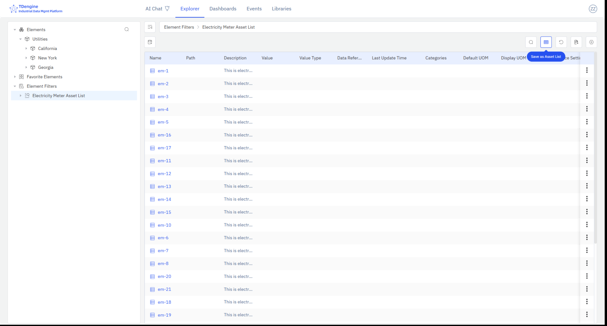

# 4.2.10 Lista de activos

## Descripción general

El panel de lista de activos muestra información de elementos en formato de tabla, incluyendo los atributos de gestión y los últimos valores recopilados de cada elemento. Se puede crear desde los resultados de una consulta de elementos o desde la lista de subelementos de un elemento padre, y puede colocarse en la lista de paneles de elementos o añadirse a un dashboard.

## Cuándo usarlo

Use el panel de lista de activos cuando:

- Necesite resumir en tiempo real un conjunto de activos filtrados y sus atributos clave en un dashboard
- Quiera monitorear en paralelo los valores de recopilación actuales de múltiples elementos bajo la misma plantilla
- Necesite crear un panel compacto de inventario o estado para un conjunto de equipos, instrumentos o máquinas

## Configuración

### Guardar un panel de lista de activos

**Guardar desde los resultados de la consulta de elementos:** Vaya a la página de consulta de elementos y configure los criterios de filtrado. Si los resultados de la consulta provienen de la misma plantilla, puede añadir columnas de atributos; haga clic en el nombre de la columna para deseleccionar las columnas que no necesite. Haga clic en el botón **Guardar como panel** y, en el cuadro de diálogo emergente, seleccione la ubicación de guardado.

**Guardar desde la lista de subelementos:** Seleccione un elemento padre en el árbol de activos y haga clic en la entrada de acción **Lista de subelementos**. Si todos los subelementos provienen de la misma plantilla, puede añadir columnas de atributos. Haga clic en **Guardar como panel** para guardar la lista de subelementos actual como panel de lista de activos bajo ese elemento padre. Cambie a la pestaña **Paneles** para confirmar que se ha creado el nuevo panel.

### Modificar un panel de lista de activos

Acceda al editor de paneles para configurarlo:

| Ajuste | Descripción |
|---|---|
| **Tipo de activo (plantilla)** | Obligatorio. Filtra la lista a los elementos de la plantilla seleccionada. Solo después de seleccionar una plantilla se pueden añadir columnas de atributos de esa plantilla. |
| **Campos de visualización** | El conjunto configurable de columnas y su orden de visualización. Incluye los atributos de gestión de IDMP (nombre, ruta, descripción, plantilla, categoría) y los atributos de referencia (TDengine Tags y TDengine Metrics). |

## Ejemplos de uso

**Panel de estado de equipos.** Un gerente de sitio guarda un panel de lista de activos que muestra todas las bombas del sitio, con columnas de estado de funcionamiento, caudal y fecha del último mantenimiento, y lo añade al dashboard del sitio. El gerente puede entender el estado operativo de toda la estación de bombeo en el dashboard sin necesidad de abrir cada página de elemento individualmente.

**Verificación de incorporación de nuevos equipos.** Un ingeniero de datos guarda un panel de lista de activos filtrado para los instrumentos añadidos el mes pasado (usando la plantilla de instrumentos), con columnas de nombre, fecha de instalación y última lectura, para confirmar rápidamente si todos los nuevos instrumentos están reportando datos correctamente.

**Vista de resumen de subelemento.** Un gerente de operaciones navega hasta un elemento de línea de producción, guarda su lista de subelementos —todos los equipos de esa línea— como panel de lista de activos con columnas para el modo operativo actual y la producción, y lo fija en el dashboard de la línea de producción para el monitoreo del turno.
