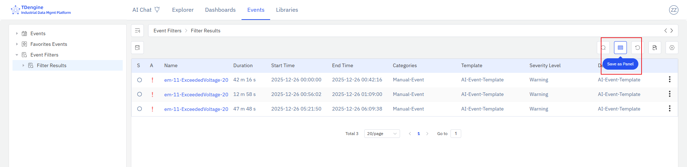

# 4.2.11 Lista de eventos

## Descripción general

El panel de lista de eventos muestra información de eventos en formato de tabla, incluyendo el nivel de gravedad, el estado de confirmación, el nombre, la duración, las horas de inicio/fin y otros metadatos de eventos. Se puede crear guardando desde la vista de eventos, y puede colocarse en la lista de paneles de elementos o añadirse a un dashboard.

## Cuándo usarlo

Use el panel de lista de eventos cuando:

- Quiera mostrar directamente en un dashboard una vista de eventos filtrada (como las alarmas activas de un área específica)
- Necesite monitorear sincronizadamente los eventos de un conjunto de activos junto a otros paneles operativos
- Quiera que los equipos de operaciones o mantenimiento puedan ver los eventos relevantes en contexto sin necesidad de entrar en la vista de eventos

## Configuración

### Guardar un panel de lista de eventos

Haga clic en el menú principal **Eventos**, haga clic en **Filtro de eventos** en el lado izquierdo para entrar en la página de consulta de eventos. Configure los criterios de filtrado para reducir el alcance de los eventos que necesita rastrear. Haga clic en el botón **Guardar como panel** para guardar la lista de eventos filtrada actual como panel de lista de eventos.

Después de guardar correctamente, se abre automáticamente la vista previa del panel. También puede ir a la pestaña **Paneles** del elemento de destino para ver el panel de lista de eventos recién creado.

## Ejemplos de uso

**Monitoreo de eventos de área.** El responsable del equipo de mantenimiento guarda un panel de lista de eventos filtrado para las alarmas del área de producción B y lo coloca en el dashboard de esa área. Los operadores pueden ver la lista de alarmas actuales junto a los paneles de tendencias en tiempo real sin necesidad de cambiar a la vista de eventos.

**Revisión de eventos de cambio de turno.** Un gerente de operaciones guarda un panel de lista de eventos filtrado para los eventos de las últimas 24 horas de una línea de producción y lo fija en el dashboard de cambio de turno. Tanto el turno saliente como el entrante ven el mismo historial de eventos filtrado en cada cambio de turno.

**Monitoreo de alarmas críticas.** El administrador de la planta guarda un panel de lista de eventos filtrado para eventos de nivel de emergencia en toda la planta y lo añade al dashboard de resumen de la planta. El panel proporciona visibilidad inmediata independientemente del área donde se produzca la alarma.
