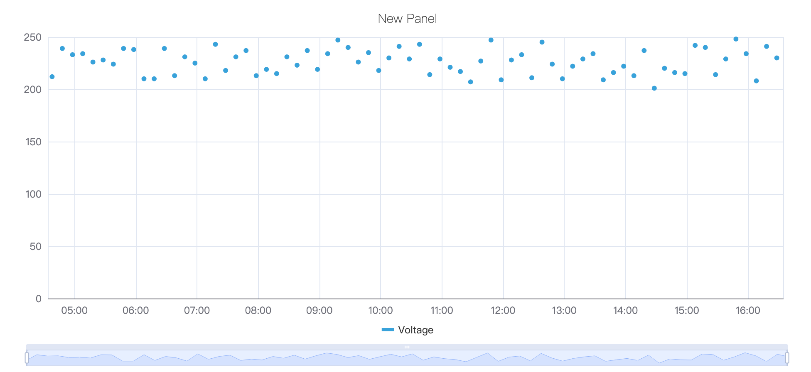
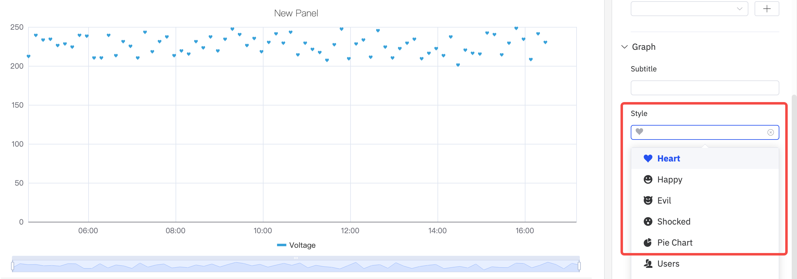
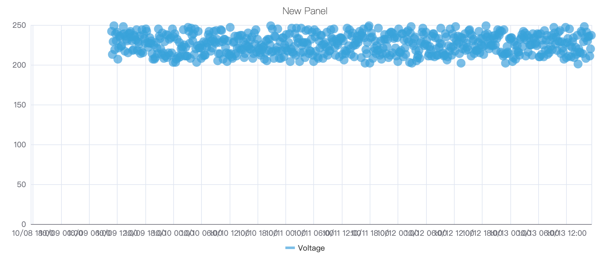
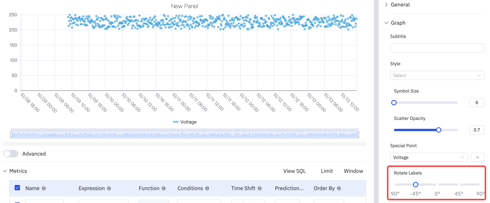
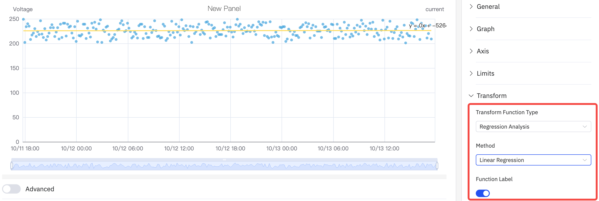
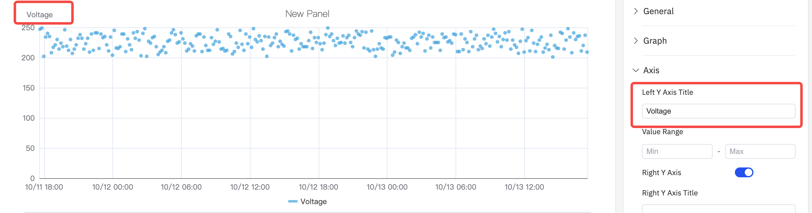
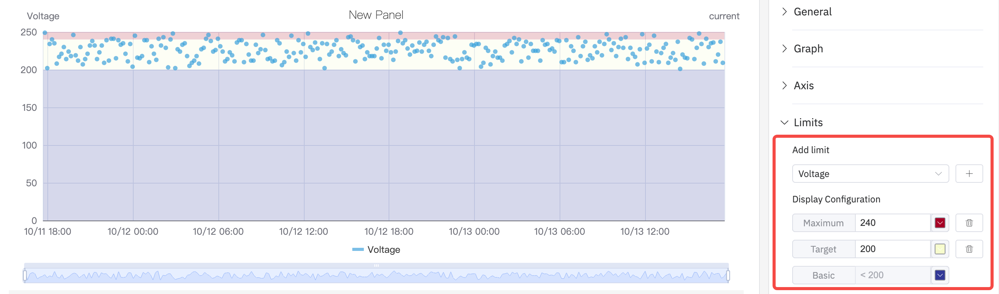

# 4.2.12 Gráfico de dispersión

## Descripción general

El gráfico de dispersión traza puntos de datos individuales como puntos en un espacio bidimensional. En el modo predeterminado, la posición X de cada punto es la marca de tiempo y la posición Y es el valor de la métrica — es decir, una vista de dispersión temporal. En el análisis de correlación, se trazan dos atributos uno frente al otro (Y frente a X), revelando la relación entre las dos variables.

Además del trazado básico, el gráfico de dispersión admite la agregación de datos y el análisis de regresión, siendo el tipo de panel principal en TDengine IDMP para el análisis estadístico y de correlación.

## Cuándo usarlo

Use el gráfico de dispersión cuando:

- Necesite explorar la relación entre dos variables de proceso (como potencia frente a temperatura, o caudal frente a caída de presión)
- Necesite identificar clústeres o valores atípicos en un conjunto de datos
- Quiera ajustar una curva de regresión para cuantificar una relación
- Quiera trazar puntos de datos sin procesar sin agregación

Para el análisis de tendencias basado en líneas continuas, use el gráfico de tendencia. Para patrones de estado discreto, use la línea de tiempo de estado.

## Configuración

### Barra de herramientas del modo de visualización

Además de los [controles generales del modo de visualización](../01-panels.md#413-modo-de-visualización-de-paneles), el gráfico de dispersión añade los siguientes controles:

| Control | Descripción |
|---|---|
| **Deshabilitar muestreo** | Obtiene datos sin procesar sin reducción de muestras, asegurando que todos los puntos de datos estén trazados |

### Barra de herramientas del modo de edición

Además de los [controles generales del modo de edición](../01-panels.md#414-modo-de-edición-de-paneles), el gráfico de dispersión añade los siguientes controles:

| Control | Descripción |
|---|---|
| **Deshabilitar muestreo** | Activa el modo de datos sin procesar en la vista previa |
| **Guardar como imagen** | Descarga la vista previa actual como imagen PNG |
| **Pantalla completa** | Expande la vista previa del editor para llenar la ventana del navegador |
| **Interpretar panel** | Ejecuta el análisis de IA sobre los datos de la vista previa actual |

### Configuración del gráfico

#### Estilo de punto

La forma del símbolo, el tamaño y la transparencia de cada punto de datos son configurables:

#### Puntos especiales

El ajuste **Puntos especiales** puede resaltar puntos de datos específicos (como el máximo o el mínimo) usando marcadores únicos y colores personalizados:

#### Etiquetas

Cuando los datos son densos, las etiquetas de los ejes pueden superponerse. Use **Rotación de etiquetas** e **Intervalo de etiquetas** para mejorar la legibilidad:

| Ajuste | Descripción |
|---|---|
| **Estilo** | Forma del símbolo de los puntos de datos (círculo, corazón, cara sonriente, etc.) |
| **Tamaño de punto** | Tamaño de cada punto (control deslizante, predeterminado: 6) |
| **Transparencia de dispersión** | Transparencia de los puntos, de 0 a 1 |
| **Puntos especiales** | Resalta el máximo/mínimo u otros puntos específicos con marcadores únicos |
| **Rotación de etiquetas** | Ángulo de rotación de las etiquetas del eje X |
| **Intervalo de etiquetas** | Densidad de las etiquetas del eje X |

### Configuración de transformación de datos

El gráfico de dispersión tiene una sección única de transformación de datos para funciones de análisis:

**Agregación de datos** agrupa los puntos en clústeres mostrados con diferentes colores, lo que permite el análisis de agrupamiento visual:

**Análisis de regresión** ajusta una curva a los datos y la superpone en el gráfico de dispersión. Las funciones admitidas incluyen regresión lineal, exponencial y polinómica (con orden configurable):

| Tipo de transformación de datos | Descripción |
|---|---|
| **Desactivado** | Sin transformación, traza los puntos de datos sin procesar directamente |
| **Agregación de datos** | Agrupa los puntos de datos y muestra clústeres agregados |
| **Análisis de regresión** | Ajusta una curva de regresión a los datos (lineal, exponencial o polinómica) |

### Configuración de ejes

#### Títulos de ejes

Configura el nombre y la unidad del eje Y:

#### Doble eje Y

Cuando dos métricas tienen rangos muy diferentes, compartir el eje Y comprime la señal más pequeña. Habilitar **Eje derecho** asigna cada métrica a su propia escala:

### Configuración de valores de límite

Se pueden superponer líneas de límite en el gráfico de dispersión para marcar los rangos operativos:

### Configuración de leyenda

En modo tabla, la leyenda muestra estadísticas de resumen. Cuando la leyenda está a la derecha y en modo tabla, también se puede ajustar el ancho de la tabla:

| Ajuste | Descripción |
|---|---|
| **Mostrar** | Modo de visualización: lista, tabla u oculto |
| **Posición** | Posición: abajo o a la derecha |
| **Valores de leyenda** | Estadísticas mostradas en modo tabla: valor más reciente, mínimo, máximo, promedio, suma, etc. |

## Ejemplos de uso

**Correlación potencia-temperatura.** Un ingeniero de procesos traza un mes de potencia activa (dimensión X) frente a la temperatura del motor (métrica Y) en un gráfico de dispersión. El gráfico muestra una clara correlación positiva — la curva de regresión cuantifica la relación, y el valor R² indica su intensidad.

**Agrupamiento de calidad.** Un ingeniero de calidad traza dos variables de proceso (presión y temperatura) de todos los lotes de un trimestre en un gráfico de dispersión. La función de agregación de datos colorea los clústeres — la mayoría de los lotes se agrupan estrechamente en la zona verde, pero algunos valores atípicos están en un clúster separado correlacionado con lotes no conformes.

**Detección de valores atípicos.** Un ingeniero de datos habilita la desactivación del muestreo y traza todas las lecturas sin procesar de un sensor. El ajuste de puntos especiales usa rojo para resaltar el máximo. Se identifica un punto anómalo claramente por encima del clúster para su investigación posterior.
