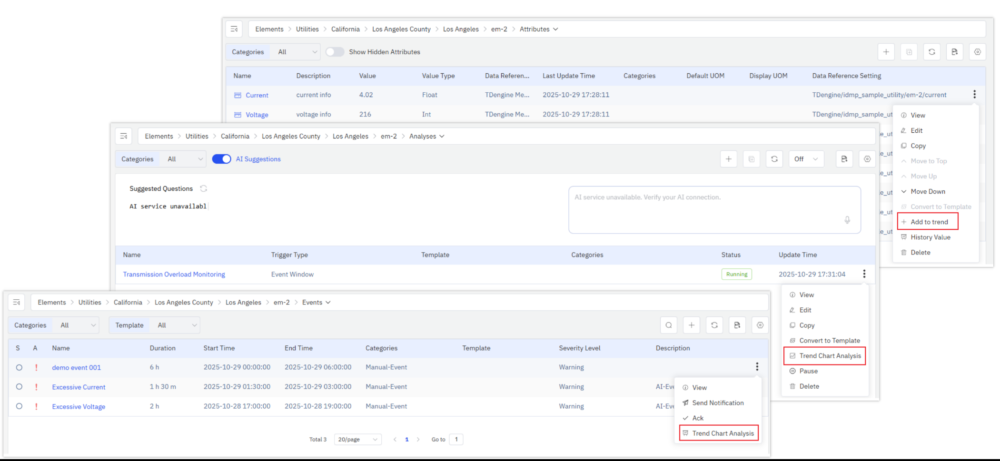
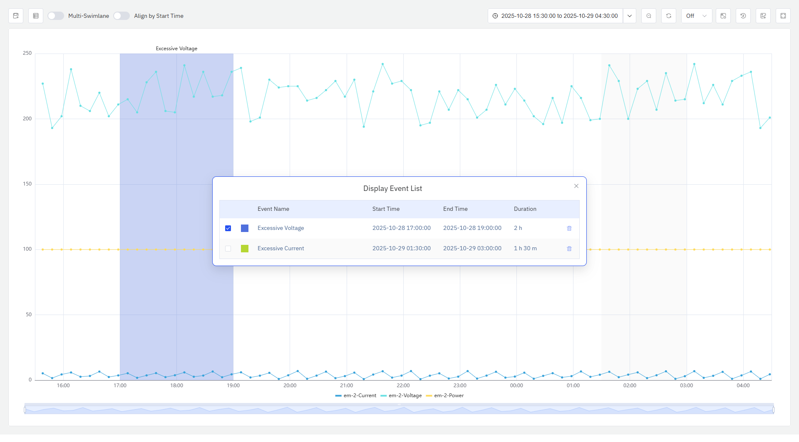
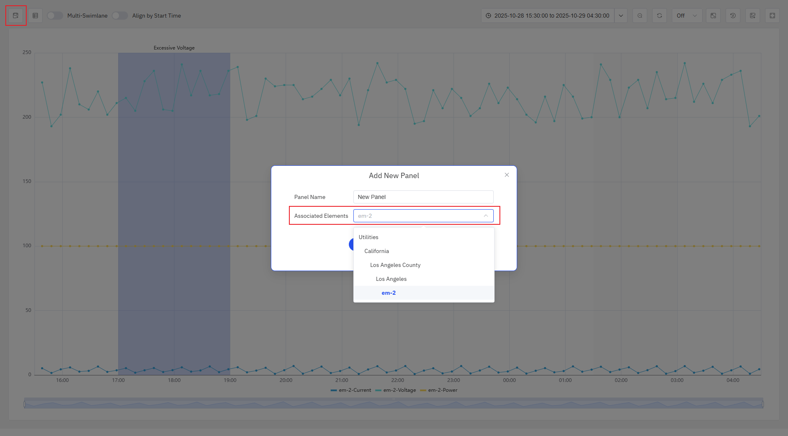

# 4.2.13 Tendencia de eventos

## Descripción general

El gráfico de tendencia de eventos superpone rangos de tiempo de eventos resaltados sobre métricas de series temporales, relacionando las señales de datos con los eventos que ocurrieron durante ese período, lo que hace que los cambios de métricas antes, durante y después de los eventos sean inmediatamente evidentes.

Se puede añadir al panel cualquier combinación de atributos de elementos, eventos y análisis. Al añadir un **Evento**, los atributos relacionados con la condición desencadenante de ese evento se añaden automáticamente al gráfico, y el rango de duración del evento se resalta en el eje de tiempo. Al añadir un **Análisis**, todos los atributos referenciados por el análisis y todos los eventos generados por ese análisis se añaden al gráfico.

## Cuándo usarlo

Use el gráfico de tendencia de eventos cuando:

- Necesite correlacionar las variables de proceso con las ocurrencias de eventos — por ejemplo, ver cómo cambian la temperatura o la presión durante una ventana de alarma
- Quiera investigar la causa raíz de un evento viendo las métricas relacionadas antes y después de su ocurrencia
- Necesite alinear múltiples ocurrencias del mismo tipo de evento en un eje de tiempo unificado para una comparación transversal
- Necesite presentar tanto tendencias de métricas como contexto de eventos en un único panel para construir una vista de investigación

Para el análisis de series temporales puro sin superposición de eventos, use el gráfico de tendencia. Para el análisis de correlación entre dos variables de proceso en lugar de su evolución individual en el tiempo, use el gráfico de dispersión.

## Configuración

### Fuente de datos

Haga clic en **Añadir** para agregar datos al gráfico de tendencia de eventos. Se admiten tres tipos de fuentes de datos:

| Tipo de fuente de datos | Efecto |
|---|---|
| **Atributo** | Añade una línea de series temporales para el atributo de elemento seleccionado |
| **Evento** | Añade todos los atributos relacionados con la condición desencadenante del evento y resalta el rango de tiempo activo del evento en el gráfico |
| **Análisis** | Añade todos los atributos monitoreados por el análisis y superpone todos los eventos generados por ese análisis |

### Herramientas de análisis

#### Múltiples carriles

El modo de múltiples carriles está activado por defecto. En este modo, cada métrica ocupa su propio carril horizontal independiente, manteniendo las señales con rangos muy diferentes visualmente separadas y claramente legibles.

#### Alinear por hora de inicio

Desactivado por defecto. Cuando está activado, todas las ocurrencias de eventos se mueven a un punto de inicio de tiempo unificado y se superponen en el mismo eje de tiempo, lo que facilita la comparación de la evolución de las métricas relacionadas durante múltiples ocurrencias de eventos.

#### Resaltar métricas relacionadas con eventos

Cuando el cursor pasa sobre el rango de tiempo de un evento en el gráfico, los atributos relacionados con la condición desencadenante de ese evento se resaltan, mientras que otras métricas y rangos de tiempo de eventos se atenúan, lo que facilita el análisis enfocado de las señales relacionadas con una ocurrencia de evento específica.

#### Lista de eventos

Haga clic en el botón **Lista de eventos** en la esquina superior izquierda para abrir el panel emergente de lista de eventos. El panel muestra el nombre, la hora de inicio, la hora de fin y la duración de todos los eventos del gráfico actual, y se puede arrastrar libremente.

Los eventos de la lista están marcados de forma predeterminada. Los eventos marcados se resaltan en el gráfico; los eventos no marcados se atenúan. También se pueden eliminar eventos de la lista.

### Guardar como panel

Haga clic en el botón **Guardar** en la esquina superior izquierda para guardar permanentemente la vista de análisis actual como panel. En el cuadro de diálogo de guardar, seleccione bajo qué elemento guardar el panel. Puede seleccionar los elementos relacionados que ya tienen datos en la vista actual y sus nodos ancestros.

## Ejemplos de uso

**Investigación de la causa raíz de una alarma.** Un ingeniero de mantenimiento añade los atributos de temperatura y vibración de un motor y añade el evento de alarma de sobretemperatura de ese motor. El gráfico de tendencia de eventos resalta la ventana de alarma de 90 minutos y muestra el proceso completo de aumento de temperatura durante las horas anteriores al inicio de la alarma junto con la señal de vibración sincronizada. La correlación entre las señales hace que la causa raíz sea inmediatamente evidente.

**Comparación transversal de lotes.** Un ingeniero de calidad activa **Alinear por hora de inicio** para un reactor y realiza un análisis de superposición de 30 ocurrencias de eventos de lote. La vista superpuesta muestra que los lotes con productos no conformes tienen una caída de presión notable a los 45 minutos del ciclo, mientras que todos los demás lotes siguen la curva esperada. El ingeniero guarda el resultado del análisis como panel del reactor para el monitoreo continuo.

**Investigación basada en análisis.** Un ingeniero de procesos añade un análisis de detección de anomalías al panel; todos los atributos monitoreados por el análisis se añaden automáticamente al gráfico, y cada ocurrencia de evento anómalo marcada por el análisis se superpone como un rango de tiempo resaltado. El ingeniero revisa cada ocurrencia de anomalía individualmente mediante la lista de eventos, manteniendo solo las señales relevantes en cada momento, para identificar qué combinaciones de condiciones operativas predicen de forma más fiable las anomalías.
