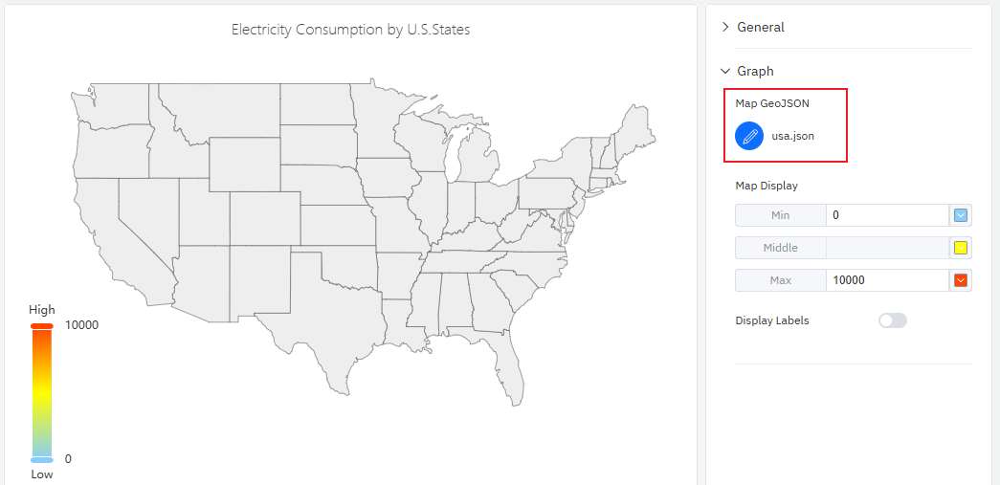
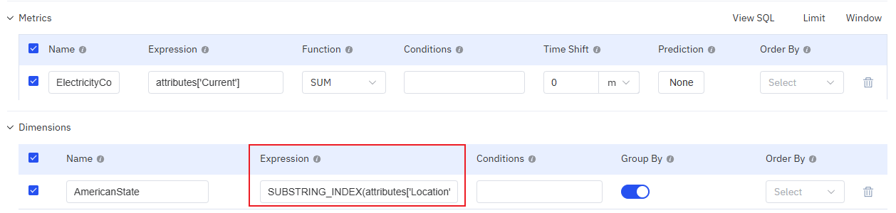

# 4.2.14 Mapa

## Descripción general

El mapa presenta datos geográficos en forma de mapa coroplético — rellena cada área con diferentes tonalidades de color según el valor de la métrica asociada a esa región. Es adecuado para el análisis espacial cuando los datos están organizados por regiones geográficas: países, provincias, ciudades, distritos o regiones personalizadas definidas por archivos GeoJSON.

La tonalidad del color de cada región refleja el valor de la métrica — el color más oscuro o más saturado indica valores más altos. La leyenda de escala de color muestra la correspondencia entre el color y los valores.

## Cuándo usarlo

Use el mapa cuando:

- Los elementos estén organizados por región geográfica y necesite visualizar una métrica en esas regiones
- Necesite responder preguntas como "¿Qué región tiene el mayor consumo de energía?" o "¿Qué sitios tienen un rendimiento inferior?"
- Tenga definiciones de límites geográficos personalizados (GeoJSON) que coincidan con sus regiones operativas

Para el análisis de tendencias de series temporales, use el gráfico de tendencia. Para comparaciones no geográficas entre categorías, use el gráfico de barras.

## Configuración

### Barra de herramientas del modo de edición

Además de los [controles generales del modo de edición](../01-panels.md#414-modo-de-edición-de-paneles), el mapa añade los siguientes controles:

| Control | Descripción |
|---|---|
| **Guardar como imagen** | Descarga la vista previa actual como imagen PNG |
| **Pantalla completa** | Expande la vista previa del editor para llenar la ventana del navegador |
| **Interpretar panel** | Ejecuta el análisis de IA sobre los datos de la vista previa actual |

### Configuración del gráfico

#### Archivo de mapa

El mapa requiere un archivo GeoJSON para definir los límites de las regiones geográficas. Use el ajuste **Archivo de mapa** para cargar su archivo GeoJSON:

Las `properties` de cada característica en el GeoJSON deben contener una clave que coincida con el atributo de identificador geográfico del elemento. Así es como el mapa asocia cada polígono de región con su valor de datos correspondiente.

#### Configuración de visualización

El gradiente de color del mapa coroplético se configura mediante la **Configuración de visualización**, que define tres puntos de anclaje:

| Ajuste | Descripción |
|---|---|
| **Archivo de mapa** | Carga o edita el archivo GeoJSON que define los límites de las regiones |
| **Configuración de visualización** | Escala de color: **Valor mínimo** (valor y color en el extremo bajo), **Valor intermedio** (color en el punto medio), **Valor máximo** (valor y color en el extremo alto). Haga clic en los bloques de color para cambiarlos. |
| **Mostrar etiquetas** | Interruptor: muestra etiquetas de nombres de región en el mapa |

## Ejemplos de uso

**Consumo de energía por provincia.** Una empresa de energía tiene sus elementos organizados por provincia. Un mapa que usa un archivo GeoJSON provincial muestra el consumo de energía total mensual de cada provincia. Las provincias de color más oscuro consumen más; las de color más claro, menos. El equipo de operaciones puede identificar de inmediato qué provincias superan las previsiones.

**Rendimiento de sitios por país.** Una empresa multinacional tiene sitios en 20 países. Un GeoJSON de nivel de país con escala de color verde a rojo muestra la Eficiencia Global de los Equipos (OEE) de cada país. El mapa destaca las regiones de bajo rendimiento que requieren atención de la dirección.

**Cobertura de sensores a nivel de ciudad.** Una empresa de medición inteligente despliega contadores de electricidad en los distritos de una ciudad. Un GeoJSON de nivel de distrito muestra el número de contadores activos en cada distrito, revelando las áreas de cobertura donde hay menos contadores que reportan datos.
