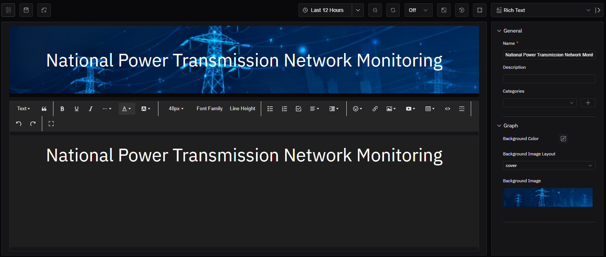

# 4.2.15 Texto enriquecido

## Descripción general

El panel de texto enriquecido reemplaza el área del gráfico por un editor de texto WYSIWYG (lo que ves es lo que obtienes) completo. En lugar de mostrar datos, proporciona un área de edición libre para incrustar documentación de instrucciones, guías operativas, materiales de referencia o diagramas anotados que desee mostrar junto a los paneles de datos.

El panel de texto enriquecido no tiene configuración de datos, tabla de métricas, tabla de dimensiones, ejes, valores de límite ni secciones de leyenda. Como no contiene datos del gráfico, no admite la función de interpretación del panel.

## Cuándo usarlo

Use el panel de texto enriquecido cuando:

- Quiera incrustar directamente el texto de los Procedimientos Operativos Estándar (POE) en la lista de paneles de un elemento
- Necesite añadir descripciones de contexto, guías operativas o contenido explicativo junto a los paneles de datos en un dashboard
- Quiera incrustar imágenes de referencia, diagramas de tuberías e instrumentación (P&ID) anotados o enlaces a documentos externos
- Esté construyendo una guía para operadores que se muestre junto a los datos en tiempo real

## Configuración

### Barra de herramientas del modo de edición

Además de los [controles generales del modo de edición](../01-panels.md#414-modo-de-edición-de-paneles), el panel de texto enriquecido añade los siguientes controles:

| Control | Descripción |
|---|---|
| **Guardar como imagen** | Descarga el contenido del panel actual como imagen PNG |
| **Pantalla completa** | Expande el editor para llenar la ventana del navegador |

### Editor de contenido

El panel central se convierte en un editor WYSIWYG completo:

El editor admite:

- Formato de texto: negrita, cursiva, subrayado, tachado
- Encabezados (H1–H6)
- Tamaño de fuente y familia de fuentes
- Color de texto y color de fondo
- Listas ordenadas y no ordenadas
- Tablas
- Hipervínculos
- Imágenes en línea (cargadas o mediante URL)
- Inserción de vídeos

### Configuración del gráfico

| Ajuste | Descripción |
|---|---|
| **Color de fondo** | El color de fondo del panel |
| **Diseño de imagen de fondo** | Cómo se posiciona la imagen de fondo: ninguno, cubrir, ajustar o mosaico |
| **Imagen de fondo** | Carga un archivo de imagen como fondo del panel |

## Ejemplos de uso

**Procedimientos operativos en el panel de elemento.** La lista de paneles de un elemento de bomba de agua incluye un panel de texto enriquecido con los procedimientos de arranque y parada. Cuando los operadores navegan al panel de la bomba, pueden ver los procedimientos operativos directamente junto al gráfico de tendencia sin necesidad de cambiar a un sistema de documentos separado.

**P&ID anotado en el dashboard.** Un dashboard de proceso incluye un panel de texto enriquecido con un diagrama P&ID cargado y anotado con los puntos de medición clave. Los operadores obtienen el contexto espacial junto a los paneles de datos.

**Plantilla de registro de cambio de turno.** Un panel de texto enriquecido en el dashboard de una línea de producción proporciona una plantilla estructurada para el registro de cambio de turno — observaciones de seguridad, estado de los equipos, problemas pendientes — incrustada directamente en la vista operativa compartida por los dos turnos.
