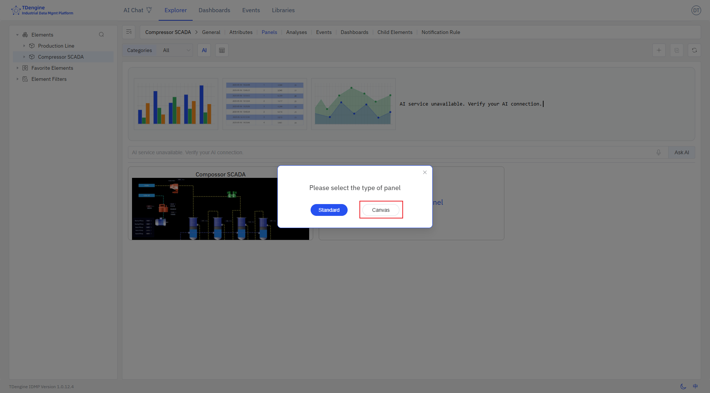

# 5.1 Crear Panel de Lienzo

Seleccione el elemento, luego seleccione el panel, haga clic en `Nuevo panel` y, a continuación, seleccione `Lienzo` para acceder a la interfaz de edición del lienzo.

El diseño del lienzo comprende los siguientes pasos:

1. Configure las propiedades del lienzo, incluyendo diseño, color, color de fondo, cuadrícula, etc.
   
2. Seleccione símbolos de la biblioteca de símbolos y arrástrelos al lienzo.
3. Edite y configure los símbolos, incluyendo:
   - Configurar texto, color, color de fondo, etc. para los símbolos
   - Configurar eventos para los símbolos, estableciendo tipos de evento (como clic, cambio del valor del símbolo), acciones de evento (como establecer propiedades del símbolo, reproducir animaciones) y condiciones de activación (como evaluaciones de umbral) para habilitar efectos de visualización impulsados por datos en los símbolos
   - Añadir efectos de animación a los símbolos. El sistema tiene animaciones integradas como salto arriba/abajo, salto izquierda/derecha, latido, rotación, etc., y puede personalizar las animaciones.
   - Configurar propiedades del símbolo, incluyendo valor, progreso, color de progreso, estado, etc., y vincularlas a las propiedades de elementos de IDMP para que los datos recopilados puedan impulsar la visualización de los símbolos en tiempo real.

4. Conecte los símbolos relacionados con líneas y configure los tipos de línea y las animaciones de línea.
5. Durante el proceso de edición puede obtener una vista previa; una vez terminada la edición, guarde el lienzo.

Estos pasos no necesitan realizarse en un orden fijo y pueden reorganizarse según convenga.
