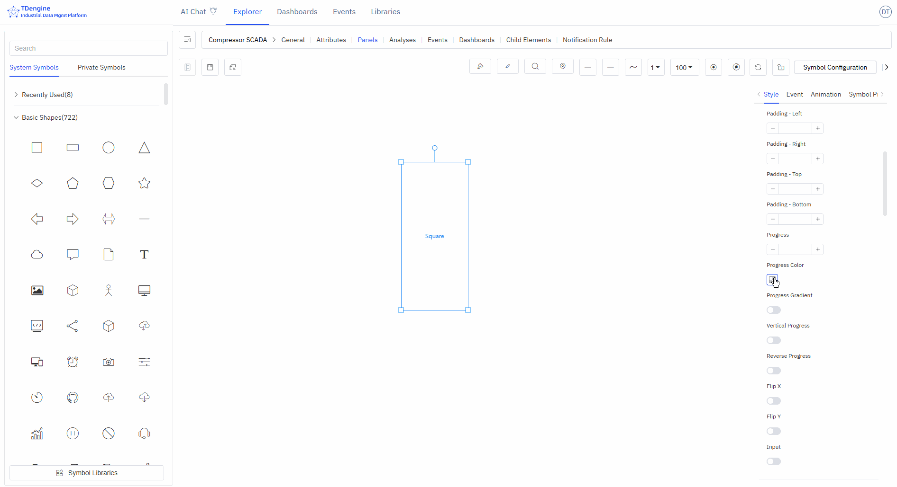
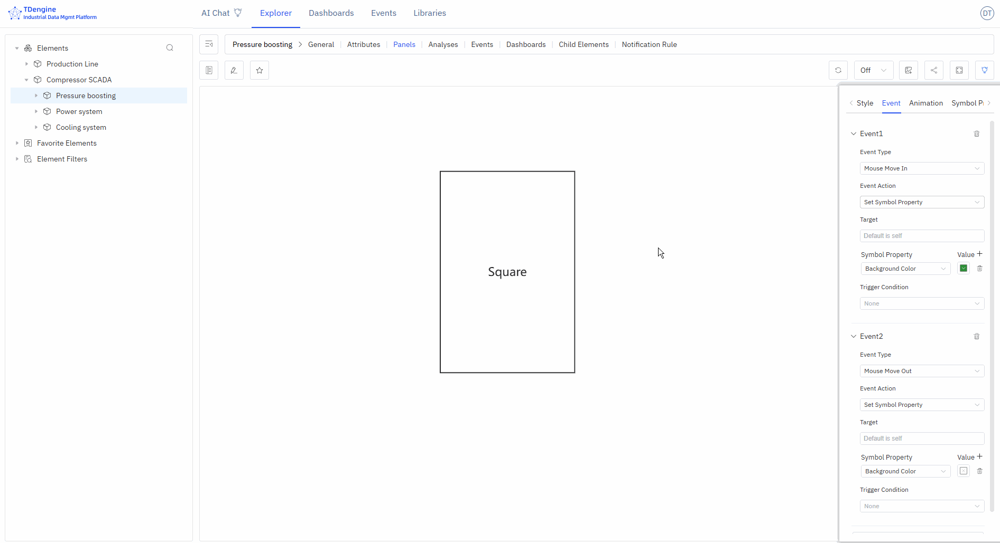
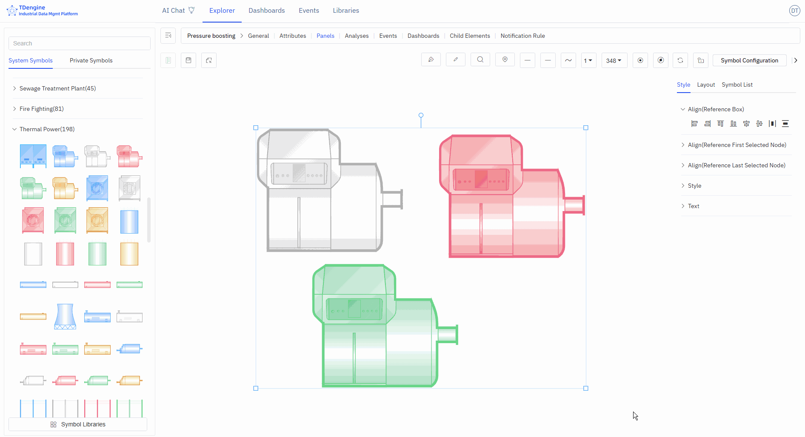
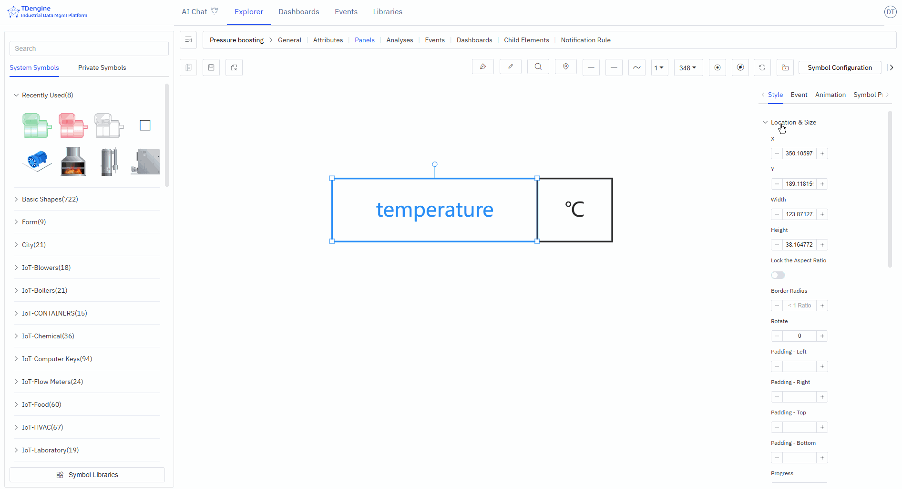

# 5.2 Símbolos

Los símbolos son las unidades básicas que componen la pantalla de monitorización, al igual que las piezas de Lego. Cada icono de dispositivo y cada figura cerrada es un símbolo. Combinando diferentes símbolos, puede construir un sistema completo de monitorización industrial.

## Ajustes de Apariencia

### Estilo del Símbolo

Ángulo: Establece la agudeza o redondez de las esquinas; rango de valores: 0~1

Rotación: Establece el ángulo de rotación del símbolo

Progreso: Cualquier figura cerrada puede usarse como barra de progreso: rectángulo, círculo, SVG, polilínea cerrada o cualquier otra figura cerrada. El rango de valores es 0~1.

### Estilo de Apariencia de Imagen

Puede subir imágenes como apariencia o imagen de fondo del símbolo.

### Estilo de Apariencia de Icono de Fuente

Puede configurar la fuente, el tamaño, el color, el estilo, el grosor, la altura de línea, la posición, etc. del texto mostrado en el símbolo.

## Eventos

La creación de configuraciones implica definir eventos, incluidos los tipos de evento, las acciones de evento y las condiciones de activación. Los tipos de evento incluyen entrada del ratón, salida del ratón, selección, etc., pero el más importante es "cambio del valor de propiedad del símbolo". Los atributos de un símbolo pueden vincularse a un atributo de elemento de IDMP, y cuando se cumple una condición de activación para ese valor, puede dispararse una acción de evento especificada. Las acciones de evento incluyen iniciar animaciones, detener animaciones, etc., pero la acción más importante es "establecer propiedades del símbolo", que puede cambiar la visualización del símbolo, como su color, color de fondo, texto mostrado, etc.

### Añadir Eventos

Añada los eventos correspondientes para lograr los comportamientos de evento deseados. Sugerencia: algunos comportamientos de evento solo muestran sus efectos durante la visualización y no pueden mostrarse durante la edición.

Tipos de evento: entrada del ratón, salida del ratón, selección, deselección, botón del ratón presionado, botón del ratón soltado, clic, doble clic, cambio del valor de propiedad del símbolo.

Acciones de evento: abrir enlace, establecer propiedades del símbolo, ejecutar animación, pausar animación, detener animación, ejecutar JavaScript, ejecutar función de Window, mensaje personalizado.

La siguiente figura muestra dos eventos configurados para los símbolos del lienzo: cuando el ratón entra, el color de fondo se establece en verde; cuando el ratón sale, el color de fondo se restaura.

### Activadores Condicionales

Puede añadir condiciones de activación a los eventos. La condición de activación más utilizada es la "operación relacional", que permite evaluaciones lógicas sobre los atributos de los símbolos, incluidos valor, progreso, estado y texto (otros atributos no admiten evaluaciones lógicas).

La siguiente figura muestra que el evento solo se activa al entrar el ratón cuando el texto del símbolo es mayor que 30. En la figura, el símbolo con texto 40 cumple la condición y activa el cambio de fondo a verde, mientras que el símbolo con texto 20 no cumple la condición y no activa el cambio de fondo a verde al pasar el ratón.

## Efectos de Animación

IDMP tiene muchos efectos de animación de símbolo integrados y también permite animaciones personalizadas fotograma a fotograma.

### Animación de Símbolo

Añada animaciones y sugerencias del ratón a los símbolos; configure la duración de la animación, los efectos de animación, el número de repeticiones, la etiqueta de la siguiente animación, si se reproduce automáticamente y si se mantiene el estado de la animación.

### Animación Integrada

Ninguna, salto arriba/abajo, salto izquierda/derecha, latido, éxito, advertencia, error, ostentación, rotación, personalizada.

### Animación Personalizada

Cree animaciones personalizadas fotograma a fotograma añadiendo fotogramas de animación.

### Sugerencias del Ratón

Muestra información de sugerencia del ratón cuando el cursor se sitúa sobre un símbolo. Se admiten dos métodos:

1. Redactar sugerencias del ratón utilizando la sintaxis Markdown
2. Escribir funciones Mark para mostrar el valor de retorno de la función

## Agrupación y Estados de Símbolos

Puede seleccionar múltiples figuras en el lienzo, luego hacer clic con el botón derecho y elegir Agrupar / Agrupar como estado. Puede ensamblarlas y combinarlas de cualquier forma deseada, y realizar operaciones de procesamiento de símbolos en cualquier sub-símbolo dentro del grupo, lo que favorece la reutilización de símbolos.

La agrupación de dos o más símbolos como estado es una forma de representación muy eficaz. Por ejemplo, encendido y apagado, la rotación y el paro de un ventilador pueden combinarse en un estado. Las luces de alarma de diferentes colores, como rojo, amarillo y verde, pueden combinarse en un estado. La modificación de estados puede impulsarse mediante eventos o vinculando atributos de elementos de IDMP para lograr efectos de animación.

## Propiedades del Símbolo

Los símbolos tienen muchos atributos, incluidos color, fuente del texto, color de fuente, progreso, etc. Estos atributos comunes pueden configurarse directamente de forma manual en los ajustes de apariencia. Sin embargo, puede controlar automáticamente los siguientes atributos del símbolo mediante configuración: color de fondo, color, color del texto, texto, X, Y, altura, anchura, visibilidad, valor de progreso, color de progreso, valor, estado, rotación, deshabilitado, etc.

Entre los atributos anteriores, los cuatro atributos de texto, valor de progreso, estado y valor también pueden usarse para evaluaciones lógicas en las condiciones de activación de eventos.

En la configuración de eventos, puede controlar automáticamente los atributos del símbolo seleccionando la acción de evento "establecer propiedades del símbolo". Otra forma es vincular estos atributos a los atributos de elementos de IDMP.

La vinculación de variables permite una visualización dinámica de datos en tiempo real de forma rápida. Como se muestra en la figura siguiente, añada una vinculación de atributo para vincular el "texto" del símbolo al voltaje del elemento "em-1". Cuando el valor adquirido de voltaje del elemento cambie, el texto del símbolo también cambiará en tiempo real al actualizar los datos.

:::tip
Antes de vincular variables, se recomienda elegir el método de entrada adecuado, introducir manualmente los valores de atributos y probar los efectos deseados, como cambios en la barra de progreso, cambios de estado, activaciones de eventos, etc. Una vez que las pruebas logren el efecto deseado, vincule los atributos a los atributos de un elemento de IDMP. En las configuraciones de producción en operación, los atributos de los símbolos deben estar vinculados a los atributos de los elementos.
:::
