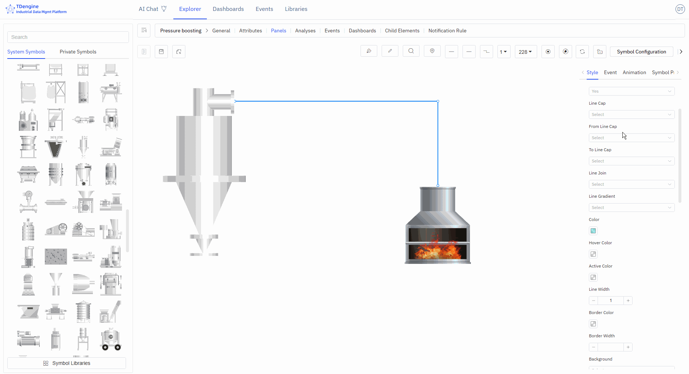

# 5.3 Líneas

Las líneas se utilizan para representar el flujo de materiales, la transmisión de señales o las relaciones lógicas entre dispositivos. Por ejemplo:

1. Las conexiones de tubería representan el transporte de materiales
2. Las líneas discontinuas representan la transmisión de señales
3. Las líneas de diferentes colores representan diferentes medios

Mediante animaciones de línea, puede visualizar el estado de flujo en tiempo real de los materiales.

## Dibujar Líneas

### Dibujar Líneas con el Lápiz de Tinta

Seleccione un tipo de línea, luego haga clic en el lápiz de tinta para activar el dibujo con ese tipo de línea.

Inicio: clic izquierdo;

Pausa: clic derecho o Intro;

Fin: Esc.

#### Curvas, Segmentos de Línea, Líneas Rectas, Curvas de Mapa Mental

Puede usar el lápiz de tinta para dibujar diferentes tipos de curvas, o seleccionar una línea y modificar su tipo.

#### Línea Horizontal

Mantenga presionada la tecla Shift, haga clic con el botón izquierdo del ratón para dibujar y haga clic derecho para terminar el dibujo (con el tipo de línea establecido en línea recta).

#### Línea Vertical

Mantenga presionada la tecla Ctrl, haga clic con el botón izquierdo del ratón para dibujar y haga clic derecho para terminar el dibujo (con el tipo de línea establecido en línea recta).

#### Línea Diagonal

Con el tipo de línea establecido en línea recta, seleccione el lápiz de tinta, haga clic izquierdo para dibujar el punto de inicio, mantenga presionadas las teclas Ctrl+Shift, mueva el ratón en el ángulo deseado (en incrementos de 15°), haga clic izquierdo para dibujar el segundo punto y haga clic derecho para terminar el dibujo.

### Dibujar Líneas con el Lápiz

Puede usar el lápiz para dibujar cualquier tipo de línea. Haga clic en "Lápiz" para activar la herramienta de lápiz, presione el botón izquierdo del ratón sobre el lienzo para comenzar a dibujar; la línea se trazará siguiendo la trayectoria del movimiento del ratón. Suelte el botón del ratón para terminar el dibujo.

### Conectar Símbolos con Líneas

Cuando el ratón se sitúa sobre un símbolo, se activan los puntos de ancla. Presione el ratón sobre un punto de ancla y arrástrelo hasta el punto de ancla de otro símbolo. Suelte el ratón para dibujar una curva entre los dos puntos de ancla de los símbolos.

### Convertir Línea en Símbolo

Haga clic con el botón derecho sobre la línea y seleccione "Convertir a nodo".

## Cortar / Unir Líneas

Cortar líneas: seleccione la línea, mueva el ratón hasta el punto de ancla donde desea separar la línea, haga clic y presione la tecla S.

Unir líneas: al conectar líneas, arrastre el extremo de conexión de la línea seleccionada actualmente para alinearlo con el extremo de conexión de otra línea, presione la tecla Alt, suelte el ratón y luego suelte la tecla Alt.

## Estilos de Línea

Después de seleccionar una línea, puede configurar su estilo de apariencia en el área de configuración de propiedades de la derecha:

- Estilo de línea: sólida, discontinua
- Tipo de línea: curva, polilínea, línea recta
- Estilo de conexión: bisel, redondeado, predeterminado
- Degradado de línea: ninguno, degradado lineal
- Color de línea, color flotante, color seleccionado
- Ancho de línea
- Fondo: color sólido, degradado lineal, degradado radial
- Color de fondo, color de fondo flotante, color de fondo seleccionado
- Opacidad: 0-1
- Color del ancla, radio del ancla (≥0)
- Color de sombra, desenfoque de sombra, desplazamiento X de sombra, desplazamiento Y de sombra
- Color del borde, ancho del borde (≥0)

## Animaciones de Línea

IDMP tiene integrados tres efectos de animación para líneas, lo que hace que los efectos visuales sean más dinámicos.

- Efectos de animación: flujo de agua, flujo de gotas de agua, puntos.
- Ancho de línea de animación (≥0), color de animación, velocidad de animación, flujo inverso, número de repeticiones.
- Siguiente animación: etiqueta, reproducción automática, mantener estado de animación, reproducción lineal: sí/no.

