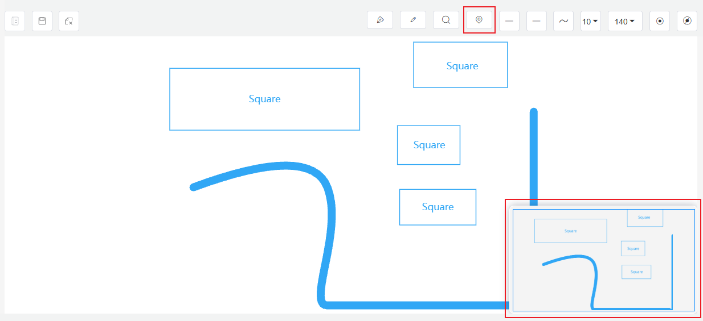

# 5.6 Caja de Herramientas

## Lápiz de Tinta

1. Inicio: clic izquierdo
2. Pausa: clic derecho o Intro
3. Fin: Esc
4. Cerrar / Abrir: Intro

## Lápiz

1. Inicio: arrastrar continuamente con el botón izquierdo
2. Pausa: soltar el botón izquierdo
3. Fin: Esc
4. Cerrar / Abrir: Intro

## Lupa

Se usa para observar los detalles de la imagen.

## Mapa General (Miniatura)

Vista global del diagrama de configuración. Hacer clic en el mapa general permite cambiar rápidamente la posición central en el lienzo.

